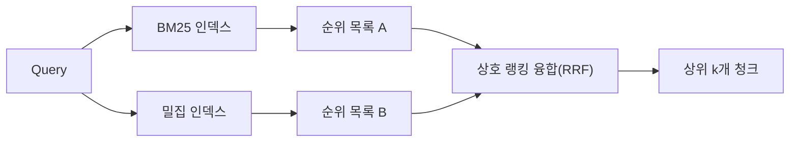

# BM25와 밀집 임베딩을 활용한 하이브리드 검색(Hybrid Retrieval)

> 어휘 기반 검색과 시맨틱 검색은 서로 반대되는 쿼리 분포에서 실패합니다. 상호 랭킹 융합(RRF)을 사용한 하이브리드 검색은 보간하지 않으며, 투표합니다. 그리고 이 투표는 모든 쿼리 클래스에서 승리합니다.

**유형:** Build
**언어:** Python
**선수 요건:** 11단계 04강 (임베딩), 06강 (RAG); 19단계 트랙 B 기초 (20-29강); 19단계 64강 (청킹 전략)
**시간:** 약 90분

## 학습 목표
- Robertson과 Sparck Jones의 공식에 따라 필드 가중치, 문서 길이 정규화, 조정 가능한 k1 및 b를 포함하여 BM25를 처음부터 구현해 보세요.
- 오프라인에서 루프가 실행되도록 결정적인(mock) 임베딩 위에 밀집 검색기를 구축해 보세요.
- Cormack, Clarke, Buettcher가 2009년에 발표한 상호 랭킹 융합(RRF)을 정확히 구현하고, 왜 이것이 점수 가중 보간보다 우월한지 설명해 보세요.
- RRF k 상수와 모달리티별 가중치를 조정하고, 작은 고정(fixtures) 코퍼스에서 트레이드오프를 읽어 보세요.

## 문제점

코퍼스가 쿼리에 포함된 문자 그대로의 식별자를 담고 있을 때 어휘 검색이 승리합니다. `AbortMultipartOnFail`에 대한 쿼리는 BM25를 통해 마이크로초 단위로 올바른 Go 함수를 반환합니다. 같은 쿼리를 임베딩하면 세 개의 유사성 클러스터의 경계 포인트에 위치하며, 밀집 검색기는 잘못된 파일을 먼저 순위에 올립니다.

쿼리가 코퍼스의 문자 그대로의 토큰에서 의역(paraphrased)될 때 밀집 검색이 승리합니다. "취소된 업로드를 어떻게 처리합니까?"라고 묻는 사용자는 abort나 multipart라는 단어를 입력하지 않았습니다. BM25는 "uploading large files"에 대한 문서 청크를 반환합니다. 그 페이지에 uploads라는 단어가 있기 때문입니다. 밀집 검색은 요약에 cancellation이 언급된 abort 함수를 찾습니다.

두 가지 중 선택은 고정된 것이 아닙니다. 쿼리 분포가 변수입니다. 프로덕션 RAG 시스템은 같은 엔드포인트에서 두 클래스를 모두 처리하므로, 검색은 두 가지를 동시에 처리해야 합니다. 이것이 하이브리드 검색입니다. 병합 단계가 정확해야 하는 부분입니다.

## 개념



### BM25 한 문단 요약

BM25는 쿼리 용어에 대해 역 문서 빈도 계수, 포화 용어 빈도 계수, 길이 정규화 보정 항을 곱한 값을 합산하여 쿼리-문서 쌍의 점수를 산출합니다. 두 개의 조절 변수가 있습니다. `k1`는 용어 빈도 포화를 제어합니다. 기본값 1.5는 공식적으로 권장되는 값이며, 벤치마크 없이 변경하지 않는 것이 좋습니다. `b`는 문서 길이가 얼마나 중요한지를 제어합니다. 기본값 0.75는 긴 문서에 페널티를 부여하되, 선형적으로 적용하지는 않는다는 의미입니다.

IDF 공식은 Robertson와 Sparck Jones의 smoothed 정의를 사용하며, 이는 `log((N - df + 0.5) / (df + 0.5) + 1)`입니다. 로그 내부의 +1은 용어가 코퍼스의 절반 이상에 나타날 때 IDF가 양수가 되도록 유지합니다. 이는 스톱워드가 기술적으로 희소한 작은 코퍼스에서 중요합니다.

필드 가중치를 적용하면 BM25가 심볼 이름에서의 매칭이 본문에서의 매칭보다 더 중요하다는 것을 인식하도록 할 수 있습니다. 구현은 인덱싱 중에 용어 개수에 곱셈 계수를 적용하는 방식이며, 점수 산정 시점에는 적용하지 않습니다. 이는 수학적 연산을 동일하게 유지하고 필드별 별도 점수를 계산하지 않도록 합니다.

### 밀집 검색 한 문단 요약

임베딩 모델을 사용하여 각 청크를 고정 차원 벡터로 임베딩합니다. 쿼리 시점에 쿼리를 임베딩하고, 모든 청크를 코사인 유사도로 순위 매겨 상위 k개를 반환합니다. 품질을 결정하는 변수는 모델입니다. 검색 알고리즘 자체는 내적(dot product)과 정렬로 이루어진 두 줄의 코드입니다.

이 강의에서는 네트워크 호출 없이 융합 연산을 읽을 수 있도록 결정적인 해시 기반 임베딩을 사용합니다. 해시는 토큰 키가 있는 오프셋을 96차원 벡터로 합산하고 정규화합니다. 코사인 순위는 실행 간에 결정적이며, 이는 테스트 스위트가 요구하는 조건입니다.

### 상호 랭킹 융합(RRF), 공식화된 수식

두 개의 순위 목록이 있습니다. 두 목록 중 하나에 나타나는 각 후보에 대해 역 랭킹 기여도를 합산합니다. 2009년 논문은 `1 / (k + rank)`를 사용했으며, 기본값으로 k를 60으로 설정했습니다. 총 점수 순으로 정렬합니다. 이것이 알고리즘의 전부입니다.

공식화된 상수 k = 60은 임의의 값이 아닙니다. k = 60일 때 랭킹 1의 기여도는 1 / 61이고, 랭킹 10의 기여도는 1 / 70입니다. 기여도가 천천히 감소하므로 깊은 위치의 후보도 투표에 참여합니다. 작은 k는 상위 결과가 지배하도록 만듭니다. 큰 k는 기여도 곡선을 평평하게 만듭니다.

구현에서 조정 가능한 두 가지 매개변수입니다. `k` 상수입니다. 모달리티별 가중치 쌍으로, 코퍼스에서 BM25 또는 밀집 검색이 더优하다는 사전 증거가 있을 때 해당 검색기를 강화할 수 있습니다. 랭킹 기여도에 가중치를 곱하는 것이 가장 단순한 원칙적인 구현입니다. 랭킹 감소 형태를 보존하고 스케일 독립성을 유지합니다.

### 융합이 점수 가중 보간보다优한 이유

BM25 점수는 상한이 없으며 코퍼스에 의존합니다. 코사인 유사도는 -1에서 1 사이로 제한됩니다. 선형 결합 `alpha * bm25 + (1 - alpha) * cosine`은 코퍼스별 alpha 튜닝이 필요하며 인덱스를 재구성할 때마다 깨집니다. 랭킹 기반 융합은 그렇지 않습니다. 두 랭킹은 모달리티 간에 비교 가능합니다. 공개된 RRF 기준선은 2010년 이후 모든 공개 TREC 트랙에서 점수 보간보다优합니다.

이것은 Vespa 및 Weaviate 문서에서 RankFusion vs RRF에 대해 들을 수 있는 것과 동일한 논거입니다. 그들은 동일한 결론에 도달했습니다: 점수를 보간해야 할 매우 강한 증거가 없는 한 랭킹 기반으로 유지하십시오.

```figure
rrf-fusion
```

## 구현하기

`code/main.py`는 다음을 구현합니다:

- `tokenize(text)` - 빠른 정규식 토크나이저입니다.
- `BM25Index` - 필드 가중치가 적용되며, `add` 및 `search`와 조정 가능한 k1, b가 있습니다.
- `mock_embed`, `DenseIndex` - 청크가 비교 가능하도록 64강과 동일한 결정론적 임베딩입니다.
- `rrf(rankings, k, weights)` - 다중 모달리티 가중치를 포함한 공개된 융합입니다.
- `HybridRetriever` - BM25와 밀집 검색을 결합합니다.
- 작은 픽스처 코퍼스를 로드하고, 각 검색기의 강점과 약점을 겨냥한 세 가지 쿼리를 실행하며, 각 모달리티가 생성한 랭킹과 융합된 목록을 출력하는 데모 `main()`입니다.

실행해 보세요:

```bash
python3 code/main.py
```

데모 출력을 나란히 읽어 보세요. 문자 그대로의 식별자 쿼리는 BM25 랭킹 1, 밀집 랭킹 4, RRF 랭킹 1에 위치합니다. 패러프레이즈된 쿼리는 BM25 랭킹 6, 밀집 랭킹 1, RRF 랭킹 1에 위치합니다. 모호한 쿼리는 BM25 랭킹 3, 밀집 랭킹 3, RRF 랭킹 1에 위치합니다. 융합은 타이 브레이커가 아닙니다. 모든 쿼리 클래스에서优승하는 시스템입니다.

## 매개변수 튜닝

| 매개변수 | 기본값 | 높일 때 | 낮출 때 |
|------|---------|----------------|------------------|
| BM25 k1 | 1.5 | 문서에서 용어가 반복되고 빈도가 더重要하길 원할 때 | 문서가 짧고 용어 반복이 잡음일 때 |
| BM25 b | 0.75 | 긴 문서는 실제로 단어당 정보량이 적습니다 | 문서 길이는 주제와 상관관계가 없습니다 |
| RRF k | 60 | 깊은 후보는 계속 투표해야 합니다 | 상위 1위가 지배해야 합니다 |
| BM25 가중치 | 1.0 | 코퍼스에 문자열 식별자가 포함되어 있고 쿼리가 이를 일치시킵니다 | 쿼리가 사용자에 의해 패러프레이징되었습니다 |
| Dense 가중치 | 1.0 | 쿼리가 패러프레이징되었습니다 | 쿼리가 문자열입니다 |

직관으로 조정하지 말고, 홀드아웃 쿼리 세트에 68강의 평가 하네스를 재실행하여 조정해 보세요.

## 데모가 숨기는 실패 모드

**어휘 외 토큰.** BM25의 IDF는 코퍼스에서 계산되므로, 쿼리에만 있는 용어는 기여도가 0입니다. Dense 임베딩은 동일한 용어에 대해 환각된 벡터를 생성합니다. 코퍼스 외 식별자에 대해 Dense 모달리티는 그럴듯해 보이지만 잘못된 이웃을 반환합니다. BM25가 아무것도 반환하지 않아 순위 기여도가 사라지므로 융합이 이를 흡수하지만, 이는 청크가 아닌 문서 단위로 중복 제거를 수행할 때만 유효합니다.

**정지 토큰 지배.** BM25가 단어 "the"에 대해 코퍼스에 대한 균일한 순위를 생성합니다. 인덱서에서 정지 토큰을 필터링하거나, 높은 IDF 용어가 자연스럽게 지배하도록 허용하세요.

**모달리티 간 동일한 콘텐츠.** 코퍼스가 충분히 작아 BM25의 상위 1위가 Dense의 상위 1위와 동일하다면, RRF는 동일한 상위 1위와 동일한 이웃을 제공합니다. 이는 실패가 아닌 올바른 동작이지만, 융합이 보이지 않는 것처럼 만듭니다. 융합이 실제로 작동하는지 확인하기 위해 평가에 적대적 쿼리 쌍을 추가하세요.

## 사용하기

프로덕션 패턴:

- BM25는 프로세스 내에서 인덱싱하세요. 병목은 벡터가 아닌 용어 빈도 사전입니다.
- Dense 벡터를 별도 저장소에 인덱싱하세요. 이 강의에서는 평면 리스트를 사용하지만, 프로덕션에서는 HNSW를 사용해야 합니다.
- 두 쿼리를 병렬로 실행하세요. 융합은 합집합에 대한 상수 시간 병합입니다.
- 검색된 각 히트의 모달리티를 저장하여, 다운스트림 리랭커가 어떤 모달리티가 투표했는지 확인할 수 있도록 하세요.

## 출시하기

66강에서는 이 강의의 융합된 top-k를 크로스 인코더로 재순위합니다. 68강에서는 정밀도, 재현율, MRR, nDCG로 전체 파이프라인을 평가합니다. 이 강의의 하이브리드 검색기는 69강의 엔드투엔드 시스템의 첫 단계입니다.

## 연습 문제

1. `mock_embed`를 제공업체의 실제 모델로 교체하세요. 데모를 다시 실행하고 패러프레이즈된 쿼리에서 밀집 검색 전용 순위가 어떻게 변하는지 보고해 보세요.
2. 세 번째 모달리티를 추가하세요: 청크 요약본을 별도로 인덱싱하고 세 번째 순위 목록으로 융합합니다. 성능 향상 폭을 측정해 보세요.
3. RRF k를 10, 30, 60, 100, 200으로 스윕하세요. 68강의 recall@k 곡선을 플롯하세요. 코퍼스에서 곡선이 최고점을 찍는 k 값을 보고해 보세요.
4. BM25F를 올바르게 구현하세요 (멀티플라이어 트릭이 아닌 필드별 길이 정규화)하고, 심볼 매칭이 가장 중요한 코퍼스에서 비교해 보세요.

## 핵심 용어

| 용어 | 사람들이 말하는 것 | 실제 의미 |
|------|-----------------|------------------------|
| BM25 | "어휘 검색" | idf x 포화 tf x 길이 정규화를 통한 확률적 순위 매기기 |
| RRF | "순위 융합" | 순위 목록 전체에 대한 1 / (k + rank)의 합; 기본값 k = 60 |
| k1 | "TF 포화" | 반복된 용어가 더 이상 점수를 추가하지 않는 속도를 제어 |
| b | "길이 페널티" | 0은 문서 길이를 무시, 1은 완전 정규화 |
| 필드 가중치 | "심볼 부스트" | 인덱싱 중 토큰을 반복하여 해당 필드의 매칭을 부스트 |
| 순위 기반 vs 점수 기반 융합 | "RRF가 선형보다 나은 이유" | 순위는 모달리티 간에 비교 가능하지만 점수는 그렇지 않음 |

## 추가 읽기

- Cormack, Clarke, Buettcher, "Reciprocal Rank Fusion outperforms Condorcet and individual rank learning methods", SIGIR 2009
- Robertson, Walker, Beaulieu, Gatford, Payne, "Okapi at TREC-3" (BM25의 원 논문)
- [Vespa: Hybrid Retrieval with BM25 and Embeddings](https://docs.vespa.ai/en/tutorials/hybrid-search.html)
- [Weaviate: Hybrid Search](https://weaviate.io/developers/weaviate/search/hybrid)
- 11단계 06강 - RAG (검색 증강 생성)(RAG (Retrieval-Augmented Generation)) 기초
- 19단계 64강 - 여기서 인덱싱되는 청커
- 19단계 66강 - 융합된 top-k를 소비하는 크로스 인코더 리랭커
