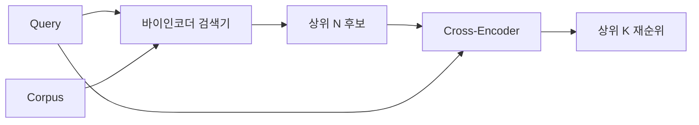

# 교차 인코더 리랭커

> 바이 인코더는 쿼리와 문서를 독립적으로 임베딩합니다. 교차 인코더는 두 문서를 연결하여 한 번에 읽습니다. 교차 인코더는 가장 똑똑한 리더이며 가장 느립니다. 바이 인코더의 상위 k개 결과에 대해 2단계로 사용했을 때, 그 비용은 충분히 상쇄됩니다.

**유형:** Build
**언어:** Python
**선수 요건:** 11단계 06강 (RAG), 11단계 07강 (고급 RAG); 19단계 트랙 B 기초 (20-29강); 19단계 65강 (이 단계에 공급하는 하이브리드 검색)
**시간:** 약 90분

## 학습 목표
- 입력 형태, 매개변수 수, 쿼리당 비용을 기준으로 바이 인코더 리트리버와 교차 인코더 리랭커를 구분해 보세요.
- 패키지화된 (쿼리, 문서) 시퀀스를 소비하고 단일 관련성 스칼라를 방출하는 트랜스포머 블록으로 작은 교차 인코더를 처음부터 구현해 보세요.
- 두 단계 검색 후 리랭킹 파이프라인을 연결해 보세요: 저렴한 리트리버로 상위 N개를 검색하고, 교차 인코더로 N개를 리랭킹하여 상위 K개를 반환합니다.
- 작은 픽스처 코퍼스에서 지연 시간 대 품질의 트레이드오프를 측정하고, 주어진 지연 시간 예산에 맞는 적절한 N을 선택해 보세요.

## 문제점

바이 인코더는 쿼리와 문서를 동일한 벡터 공간에 매핑하고 코사인 유사도로 순위를 매깁니다. 두 임베딩은 서로를 볼 수 없습니다. 모델은 문서에 대한 모든 유용한 정보를 쿼리를 알지 못한 채 단일 벡터로 압축해야 합니다. 이는 빠릅니다 - 인덱싱 시 문서당 임베딩 하나, 쿼리 시 쿼리당 임베딩 하나 - 그리고 코퍼스 규모에서 순위를 매길 수 있는 유일한 방법입니다.

비용은 정확도입니다. 전체적인 주제가 같은 두 문서는, 하나가 쿼리에 답하고 다른 하나가 답하지 않는 경우에도 거의 동일한 임베딩을 가질 수 있습니다. 바이 인코더는 이 둘을 구분할 수 없습니다.

교차 인코더는 쿼리와 문서를 함께 읽음으로써 이 문제를 해결합니다. 모델은 `[query] [SEP] [document]`를 단일 시퀀스로 수신하고, 결합된 부분에 대한 전체 어텐션을 실행하며, 하나의 관련성 스칼라를 생성합니다. 문서의 모든 토큰은 쿼리의 모든 토큰에 어텐션할 수 있습니다. 모델은 전체 컨텍스트를 고려하여 점수를 결정합니다.

비용은 처리량입니다. 바이인코더는 한 번 임베딩하고 영원히 쿼리하는 반면, 크로스인코더는 (쿼리, 문서) 쌍마다 한 번 실행됩니다. 1,000만 문서 코퍼스의 경우 쿼리당 1,000만 번의 순방향 패스가 필요합니다. 요청 예산 내에서는 실행할 수 없습니다.

해결책은 단계화입니다. 바이인코더를 사용하여 상위 N개를 검색합니다. 크로스인코더를 사용하여 N개를 상위 K개로 재순위합니다. N은 작으며(50~200), 크로스인코더의 품질 향상은 중요한 부분에 집중됩니다. 총 지연 시간은 요청 예산 내에 유지됩니다. 총 품질은 크로스인코더의 품질이며, N에서의 바이인코더 재현율에 의해 상한이 결정됩니다.

## 개념



### 크로스인코더의 입력 형상

표준 패킹은 `[CLS] query_tokens [SEP] document_tokens [SEP]`입니다. CLS 위치의 출력은 관련성 스칼라를 출력하는 단일 선형 헤드로 전달됩니다. 일부 구현에서는 CLS 대신 평균 풀링을 사용하며, 차이는 작습니다. 핵심은 모델이 쌍마다 하나의 숫자를 생성한다는 점입니다.

2,200만 매개변수 크로스인코더(공개된 `ms-marco-MiniLM-L-6-v2` 가중치 클래스)는 일반적인 프로덕션 지점입니다. 더 작은 모델은 지연 시간을 절약하는 것보다 품질을 더 빠르게 잃습니다. 더 큰 모델(예: 5,680만 매개변수의 `bge-reranker-v2-m3`)은 오프라인 재순위나 K가 작은 첫 페이지 재순위에 예약됩니다.

### 이 강의가 작은 모델을 훈련하는 이유

실제 크로스인코더는 미세 조정된 인코더 트랜스포머입니다. 프로덕션에서는 체크포인트를 로드하고 실행합니다. 이 강의의 목표는 모델의 형상과 지연 시간-품질 곡선의 형상을 보여주는 것이지, 최신 랭커를 훈련하는 것이 아닙니다. 따라서 하나의 트랜스포머 블록, 멀티헤드 어텐션(기본값 4헤드), 하나의 회귀 헤드를 가진 작은 `nn.Module`을 구축합니다. 시드에서 결정적으로 초기화되므로 디스크에 가중치가 없어도 데모가 재현 가능합니다.

토이 모델은 픽스처 코퍼스에서 올바른 형상을 학습합니다. 관련 있는 쿼리-문서 쌍은 관련 없는 쌍보다 예측 점수가 높습니다. 엔드투엔드 파이프라인은 바이인코더의 출력을 재순위하며, 재순위의 상위 k는 골라벨과 상관관계가 있습니다.

### 지연 시간 대 품질

2단계 파이프라인에는 하나의 조정 가능한 매개변수인 N이 있습니다. 홀드아웃 쿼리 세트에서 N을 5에서 100까지 스윕하면 곡선을 얻을 수 있습니다.

| N | 2단계의 Recall@1 | 쿼리당 크로스 인코더 순방향 패스 | 지연 시간 |
|---|--------------------|---------------------------------------|---------|
| 5 | 0.62 | 5 | 낮음 |
| 20 | 0.81 | 20 | 중간 |
| 50 | 0.86 | 50 | 높음 |
| 100 | 0.86 | 100 | 매우 높음 |

위의 숫자는 형태를 설명하기 위한 예시일 뿐, 이 픽스처에서 측정된 값이 아닙니다. 형태는 실제입니다. 리랭크 상승이 포화되는 무릎(knee)은 항상 20~50 후보 주변에 있습니다. 무릎을 넘어서면 아무것도 얻지 못하면서 비용만 지불하게 됩니다.

평가 곡선과 지연 시간 예산을 고려하여 N을 선택하세요. 크로스 인코더는 N에서의 바이 인코더 리콜을 높일 수 없으므로, 낮은 N은 지연 시간뿐만 아니라 품질도 제한합니다.

```figure
rerank-funnel
```

## 구현하기

`code/main.py`는 다음을 구현합니다:

- `CrossEncoder` - 작은 `torch.nn.Module`: 토큰 임베딩, 멀티 헤드 어텐션과 피드포워드가 있는 하나의 트랜스포머 블록, 하나의 스칼라를 생성하는 평균 풀링 헤드.
- `tokenize_pair(query, document)` - 경계를 표시하는 타입 ID를 사용하여 두 문자열을 단일 ID 시퀀스로 패킹하며, 결정적(deterministic)이고 표준 라이브러리(stdlib)를 사용합니다.
- `train_tiny(pairs)` - 수동으로 라벨링된 (쿼리, 문서, 관련성) 삼중 목록에 대한 한 번의 지도 학습(supervised training)을 수행하여, 모델이 픽스처에서 합리적인 점수를 생성하도록 합니다.
- `rerank(query, candidates, top_k)` - 프로덕션 인터페이스.
- `pipeline(query, retriever, top_n, top_k)` - 2단계 흐름.
- 65강의 패턴으로 코퍼스를 로드하고, 상위 N을 검색하며, 상위 K로 리랭크하고, 두 목록을 나란히 출력하며, 각 단계의 지연 시간을 보고하는 데모 `main()`.

실행하세요:

```bash
python3 code/main.py
```

출력에는 바이 인코더의 상위 N, 크로스 인코더의 상위 K, 그리고 시간 요약이 표시됩니다. 크로스 인코더는 호출당 시간이 더 오래 걸리지만 전체 코퍼스를 실행하지는 않습니다. 2단계 합계는 요청 예산 내에 유지되면서 바이 인코더가 2위 또는 3위로 랭킹한 정답을 선택합니다.

## 데모가 숨기는 실패 모드

**크로스 인코더는 대칭이 아닙니다.** `rerank(q, d)`과 `rerank(d, q)`는 서로 다른 점수입니다. 항상 쿼리를 먼저 입력하세요. 실수로 순서를 바꾸면 리콜이 급격히 떨어집니다.

**N이 너무 낮아 버그를 드러내지 못합니다.** N = K로 설정하면 크로스 인코더는 순서를 바꿀 수 없고 가중치만 재조정할 수 있습니다. 상승 효과가 0으로 보입니다. N을 K의 최소 3배 이상으로 선택하세요.

**학습 데이터가 평가에 유입됩니다.** 수동으로 라벨링한 학습 쌍에 평가 쿼리가 포함되면, 리랭킹이 마법처럼 보일 수 있습니다. 피스처(fixture)에서도 학습과 평가를 엄격하게 분리하세요.

**프로덕션 가중치는 밀집(dense) 형태입니다.** 22M 매개변수(Parameter)의 교차 인코더(Cross-Encoder)는 float32에서 88MB입니다. 100ms 미만의 p95를 약속하기 전에 모델 서버의 메모리를 계획하세요.

**배치 처리가 중요합니다.** 실제 교차 인코더는 N개의 후보를 하나의 배치로 실행합니다. 이 강의에서는 `_batch_encode`에서 이를 수행하며, `torch.tensor(...)`를 사용하여 배치된 id 및 type-id 텐서(Tensor)를 구축하고 하나의 순전파(forward pass)를 실행합니다. 배치를 건너뛰면 지연(latency)이 N배로 증가합니다.

## 사용하기

프로덕션 패턴:

- 바이 인코더(Bi-Encoder), 교차 인코더, N을 고정하세요. 하나라도 변경하면 평가가 무효화됩니다.
- (쿼리, document_id) 해시로 리랭커의 출력을 캐시하세요. 안정적인 코퍼스에 대해 동일한 쿼리는 동일한 순서로 리랭킹됩니다. 캐시 히트는 지연(latency)을 줄여줍니다.
- 랭크 1의 교차 인코더 점수를 로깅하세요. 상위 1점수가 코퍼스별 임계값 미만인 쿼리는 도메인 외(out-of-domain) 히트입니다. LLM에 "확신하지 못합니다"로 표시하세요.

## 출시하기

68강은 이 2단계 파이프라인을 엔드 투 엔드(end-to-end)로 평가합니다. 69강은 이 리랭커를 65강의 하이브리드 검색기(Hybrid Retriever) 뒤에, 그리고 답변 생성기 앞에 연결합니다. 리랭커는 엔드 투 엔드 시스템의 두 번째 단계입니다.

## 연습 문제

1. N을 5에서 50까지 스윕(sweep)하고 리랭킹된 출력의 recall@1을 플롯(plot)하세요. 이 피스처에서의 무릎(knee) 지점을 찾으세요.
2. 교차 인코더를 1에포크(Epoch)가 아닌 10에포크로 학습하세요. 각 에포크에서 양수 및 음수 쌍 간의 점수 마진(score-margin)을 측정하세요.
3. 평균 풀링(mean-pooling)을 CLS 토큰 헤드로 교체하세요. 이 피스처에서의 수렴(convergence)을 비교하세요.
4. "이 답변이 문서에 포함되어 있는가"라는 이진 라벨을 예측하는 두 번째 교차 인코더 헤드를 추가하세요. 추론(Inference) 시 두 헤드를 모두 사용하세요. 하나는 랭킹용, 하나는 임계값(threshold)용입니다.
5. 결정론적 모의 바이 인코더를 65강의 바이 인코더로 교체하고 두 단계를 체이닝(chain)하세요. 바이 인코더 단독 대비 top-K의 변화를 측정하세요.

## 핵심 용어

| 용어 | 사람들이 말하는 것 | 실제 의미 |
|------|-----------------|------------------------|
| 바이 인코더 | "벡터 검색기" | 쿼리와 문서를 독립적으로 인코딩하며, 코사인 유사도(Cosine Similarity)로 랭킹합니다 |
| 크로스 인코더 | "리랭커" | (쿼리, 문서)를 함께 인코딩하며 하나의 관련성 스칼라를 출력합니다 |
| 2단계 파이프라인 | "검색 및 리랭킹" | 저비용 리트리버가 N개를 반환하고, 고비용 리랭커가 K개를 유지합니다 |
| N (후보 예산) | "리랭킹 풀" | 크로스 인코더가 쿼리당 점수를 매기는 후보의 수입니다 |
| 평균 풀링 헤드 | "마지막 은닉층의 평균" | 인코더의 마지막 층 출력들을 하나의 벡터로 평균냅니다 |

## 추가 읽기

- Nogueira, Cho, "Passage Re-ranking with BERT", 2019 - 표준 크로스 인코더 랭커 논문
- Reimers, Gurevych, "Sentence-BERT: Sentence Embeddings using Siamese BERT-Networks", 2019 - 바이 인코더와 크로스 인코더 비교
- [SentenceTransformers Cross-Encoders documentation](https://www.sbert.net/examples/applications/cross-encoder/README.html)
- [BGE Reranker v2 model card](https://huggingface.co/BAAI/bge-reranker-v2-m3)
- 19단계 65강 - 이 리랭킹 단계에 공급하는 하이브리드 리트리버
- 19단계 68강 - 이 리랭킹이 제공하는 성능 향상을 측정하는 평가
