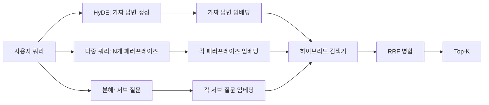

# 쿼리 재작성: HyDE, 다중 쿼리, 분해

> 사용자가 입력한 쿼리는 검색기가 원하는 쿼리가 아닙니다. 재작성은 검색 전에 간극을 메워, 인덱스가 정답에 더 가까운 형태를 보게 합니다.

**유형:** Build
**언어:** Python
**선수 요건:** 11단계 04강 (임베딩), 06강 (RAG); 19단계 B트랙 기초 (20-29강); 19단계 64강 및 65강
**시간:** 약 90분

## 학습 목표
- 가상 문서 임베딩(Hypothetical Document Embeddings, HyDE) 구현: 가짜 답변을 생성하고, 이를 임베딩하여 쿼리 벡터 대신 해당 벡터를 기준으로 검색합니다.
- 다중 쿼리 확장 구현: 하나의 쿼리를 N개의 패러프레이즈로 재작성하고, 각각으로 검색한 후 상호 랭킹 융합(RRF)으로 합집합을 병합합니다.
- 쿼리 분해 구현: 복잡한 질문을 하위 질문으로 분할하고, 하위 질문별로 검색한 후 병합합니다.
- 세 가지 재작성기를 고정된 테스트 데이터(fixtures)에서 직접 비교하고, 각 전략이 승리하는 시점을 설명합니다.
- 고정된 테스트 데이터에서 결정적인 출력(deterministic, on-fixture outputs)을 생성하는 모의 LLM을 연결하여, 재작성 루프가 오프라인에서 실행되도록 합니다.

## 문제점

사용자가 "업로드가 실패하고 예산이 소진되면 우리 팀은 무엇을 하나요?"라고 입력합니다. 코퍼스에 "AbortMultipartOnFail은 업로드가 실패하면 진행 중인 S3 다중 부분 업로드를 중단하고 버킷별 재시도 예산을 감소시킵니다"라는 문서가 있습니다. 쿼리와 문서가 명사구를 공유하지 않습니다. BM25는 놓칩니다. 바이인코더(bi-encoder)는 쿼리 벡터가 임베딩 공간의 특정 영역에 위치하여 취소된 작업에 대한 문서보다 중단된 업로드에 대한 문서를 선호하지 않기 때문에, 해당 문서를 3위 또는 4위로 순위를 매깁니다. 66강의 2단계 리랭킹은 해당 문서가 top-N에 포함되면 답을 구할 수 있지만, top-N에 포함되지 않으면 리랭커는 해당 문서를 볼 수 없습니다.

해결책은 쿼리가 검색기에 도달하기 전에 쿼리를 재작성하는 것입니다. 2023년 논문 "Precise Zero-Shot Dense Retrieval without Relevance Labels" (Gao et al.)는 HyDE를 도입했습니다: LLM에게 쿼리에 답할 문서를 작성하게 하고, 그 가상 문서를 임베딩하여 검색 벡터로 사용합니다. 가상 문서는 코퍼스의 어조로 작성되므로 임베딩 공간의 올바른 영역에 위치합니다. 쿼리 벡터는 그렇지 않았습니다.

두 가지 유사 기법이 HyDE와 짝을 이룹니다. 다중 쿼리 확장(Microsoft의 GraphRAG가 사용한 용어)은 쿼리의 N개 패러프레이즈를 생성하고 각각으로 검색한 후 병합합니다. 분해(2024년 Stanford DSPy 연구에서 "서브쿼리 분해"로 대중화됨)은 "업로드가 실패하고 예산이 소진되면 우리 팀은 무엇을 하는가"를 "업로드가 실패하면 어떻게 되는가"와 "재시도 예산이 소진되면 어떻게 되는가"라는 두 가지 질문으로 나눕니다. 두 번의 검색, 하나의 병합된 결과, 답변의 두 부분 모두에 도달할 수 있습니다.

이 강의는 세 가지를 모두 구현하고 동일한 픽스처 코퍼스에 대해 실행합니다.

## 개념



### HyDE 상세

HyDE는 사용자의 쿼리 벡터를 LLM이 작성한 가설적 문서 벡터로 대체합니다. 프롬프트는 짧습니다:

```
You are a domain expert. Write a one-paragraph passage that answers the question
below. Use the same vocabulary and phrasing the documentation in this domain would
use. Do not refuse. Do not say you do not know.

Question: {user_query}

Passage:
```

LLM의 답변은 LLM이 코퍼스를 알지 못하기 때문에 사실적 답변으로는 틀립니다. 이는 문제가 없습니다. 검색기는 사실적 정확성이 아니라 토큰 분포에만 관심이 있습니다. 가설적 지문은 "abort", "multipart", "bucket", "budget"라는 단어를 포함합니다. 이 주제에 대한 문서 지문이 그렇게 말하기 때문입니다. 그 지문을 임베딩하세요. 벡터는 실제 지문 근처에 위치합니다.

프로덕션에서는 가설적 문서를 두세 문장으로 제한합니다. 더 긴 가설은 더 많은 잡음을 수집합니다. 더 짧은 가설은 HyDE가 필요로 하는 어휘적 신호를 잃습니다.

### 다중 쿼리 확장 상세

사용자 쿼리의 N개 패러프레이즈를 생성합니다. 가장 간단한 프롬프트:

```
Rewrite the following question in {N} different ways. Each rewrite must preserve
the original intent. Number them 1 to {N}. Do not add explanations.
```

각 패러프레이즈에 대해 top-k를 검색합니다. N개의 랭킹된 목록을 RRF(65강의 동일한 알고리즘)로 병합합니다. 저렴하고, 병렬이며, 결정적입니다.

다중 쿼리는 사용자의 표현이 질문을 하는 여러 동등한 유효한 방법 중 하나이며, 어떤 재작성이든 더 잘 질문할 수 있을 때 승리합니다. 원문이 동일한 방식으로 나빴기 때문에 모든 재작성이 동등하게 나쁜 경우 패배합니다.

### 분해 상세

단일 검색은 다면적인 질문에 대한 요구를 충족할 수 없습니다. 분해는 LLM이 질문을 하위 질문으로 나누도록 요청하며, 시스템은 각 하위 질문에 대해 검색을 수행합니다. 프롬프트는 다음과 같습니다:

```
The following question may require information from multiple distinct topics.
Decompose it into a list of sub-questions. Each sub-question must be answerable
independently. If the question is already atomic, return it unchanged.

Question: {user_query}
```

하위 질문별로 검색하고 병합하세요. 분해는 접속사, 다중 절 비교, 또는 두 개의 관련 없는 주제를 포함하는 질문에 적합한 도구입니다. 원자적 질문에는 부적합한 도구입니다. 분해기의 역할은 단일 질문을 반환하는 것이며, 가짜 하위 질문을 만들어 내지 않아야 합니다.

### 세 가지가 모두 존재하는 이유

세 가지는 상호 보완적입니다. HyDE는 쿼리-코퍼스 토큰 간격을 연결합니다. 다중 쿼리는 패러프레이즈 변형을 다루며, 분해는 다중 주제 쿼리를 다룹니다. 프로덕션 시스템은 세 가지를 모두 실행하고 쿼리별로 전략을 선택합니다 (69강의 엔드투엔드 시스템이 셀렉터를 보여줍니다).

## Mock LLM

이 강의는 오프라인으로 실행됩니다. Mock LLM은 사용자 쿼리를 키로 하는 작은 조회 테이블과, 본 적이 없는 쿼리에 대한 폴백으로 구성됩니다. 조회 테이블에는 다음이 포함됩니다:

- 각 픽스처 쿼리에 대해: 작성된 가설적 패시지, 세 개의 패러프레이즈, 그리고 분해 결과.
- 알 수 없는 쿼리에 대해: 결정론적 변환을 수행합니다. 쿼리의 내용 단어를 추출하고, 동의어 맵을 통해 확장한 후 결과를 반환합니다.

Mock의 형태가 중요하며, 데이터는 중요하지 않습니다. 프로덕션에서는 Mock을 실제 모델 호출로 교체합니다. 리트리버는 변경되지 않습니다.

```figure
cd-hyde-vector
```

## 구현하기

`code/main.py`는 다음을 구현합니다:

- `MockLLM` - 위에서 설명한 결정론적 대체 수단.
- `HyDERewriter` - LLM을 호출하여 가설적 문서를 작성하고, 리트리버가 사용해야 할 가설적 텍스트와 쿼리를 포함하는 `RewriteResult`으로 리라이터의 출력값을 반환합니다.
- `MultiQueryRewriter` - LLM을 호출하여 N개의 패러프레이즈를 생성하고, 쿼리 목록을 반환합니다.
- `DecomposeRewriter` - LLM을 호출하여 분해하고, 하위 질문을 반환합니다.
- `retrieve_with_rewriter` - 리라이터와 리트리버를 받아 재작성을 실행하고, 결과를 융합합니다.
- 픽스처에 세 가지 리라이터를 실행하고, 어떤 전략이 정답 문서를 가장 먼저 반환했는지 출력하는 데모.

리트리버의 형태는 65강에서 재사용됩니다 (하이브리드 BM25 + 밀집 검색). 융합은 동일한 RRF입니다. 유일한 새로운 형태는 리라이터 인터페이스이며, 이는 작습니다.

실행해 보세요:

```bash
python3 code/main.py
```

출력은 전략별 순위와 최종 요약입니다. 표현 불일치 쿼리에서는 HyDE가 승리합니다. 다중 쿼리는 패러프레이즈 변형 쿼리에서 승리합니다. 분해는 다중 주제 쿼리에서 승리합니다. 폴백(리라이터 없음)은 세 가지 중 적어도 하나에서 패배합니다.

## 데모가 숨기는 실패 모드

**HyDE가 코퍼스 특식 식별자를 잘못 환각합니다.** 모델이 함수 이름을 만들어냅니다. 가설의 BM25 점수가 올바른 문서에서 급락합니다. 만들어낸 이름이 인덱스에 존재하지 않는 고가중치 토큰이 되기 때문입니다. 가설의 길이를 제한하고 융합 시 BM25 가중치를 낮추세요.

**다중 쿼리 리라이팅이 모두 수렴합니다.** 약한 모델은 세 개의 거의 동일한 패러프레이즈를 생성합니다. N번의 검색이 동일한 top-k를 반환합니다. RRF 병합은 단일 검색보다 낫지 않습니다. 리라이팅 프롬프트에 명시적인 다양성 지시를 추가하고 자카드(Jaccard)로 중복을 감지하세요.

**분해가 과분할합니다.** 분해기가 원자적 질문을 목록으로 만듭니다. 모든 검색이 동일한 문서를 반환하지만 순위가 낮아집니다. 병합 결과가 원본보다 나빠집니다. 팬아웃 전에 "이 하위 질문들이 충분히 다른가"를 확인하는 패스를 통해 이를 감지하세요.

**레이턴시가 곱해집니다.** HyDE는 LLM 호출 한 번이 필요합니다. 다중 쿼리는 N개의 리라이팅을 생성하는 LLM 호출 한 번, 그 후 N번의 검색이 필요합니다. 분해는 분해하는 LLM 호출 한 번, 그 후 M번의 검색이 필요합니다. 검색은 병렬로 실행되지만, LLM 호출이 하한선입니다.

## 사용하기

프로덕션 패턴:

- 쿼리 길이에 따른 전략별 선택: 원자적 짧은 쿼리는 다중 쿼리, 복잡한 다중 절 쿼리는 분해, 전문 용어가 많은 쿼리는 HyDE를 사용합니다.
- 쿼리 해시로 리라이터 출력을 캐시하세요. 많은 쿼리가 반복됩니다.
- 세 가지를 병렬로 실행하고 세 결과 집합을 RRF로 하나로 융합하세요. 비용은 LLM 호출 세 번과 융합 한 번이며, 품질은 세 전략의 커버리지 합집합입니다.

## 출시하기

69강은 65강의 리트리버와 66강의 리랭커 앞에 이 리라이터 단계를 연결합니다. 68강은 리라이터가 검색 재현율에 추가하는 상승분을 평가합니다.

## 연습 문제

1. RAG-Fusion (2024년 다중 쿼리 변형)을 구현해 보세요. 리라이터의 패러프레이즈가 의도적으로 다양하도록 한 후, 재랭킹 단계(66강)에서 최종 목록을 선택합니다.
2. 네 번째 전략을 추가하세요: 스텝백 프롬팅(더 일반적인 질문을 LLM에 요청하고, 이를 검색한 후 좁혀 나가는 방식)을 적용해 보세요. 픽스처에서 비교해 보세요.
3. 분해기가 원자적 쿼리를 인식하도록 "질문이 원자적인가" 헤드를 추가하여 학습하세요. 과분할률을 전후로 측정하세요.
4. 목(mock) LLM을 실제 모델 호출로 교체하세요. 스택에서 전략별 지연 시간을 측정하세요.
5. 각 리라이팅에 신뢰도 점수를 추가하세요. 임계값 미만의 리라이팅은 제거하세요. 재현율에 미치는 영향을 측정하세요.

## 핵심 용어

| 용어 | 사람들이 말하는 것 | 실제 의미 |
|------|-----------------|------------------------|
| HyDE | "가짜 문서 검색" | LLM이 답변을 작성하고, 쿼리 대신 이를 임베딩하여 검색 |
| 다중 쿼리 | "패러프레이즈 확장" | 쿼리의 N개 리라이팅; N번 검색하고 RRF로 병합 |
| 분해 | "하위 쿼리 분할" | 다중 주제 쿼리를 하위 질문으로 분할하여 각각 검색 |
| 원자적 쿼리 | "단일 주제" | 가짜 하위 질문을 만들어내지 않고는 분해할 수 없음 |
| 스텝백 | "쿼리 추상화" | 더 일반적인 질문을 요청하고, 검색한 후 좁혀 나감 |

## 추가 읽기

- Gao, Ma, Lin, Callan, "Precise Zero-Shot Dense Retrieval without Relevance Labels" (HyDE), 2023
- Microsoft Research, "Multi-Query Expansion for Retrieval"
- Stanford DSPy, "Subquery Decomposition for Multi-Hop QA"
- [LlamaIndex query transformations documentation](https://docs.llamaindex.ai/en/stable/optimizing/advanced_retrieval/query_transformations/)
- 11단계 07강 - 고급 RAG 패턴
- 19단계 65강 - 이 리라이터가 공급하는 검색기
- 19단계 68강 - 리라이터의 성능 향상을 측정하는 평가
