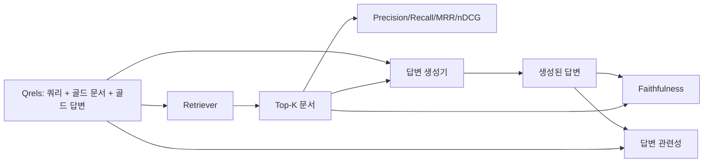

# RAG 평가: 정밀도, 재현율, MRR, nDCG, 충실성, 답변 관련성

> 검색과 답변을 동시에 채점할 수 없다면 시스템을 출시할 수 없습니다. 두 가지는 같은 지표가 아니며, 같은 프롬프트가 서로 다른 축에서 실패합니다.

**유형:** Build
**언어:** Python
**선수 요건:** 11단계 06강 (RAG), 10강 (평가); 19단계 Track B 기초 (20-29강); 19단계 64강, 65강, 66강, 67강
**시간:** 약 90분

## 학습 목표
- 골드 qrels에서 네 가지 검색 지표(precision@k, recall@k, MRR (평균 역 랭킹), nDCG@k)를 계산합니다.
- 두 가지 답변 채점 지표(충실성(모든 주장이 검색된 컨텍스트에 근거함)과 답변 관련성(답변이 질문에 응답함))를 계산합니다.
- 평가가 끝에서 끝까지 읽는 fixture qrels 파일(쿼리, 골드 문서 ID, 골드 답변 텍스트)을 구축합니다.
- 지표 값을 읽어 파이프라인이 실패하는 위치(검색, 랭킹, 생성, 그라운딩)를 진단합니다.

## 문제점

RAG 시스템에는 최소한 네 개의 이동 부분이 있습니다: 청커, 리트리버, 리랭커, 생성기. 이들 중 어느 것이든 잘못된 답변의 원인이 될 수 있습니다. 단계별 지표가 없다면 눈이 가려진 채로 날고 있는 셈입니다.

사용자가 잘못된 답변을 보고합니다. 청커가 답변 범위를 잘랐기 때문일까요? 리트리버가 top-k에 청크를 포함하지 않았기 때문일까요? 리랭커가 올바른 청크를 위치 1 너머로 밀어냈기 때문일까요? 생성기가 청크를 무시하고 무언가를 지어냈기 때문일까요? 답변만으로는 알 수 없습니다. 다음이 필요합니다:

- 리트리버에서 나온 결과를 채점하기 위한 검색 지표.
- 올바른 청크가 순서에서 어디에 있었는지 채점하기 위한 랭킹 지표.
- 생성기가 검색된 컨텍스트 안에 머물렀는지 채점하기 위한 충실성.
- 답변이 질문에 응답하는지 채점하기 위한 답변 관련성.

이 강의는 fixture qrels 파일 위에 이 여섯 가지를 모두 구축합니다. 평가는 오프라인이며 결정적입니다. 프로덕션에서는 mock LLM-as-judge를 실제 것으로 교체합니다.

## 개념



### Precision@k

리트리버가 반환한 상위 k개 문서 중 골드셋(gold set)에 포함된 문서의 비율은 얼마입니까? 골드셋에 세 개의 문서가 있고 상위 3개 중 두 개가 골드셋에 속하고 하나가 잘못된 경우, precision@3은 2 / 3입니다. 관련 없는 검색 청크의 비용이 높을 때 precision을 사용하세요 (생성기가 해당 청크에 토큰을 낭비하거나, 청크가 답변을 오염시키는 경우).

### Recall@k

골드 문서 중 상위 k개에 포함된 문서의 비율은 얼마입니까? 골드셋에 세 개의 문서가 있고 상위 5개에 세 개가 모두 포함되면 recall@5는 1.0입니다. 놓친 답변의 비용이 높을 때 recall을 사용하세요 (답변 청크를 완전히 놓치는 것보다 불필요한 청크를 하나 더 보는 것이 낫다면).

프로덕션 RAG에서는 일반적으로 recall@k를 지표로 인용합니다. 생성기는 관련 없는 청크를 쉽게 버릴 수 있지만, 본 적 없는 청크로부터 답변을 만들어낼 수는 없습니다.

### MRR (평균 역순위)

각 쿼리에 대해 랭킹된 목록에서 첫 번째 관련 문서의 위치를 찾습니다. 역순위(reciprocal rank)는 1 / 위치입니다. 쿼리 세트 전체의 평균을 계산합니다. MRR은 리트리버가 최선의 답변을 최상위에 얼마나 잘 배치하는지를 단일 숫자로 요약한 지표입니다.

MRR은 위치 1을 가중치 높게 반영합니다. 골드 문서가 랭크 1에 있는 쿼리는 1.0을 기여합니다. 랭크 2는 0.5를 기여합니다. 랭크 10은 0.1을 기여합니다. 이 지표는 목록의 상위에 의해 지배됩니다.

### nDCG@k

정규화 할인 누적 이득(Normalized Discounted Cumulative Gain). 전체 공식은 각 검색된 문서에 이득을 할당하고 (관련된 경우 보통 1, 아닌 경우 0), 위치의 로그로 할인하며, 합산하고, 이상적인 DCG (완벽하게 랭킹했을 경우의 DCG)로 나눕니다. 범위는 0에서 1입니다.

nDCG는 단계적 관련성을 수용합니다. 골드셋은 "문서 A는 3, 문서 B는 2, 문서 C는 1"이라고 말할 수 있습니다. MRR과 recall@k는 모든 것을 이진(binary)으로 평탄화합니다. 쿼리마다 부분적으로 관련 있는 여러 문서가 있는 코퍼스를 사용할 때 nDCG를 사용하세요.

### 충실성

생성된 답변의 각 주장을 대해, 그 주장이 검색된 컨텍스트에 의해 지원되는지 확인합니다. 표준 구현은 (claim, context)를 받아 예 또는 아니오를 반환하는 LLM-as-judge 프롬프트를 사용합니다. 지표는 통과한 주장의 비율입니다.

충실성(Faithfulness)은 모델이 내용을 만들어내는 생성기 실패 모드를 포착합니다. 검색기가 올바른 청크를 반환했더라도 환각(Hallucination)을 일으키는 생성기는 결함 있는 것입니다. 충실성은 근거성(Groundedness), 지원(Support), 귀속(Attribution)이라고도 불립니다.

이 강의는 검색된 컨텍스트와 각 주장의 토큰이 임계값 이상 겹치는지 확인하는 결정론적 목(mock) 판정자를 사용하여 충실성을 구현합니다. 프로덕션에서는 실제 모델 호출로 교체합니다. 지표의 형태는 동일합니다.

### 답변 관련성

답변이 실제로 질문에 대응합니까? 충실성은 "답변이 컨텍스트에 근거하고 있는가?"를 묻습니다. 답변 관련성은 "답변이 질문에 근거하고 있는가?"를 묻습니다. 충실하지만 주제에서 벗어난 답변은 충실성 점수가 높고 관련성 점수가 낮습니다. 컨텍스트를 무시하는 짧고 주제에 맞는 답변은 관련성 점수가 높고 충실성 점수가 낮습니다.

표준 구현은 LLM-as-judge도 사용합니다: (질문, 답변)을 받아 답변이 질문에 대응하는지 물어봅니다. 이 강의는 토큰 겹침과 판정자 대체 구현을 사용합니다.

## qrels 픽스처

```python
{
  "qid": "q1",
  "query": "what is the abort threshold for multipart uploads",
  "gold_doc_ids": ["d1", "d3"],
  "gold_answer_substring": "three failed parts",
  "graded_relevance": {"d1": 3, "d3": 2},
}
```

각 쿼리에는 다음이 포함됩니다:
- 쿼리 문자열,
- 골드 문서 ID 집합 (정밀도 / 재현율 / MRR용),
- 등급화된 관련성 사전 (nDCG용),
- 골드 답변 부분 문자열 (각 qrel에 참조 메타데이터로 유지; 이 강의의 충실성은 추출된 주장을 검색된 컨텍스트와 비교하여 판정하며, 이 부분 문자열과 비교하지는 않습니다).

프로덕션에서는 이러한 항목에 라벨을 붙입니다. 이 강의는 평가가 즉시 실행되도록 수동으로 만든 픽스처를 제공합니다.

```figure
ci-rag-metric-ladder
```

## 구현하기

`code/main.py`는 다음을 구현합니다:

- `precision_at_k(retrieved, gold, k)` - 문자 그대로의 정의.
- `recall_at_k(retrieved, gold, k)` - 문자 그대로의 정의.
- `mean_reciprocal_rank(retrieved_list_of_lists, gold_list)` - 쿼리에 대한 평균.
- `ndcg_at_k(retrieved, graded_relevance, k)` - 이진 또는 등급화된 이득을 사용하는 DCG / IDCG.
- `extract_claims(answer)` - 답변을 문장 형태의 주장으로 분할합니다.
- `faithfulness(claims, context_texts, judge)` - 지원된다고 판정된 주장의 비율.
- `answer_relevance(question, answer, judge)` - 답변이 질문에 대응하는지 판정합니다.
- `MockJudge` - 평가가 오프라인으로 실행되도록 하는 결정론적 토큰 겹침 판정자.
- `evaluate_pipeline(pipeline_fn, qrels, ks)` - 모든 메트릭을 실행하는 오케스트레이터입니다.
- qrels에 대해 세 가지 파이프라인 변형(청커 기반, 하이브리드 검색, 하이브리드 + 리랭크)을 실행하고 메트릭 테이블을 출력하는 데모입니다.

실행해 보세요:

```bash
python3 code/main.py
```

출력 결과는 각 변형에 대한 precision@k, recall@k, MMR, nDCG@k, 충실도(faithfulness), 답변 관련성을 단일 메트릭 테이블로 보여줍니다. 하이브리드 검색 행은 recall에서 청커 기반보다 우월하며, 리랭크 행은 MMR에서 하이브리드보다 우월합니다.

## 메트릭을 읽어 실패를 진단하기

| 증상 | 가능한 원인 | 수정 사항 |
|---------|-------------|-------------|
| 낮은 recall@k, 낮은 precision@k | 청커가 답변을 잘라냈거나 검색기가 답변을 찾지 못함 | 청커 경계(64강) 또는 검색기 모달리티(65강) |
| 적절한 recall@k, 낮은 MMR | 올바른 청크가 top-k에 포함되었지만 위치 1이 아님 | 리랭커(66강) |
| 높은 MMR, 낮은 충실도 | 생성기가 올바른 컨텍스트에도 불구하고 내용을 만들어냄 | 생성 프롬프트; 인용 강제 또는 거절 |
| 높은 충실도, 낮은 관련성 | 답변은 근거가 있지만 주제에서 벗어남 | 쿼리 재작성기(67강) 또는 생성 프롬프트 |
| 네 가지 모두 높지만 사용자가 여전히 불평함 | 평가 세트가 대표성이 없음 | 실제 사용자 쿼리로 qrels 확장 |

## 데모가 숨기는 실패 모드

**LLM-as-judge 편향.** 모델이 자신의 출력을 실제보다 더 충실하다고 판단합니다. 생성기와 다른 모델 계열을 판정자로 사용하거나, 샘플을 수동으로 채점해 보세요.

**Qrels 노후화.** 코퍼스가 변경됨에 따라 골드(gold) 답변이 변합니다. 2024년 1월에 q1의 골드였던 문서가 팀이 함수 이름을 변경했기 때문에 2024년 10월에는 더 이상 올바른 답변이 아닙니다. 분기별 qrels 검토를 예약하세요.

**충실도 미세 검사가 거시적 주장을 놓침.** 문장 단위 충실도는 통과할 수 있지만, 전체 답변의 구조가 오해를 불러일으킬 수 있습니다. 자동화된 메트릭 위에 샘플 단위 정성적 검토를 추가하세요.

**Recall@k가 쿼리별 실패를 가림.** 평균 recall이 90%인 경우, 특정 쿼리 클래스가 항상 실패하는 사실을 숨길 수 있습니다. qrels를 쿼리 클래스(직접 표현, 패러프레이즈, 다중 주제)별로 슬라이스하고 슬라이스별로 보고하세요.

## 사용하기

프로덕션 패턴:

- 모든 리트리버(retriever) 또는 생성기(generator) 변경 시마다 평가를 실행하세요. recall@k의 회귀(regression)는 테스트 실패로 취급하세요.
- 쿼리별로 지표 추적(metric trace)을 저장하세요. 사용자가 불만을 제기할 때, 일치하는 qrels 항목을 찾아 이것이 포착되었을지 확인하세요.
- qrels를 계층화(tier)하세요: CI에서 실행되는 20개 쿼리의 스모크(smoke) 세트, 야간(nightly)에 실행되는 200개 쿼리의 회귀(regression) 세트, 주간(weekly)에 실행되는 2000개 쿼리의 딥(deep) 세트.

## 출시하기

69강은 전체 파이프라인(청커(chunker), 리트리버(retriever), 리랭커(reranker), 생성기(generator))을 연결하고 이 평가를 엔드투엔드(end-to-end) 시스템에 대해 실행합니다.

## 연습 문제

1. 다섯 번째 검색 지표로 hit-rate@k를 추가하세요. recall@k와 비교하세요. 두 지표가 서로 다른 시점을 설명하세요.
2. 단계적 충실도(graded faithfulness)를 구현하세요: 0 (지원되지 않음), 1 (부분적으로 지원됨), 2 (전체적으로 지원됨). 지표에 accordingly 업데이트하세요.
3. 목(mock) 판정(judge)을 실제 모델 호출로 교체하세요. 픽스처(fixture)에서 목 판정과 실제 판정 간의 불일치를 측정하세요.
4. 쿼리 클래스 슬라이스(slice) ("literal", "paraphrased", "multi-topic")를 추가하세요. 슬라이스별 지표를 보고하세요.
5. "답변 길이(answer length)" 지표를 추가하고 충실도(faithfulness)와 상관관계를 분석하세요. 곡선을 플롯(plot)하세요.

## 핵심 용어

| 용어 | 사람들이 말하는 것 | 실제 의미 |
|------|-----------------|------------------------|
| Precision@k | "검색된 것에 대한 히트율" | top-k 중 gold인 비율 |
| Recall@k | "gold에 대한 히트율" | top-k에 포함된 gold의 비율 |
| MRR | "첫 히트 위치" | 첫 번째 관련 문서의 순위의 역수(1 / rank)의 평균 |
| nDCG@k | "단계적 랭킹 품질" | top-k의 DCG를 이상적 DCG로 나눈 값 |
| 충실도(Faithfulness) | "그라운딩(Groundedness)" | 검색된 컨텍스트에 의해 지원되는 답변 주장의 비율 |
| 답변 관련성(Answer relevance) | "질문에 답했는가?" | 답변이 질문의 의도와 일치하는지 여부 |
| Qrels | "Gold 레이블" | 쿼리와 그 gold 문서 및 답변이 레이블링된 세트 |

## 추가 읽기

- Buckley, Voorhees, "Evaluating Evaluation Measure Stability", SIGIR 2000 - 랭킹 지표에 관한 표준 논문
- Jarvelin, Kekalainen, "Cumulated Gain-based Evaluation of IR Techniques" - nDCG 논문
- [Ragas: Automated Evaluation of RAG Pipelines](https://docs.ragas.io)
- [Anthropic, Introducing Contextual Retrieval](https://www.anthropic.com/engineering/contextual-retrieval) - 1에서 recall@20를 뺀 값으로 검색 점수를 산출합니다
- 11단계 10강 - 평가 프레임워크의 기초
- 19단계 64-67강 - 여기서 평가되는 구성 요소
- 19단계 69강 - 이 평가가 채점하는 엔드투엔드 파이프라인
