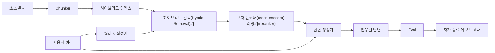

# 엔드투엔드 RAG (검색 증강 생성)(RAG (Retrieval-Augmented Generation)) 시스템

> 여섯 개의 구성 요소 강의. 하나의 파이프라인. 하나의 평가 루프. 하나의 자가 종료 데모. 이것이 여러분이 출시하는 시스템입니다.

**유형:** Build
**언어:** Python
**선수 요건:** 11단계 06강 (RAG (검색 증강 생성)(RAG (Retrieval-Augmented Generation))), 10강 (평가(Evaluation (Eval))); 19단계 Track B 기초 (20-29강); 19단계 64강, 65강, 66강, 67강, 68강
**시간:** 약 90분

## 학습 목표
- 청커(chunker), 하이브리드 검색(Hybrid Retrieval)기, 쿼리 재작성기, 교차 인코더(cross-encoder) 리랭커(reranker), 답변 생성기를 하나의 엔드투엔드 파이프라인으로 구성하세요.
- 청크 앵커(chunk anchor)로 주장을 인용하고, 낮은 신뢰도 시 거절(refuse-on-low-confidence) 폴백(fallback)을 사용하는 답변 생성기를 구현하세요.
- 68강의 평가(Evaluation (Eval))를 조립된 파이프라인에 실행하고, 동일한 구성 요소를 개별적으로 사용했을 때보다 모든 지표에서 단계별 빌드가 승리함을 증명하세요.
- 픽스처(corpus)를 입력하고 고정된 쿼리 세트를 실행하며, 요약 보고와 함께 0으로 종료하는 자가 종료 CLI 데모를 구축하세요.

## 문제점

여섯 개의 구성 요소를 개별적으로 검증하는 것은 아무것도 증명하지 못합니다. 청커(chunker)는 코퍼pus에 대해 recall@5에서 승리할 수 있지만, 검색(retriever)이 청커가 생성한 결과를 랭킹할 수 없기 때문에 시스템의 recall@5에서는 실패할 수 있습니다. 리랭커(reranker)는 합성된 후보 풀에서 MRR (최대 주변 관련성)(Maximum Marginal Relevance (MMR))을 높일 수 있지만, 리랭크 예산에서의 바이인코더(bi-encoder)의 recall이 너무 낮기 때문에 실제 바이인코더 후보에서는 실패할 수 있습니다. 쿼리 재작성기는 단일 쿼리에서 골드(gold) 문서를 상위에 올릴 수 있지만, LLM mock가 퇴화된 가설을 반환하기 때문에 다음 쿼리에서는 실패할 수 있습니다.

통합 테스트는 동일한 픽스처 qrels, 동일한 지표로 파이프라인 전체를 엔드투엔드로 실행하는 것이며, 모든 것을 연결하는 하나의 오케스트레이션(Orchestration) 파일이 필요합니다. 이것이 이 강의가 구축하는 것입니다. 통합된 파이프라인의 지표가 각 단계의 개별 데모 지표보다 높다면, 시스템을 증명하는 것입니다.

## 개념



### 연결 선택

파이프라인은 작은 그래프입니다. 각 단계는 명확한 시그니처를 가진 함수입니다.

| 단계 | 입력 | 출력 |
|-------|-------|--------|
| 청커 | 문서 텍스트 | 청크 레코드 목록 |
| 리트리버 | 쿼리 문자열 | 상위 N개 청크 레코드 |
| 리라이터 (선택) | 쿼리 문자열 | 재작성 목록 + 가설 |
| 리랭커 | 쿼리, 후보 | 교차 점수가 포함된 상위 K개 청크 레코드 |
| 생성기 | 쿼리, 상위 K개 청크 레코드 | 인용이 포함된 답변 문자열 |

각 시그니처가 안정적이면 구성이 단순합니다. 이 강의의 `Pipeline` 클래스는 5개 단계와 `query` 메서드를 포함하며, 이 메서드는 단계들을 순서대로 실행합니다. 모든 단계는 교체 가능합니다: 다른 청커, 리트리버, 리라이터, 리랭커, 또는 생성기를 전달해도 파이프라인은 계속 실행됩니다.

### 인용이 포함된 답변 생성기

생성기는 마지막 단계이며 가장 쉽게 깨질 수 있습니다. 이 강의는 결정론적 목업(mock) 생성기를 제공합니다. 이 생성기는:

1. 상위 K개 리랭킹된 청크를 가져옵니다.
2. 쿼리와 가장 높은 콘텐츠 토큰 중복을 가진 청크를 최대 두 개까지 선택합니다.
3. 선택된 각 청크에서 한 문장을 추출하여 연결한 답변을 생성하며, 각 문장 뒤에 `[doc_id:chunk_index]` 앵커를 붙입니다.
4. 거절 임계값 이상의 중복을 가진 청크가 없으면 인용 없이 "모르겠습니다"를 출력합니다.

프로덕션에서는 목업을 프롬프트 템플릿을 사용하는 실제 LLM 호출로 교체합니다:

```
You are answering a question using only the snippets below.
Cite every claim with the anchor in parentheses.
If the snippets do not answer the question, say "I do not know".

Question: {query}

Snippets:
{enumerated chunks with anchors}

Answer:
```

낮은 신뢰도 시 거절하는 경로가 교차 인코더의 순위 1 점수를 기록하는 이유입니다. 이 점수가 코퍼스 임계값 아래에 있으면 생성기가 거절합니다. 이는 환각된 답변에 대한 안전 밸브입니다.

### 자기 종료 데모

데모는 모든 것을 끝에서 끝까지 실행합니다. 하나의 쿼리에 대한 단계별 세부 정보를 출력하고, 4개 fixture qrels에 대한 평가를 실행하며, 지표 테이블을 출력합니다. 그리고 68강의 모든 지표가 데모에 설정된 임계값을 충족하면 상태 코드 0으로 종료합니다. 만약 어떤 지표가 임계값 아래에 있으면, 데모는 비-0 상태로 종료하며 실패한 지표의 이름을 명시한 메시지를 출력합니다.

이것은 CI 스모크 테스트가 취하는 형태입니다. 파이프라인은 오프라인에서, 빠르게, 결정적으로 실행됩니다. 임계값은 픽스처에 대해 의도적으로 엄격하게 설정되어 있어, 6개 강의 중 어느 곳에서 회귀가 발생해도 데모가 실패합니다.

```figure
rag-pipeline-flow
```

## 구현하기

`code/main.py`는 다음을 구현합니다:

- `Chunk` - 모든 단계를 통해 전달되는 레코드 (4강의 형태에 chunk_index와 source doc_id를 확장하여 포함합니다).
- `Chunker` - 4강의 전략을 선택합니다 (기본값은 재귀적 분할).
- `HybridIndex` - 5강의 BM25 + 밀집 검색 + RRF를 묶습니다.
- `Rewriter` (선택적) - 쿼리 길이와 접속사 존재 여부에 따라 7강의 HyDE, 다중 쿼리, 분해 중 하나를 선택합니다.
- `Reranker` - 6강의 학습된 교차 인코더로, 더 작은 픽스처 학습 세트를 사용하여 몇 초 안에 수렴합니다.
- `Generator` - 인용문과 낮은 신뢰도 시 거절 기능을 갖춘 결정적 목(mock) 생성기입니다.
- `Pipeline` - `query(question)` 메서드를 통해 5개 단계를 조합하며 `Result(answer, top_k, latency_ms_per_stage)`를 반환합니다.
- `run_demo()` - 코퍼스를 흡수하고, 세 개의 픽스처 쿼리를 실행하고, 평가를 수행하고, 결과를 출력하고, 임계값에 따라 종료 코드를 설정합니다.

실행해 보세요:

```bash
python3 code/main.py
```

출력은 하나의 인쇄된 쿼리 추적, 전체 평가 표, 그리고 최종 통과/실패 상태입니다. 픽스처에서는 종료 코드 0을 반환합니다.

## 데모가 숨기는 실패 모드

**청커 경계 드리프트.** 평가 qrels 라벨링 패스와 데모 사이에서 청커 전략을 교체하면, 골드 문서 ID가 더 이상 일치하지 않습니다. qrels 파일에서 청커 전략을 고정하세요. 데모에는 청커 이름을 명시하는 헤더가 포함되어 있습니다.

**리랭커 학습 세트가 평가에 유입됨.** 6강의 14개 학습 삼중항은 평가 쿼리와 유사한 쿼리를 포함합니다. 프로덕션에서는 평가 쿼리를 엄격하게 제외하세요. 데모의 평가 쿼리는 리랭크 학습 세트와 의도적으로 분리되어 있습니다.

**목(mock) 생성기가 환각 위험을 숨김.** 목은 검색된 청크에서 텍스트만 생성하므로 환각을 일으킬 수 없습니다. 강의는 이 점을 명시하며, 프로덕션 교체 경로를 실제 모델로 지정합니다.

**스트리밍 없음.** 파이프라인은 모든 단계가 끝날 때 전체 답변을 반환합니다. 프로덕션 시스템은 생성기의 출력을 스트리밍할 것입니다. 스트리밍은 범위 밖이며, 답변 등급 지표는 어느 쪽이든 최종 문자열에 대해 작동합니다.

**레이턴시는 오프라인입니다.** 목업 LLM 호출은 상수 시간입니다. 실제 LLM 호출이 지배적입니다. 요청 범위 내에서 레이턴시 예산을 계획하세요. 강의의 단계별 타이밍은 CPU 작업만 측정합니다.

## 사용하기

프로덕션 패턴:

- 명시적인 단계 인터페이스를 가진 단일 오케스트레이터 아래에 파이프라인 파일을 출시하세요. 저장소 전체에 배선을 분산하지 마세요.
- 단계에 영향을 미치는 모든 병합 전에 평가를 실행하세요. 평가 점수가 떨어지면 병합이 적용되지 않습니다.
- CI 실행마다 지표 추적을 영속화하여 단계 교체로 인한 회귀를 추적할 수 있도록 하세요.
- 30초 미만으로 실행되는 20개 쿼리 스모크 세트(회귀 세트의 하위 집합)를 추가하세요. 전체 회귀 세트는 야간에 실행됩니다.

## 출시하기

이 강의의 파이프라인 파일은 19단계의 Track F 강의들이 가정하는 형태입니다. 이후 강의들은 데이터 수집 자동화, 증분 재인덱싱, 텔레메트리, 서빙 계층을 추가할 것입니다. 검색, 리랭킹, 재작성, 평가 부분은 여기서 완료됩니다.

## 연습 문제

1. 재작성기 내부에 쿼리별 전략 선택기를 추가하세요. 67강의 휴리스틱(길이, 접속사, 전문 용어 비율)이 HyDE, 다중 쿼리, 분해를 선택합니다.
2. 환경 플래그 뒤에 생성기를 위한 실제 LLM 호출을 추가하세요. 기본값은 목업입니다. 레이턴시 델타를 측정하세요.
3. 데모가 `--corpus path` 플래그를 받아 실제 코퍼스를 로드하도록 확장하세요. 평가와 임계값 검사를 다시 실행하세요.
4. 청커에 `--strategy` 플래그를 추가하세요. 각 전략이 엔드투엔드 재현율에 기여하는 정도를 측정하세요.
5. 스트리밍 생성기 인터페이스를 추가하고 평가에 연결하세요. 충실도가 스트리밍된 접두어가 아닌 최종 문자열에 대해 계산되는지 확인하세요.

## 핵심 용어

| 용어 | 사람들이 말하는 것 | 실제 의미 |
|------|-----------------|------------------------|
| 파이프라인 | "RAG 파이프라인" | 데이터 수집부터 인용된 답변까지의 조합된 단계 |
| 인용 앵커 | "출처 링크" | 각 주장에 연결된 (doc_id, chunk_index) 참조 |
| 낮은 신뢰도 시 거절 | "모르겠습니다" | 리랭커의 top-1 점수가 임계값 미만일 때 생성기가 답변을 반환하지 않음 |
| 스모크 세트 | "CI 평가" | 모든 PR 체크에서 실행되는 최소 qrels 하위 집합 |
| 단계 인터페이스 | "함수 시그니처" | 각 파이프라인 단계의 안정된 입력 및 출력 타입 |

## 추가 읽기

- [Anthropic, Building search and retrieval](https://www.anthropic.com/news/contextual-retrieval)
- [Pinterest, MCP internal search](https://medium.com/pinterest-engineering) - 프로덕션 아키텍처 참조
- [Ragas: Automated Evaluation of RAG Pipelines](https://docs.ragas.io)
- 11단계 06강 - RAG 기초
- 19단계 64-68강 - 여기서 조합된 구성 요소
