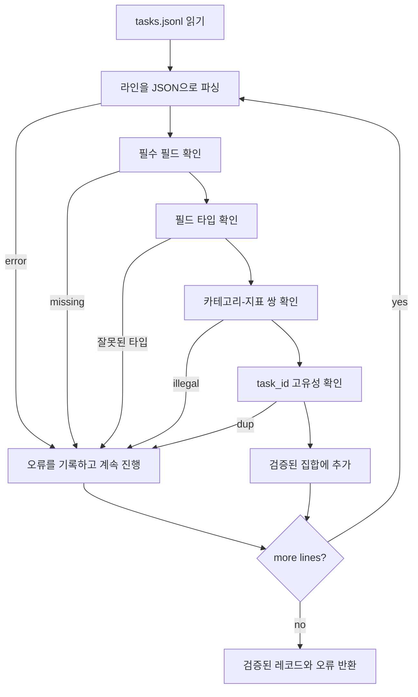

# 작업 사양 형식

> 평가 하네스는 작업이 준수하는 계약의 품질만큼만 좋습니다. 단일 채점 함수를 작성하기 전에 JSONL 형식과 지표 용어를 고정하세요.

**유형:** Build
**언어:** Python
**선수 요건:** 19단계 Track B 기초
**시간:** 약 90분

## 학습 목표

- 산술, 객관식, 코드 실행, 분류 및 자유 텍스트 요약 등 모든 유형을 하나의 형식으로 다루는 JSONL 작업 레코드 스키마를 정의하세요.
- 지표 이름의 폐쇄적 어휘를 고정하여 후속 강의(71-73)가 단일 필드만으로 분기 처리할 수 있도록 하세요.
- 소수 예시(Few-Shot)와 후처리 규칙을 러너가 아닌 작업의 일부로 지정하여, 동일한 프롬프트가 모델에 관계없이 동일한 목표를 생성하도록 하세요.
- 잘못된 레코드가 러너에 도달하기 전에 거부하는 엄격한 검증기를 구현하세요.
- 사양의 모든 분기를 다루는 10개 작업 픽스처 세트를 출시하여, 검증기가 실제로 처리할 수 있는 데이터를 제공하세요.

```figure
ci-task-spec-gate
```

## 사양을 고정하는 이유

연구용 코드베이스는 테스트보다 평가 스크립트를 더 빠르게 축적합니다. 6개월이 지나면 모든 노트북이 자체 JSON 형식을 가지며, 모든 지표가 두 번 재구현되고, 실행 간 비교가 불가능해집니다. 해결책은 단순합니다. 스키마를 선택하고, 검증기를 작성하고, 나머지는 거부하세요. 이 강의가 바로 그 일을 합니다.

이 형식은 BIG-bench, HELM 및 lm-eval 스타일 하네스의 아이디어를 차용하지만, 필드 이름은 우리 것입니다. 모든 필드에는 단일 소유자가 있습니다. 러너는 작업을 읽고, 지표는 목표를 읽으며, 후처리 단계는 생성물을 정규화합니다. 파이프라인 중간에 변경 가능한 필드는 없습니다.

## 레코드 형식

작업은 한 줄의 JSON 객체입니다. 하네스는 `tasks.jsonl`을 읽고 각 줄을 독립적으로 검증합니다. 잘못된 줄은 해당 레코드를 중단시키며, 전체 실행을 중단시키지는 않습니다.

```json
{
  "task_id": "arith_001",
  "category": "arithmetic",
  "prompt": "Compute the result. Question: 17 + 24\nAnswer:",
  "targets": ["41"],
  "metric_name": "exact_match",
  "few_shot_examples": [
    {"prompt": "Question: 2 + 2\nAnswer:", "completion": "4"}
  ],
  "post_process": "strip_whitespace",
  "metadata": {"difficulty": "easy"}
}
```

필수 필드는 `task_id`, `category`, `prompt`, `targets`, `metric_name`, `post_process`입니다. `few_shot_examples`과 `metadata`은 선택 사항입니다. 알 수 없는 최상위 필드는 검증에 실패합니다.

## 필드 규칙

`task_id`은 공백이 없는 문자열입니다. 검증기는 파일 전체에서 고유성을 강제합니다.

`category`는 `arithmetic`, `mcq`, `code_exec`, `classification`, `summary` 중 하나입니다. 카테고리는 어떤 지표와 후처리 조합이 합법적인지 제한합니다. `code_exec` 작업은 `metric_name = code_exec`를 사용해야 하며, `mcq` 작업은 단일 문자 타겟에 대해 `metric_name = exact_match`를 사용해야 합니다.

`prompt`는 비어 있지 않은 문자열입니다. 검증기는 후미 공백을 금지하며, 프롬프트 본문에 이미 소수 예시 블록이 포함된 레코드를 거부합니다. 소수 예시 렌더링은 작성자가 아닌 러너에서 수행됩니다.

`targets`는 문자열의 비어 있지 않은 리스트입니다. `exact_match`의 경우, 일치하는 모든 요소가 카운트됩니다. `f1`와 `rouge_l`의 경우, 가장 높은 점수를 받은 타겟이 승리합니다. `mcq`의 경우, 리스트는 정확히 하나의 요소를 포함합니다.

`metric_name`는 `exact_match`, `f1`, `bleu_4`, `rouge_l`, `accuracy`, `code_exec` 중 하나입니다. 어휘는 폐쇄적입니다. 새로운 지표는 새로운 강과 여기에 새로운 항목을 필요로 합니다.

`few_shot_examples`는 `{prompt, completion}` 쌍의 리스트입니다. 검증기는 프롬프트가 제한되도록 리스트를 최대 8개 항목으로 제한합니다.

`post_process`는 `none`, `strip_whitespace`, `lower`, `extract_letter`, `extract_code_block`, `extract_first_line` 중 하나입니다. 각 규칙은 단일 결정적 동작을 가집니다. 검증기는 규칙의 결합을 금지합니다.

## 검증기 동작



검증기는 두 개의 리스트를 반환합니다: 검증된 레코드와 offending line, 위반된 규칙, 결함이 있는 필드를 포함한 오류 레코드. 러너는 명시적인 `--allow-bad-tasks` 플래그가 설정되지 않는 한, 오류 리스트가 비어 있지 않으면 시작을 거부합니다.

## 소수 예시 렌더링

러너는 소수 예시들을 프롬프트 앞에 빈 줄 구분자로 연결합니다. 모든 모델에 동일한 코드 경로가 실행되므로, 변동의 유일한 원인은 모델 자체입니다. 작성자는 예시를 한 번만 작성하며, 제공자마다 한 번씩 작성하지 않습니다.

```python
def render(task):
    parts = []
    for ex in task.get("few_shot_examples", []):
        parts.append(ex["prompt"] + " " + ex["completion"])
    parts.append(task["prompt"])
    return "\n\n".join(parts)
```

## 후처리 규칙

후처리 단계는 생성 후, 지표 계산 전에 실행됩니다. 결정적이며 상태 비저장입니다.

- `none`는 문자열을 변경하지 않고 반환합니다.
- `strip_whitespace`는 앞뒤 공백을 제거합니다.
- `lower`는 문자열을 소문자로 변환합니다.
- `extract_letter`는 `[A-E]`과 일치하는 첫 문자를 반환하며, MCQ에 사용됩니다.
- `extract_code_block`는 첫 번째 삼중 백틱 fenced 블록의 본문을 반환하며, code-exec에 사용됩니다.
- `extract_first_line`는 첫 번째 비어 있지 않은 줄을 반환하며, 요약 분류에 사용됩니다.

이 목록 밖의 규칙이 필요한 작업은 새 강의로 분리해야 합니다.

## 이 강의가 하지 않는 것

이 강의는 점수를 매기지 않습니다. 모델을 호출하지 않습니다. 코드를 실행하지 않습니다. 이러한 기능은 71강, 72강, 75강에서 다루며, 이 강의는 모든 강의가 준수하는 계약을 고정합니다.

10개 작업 fixture는 산술 항목 2개, MCQ 항목 2개, code-exec 항목 2개, 분류 항목 2개, 요약 항목 2개를 포함합니다. validator는 모든 10개 항목에서 통과합니다. 별도의 fixture (`tasks_bad.jsonl`)는 모든 규칙을 위반하며 validator는 정확히 그 수만큼의 오류를 반환합니다.

## 코드 읽는 방법

`main.py`는 `TaskSpec`, `validate_task`, `validate_file` 및 CLI 진입점을 정의합니다. fixture 로더는 `load_fixtures`입니다. 렌더링 및 후처리 헬퍼는 validation 옆에 위치하므로, 75강의 runner는 단일 모듈을 import합니다.

`main.py`를 위에서 아래로 읽어 보세요. 그 다음 `code/tests/test_spec.py`를 읽어 보세요. 테스트는 모든 validation 규칙과 모든 후처리 동작을 고정합니다. `main.py` 하단의 데모는 번들된 fixture를 validation하고 요약 정보를 출력합니다.

## 더 깊이 들어가기

실제 eval suite는 schema가 컬럼을 추가하듯 카테고리를 확장합니다. 현명한 접근법은 지표, 후처리 규칙, 최소한 하나의 fixture 작업 없이 카테고리를 추가하지 않는 것입니다. spec를 database migration처럼 다루세요. 모든 변경은 검토되고, 버전이 매겨지며, 테스트와 함께 진행됩니다. 이 강의의 validator가 게이트입니다.
