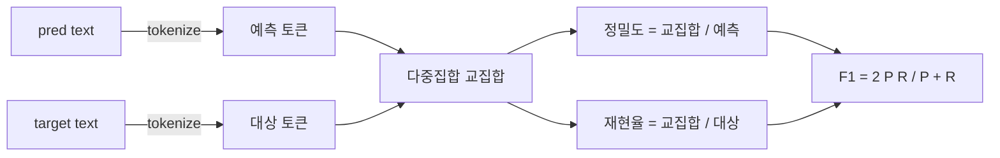
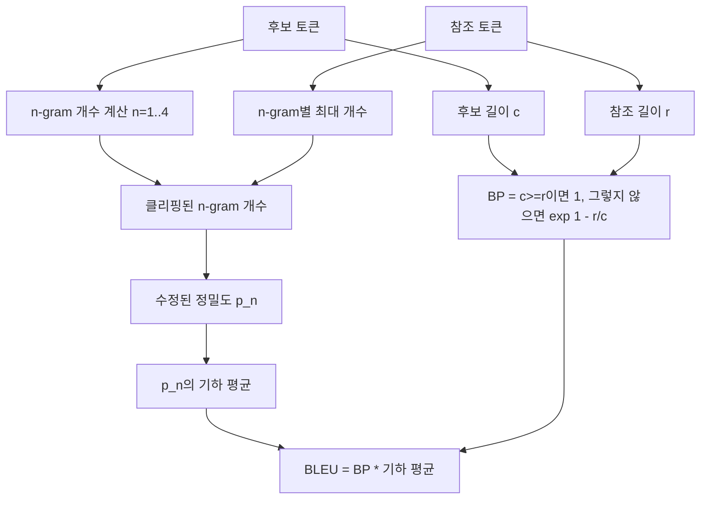

# 고전적 지표

> BLEU, ROUGE-L, F1, 정확 일치(exact-match), 정확도(accuracy). 대부분의 공개된 LLM 평가 수치에서 여전히 주요한 위치를 차지하는 5가지 지표입니다. 각 지표를 처음부터 구현하여 그 수치가 무엇을 의미하는지 이해해 보세요.

**유형:** Build
**언어:** Python
**선수 요건:** 19단계 트랙 B 기초, 70강
**시간:** 약 90분

## 학습 목표

- 명시적인 토큰화 규칙을 사용하여 토큰 단위 정확 일치(exact-match), F1, 정확도(accuracy)를 구현해 보세요.
- BLEU-4를 처음부터 구현해 보세요: 수정된 n-gram 정밀도, n이 1부터 4까지의 기하 평균, 간결성 페널티(간결성 페널티)를 포함합니다.
- 최장 공통 부분 수열(longest common subsequence)을 사용하여 ROUGE-L을 구현하고, 정밀도와 재현율의 F-beta 조합을 적용해 보세요.
- 70강의 `metric_name` 필드에 따라 분기(dispatch)하여 러너(runner)가 지표에 독립적으로 동작하도록 해 보세요.
- 제3자 라이브러리가 아닌, 상세한 예제에서 추출한 참조 벡터(reference vectors)로 동작을 고정해 보세요.

```figure
cd-bleu-overlap
```

## 왜 다시 구현하는가

BLEU 28.3을 보고하는 논문과 BLEU 0.283을 보고하는 논문을 읽게 될 것입니다. 한 라이브러리는 소문자로 잘라내지만 다른 라이브러리는 그렇지 않아 두 라이브러리 간 ROUGE-L 점수가 10점 차이 나는 것을 발견하게 될 것입니다. 혼란을 멈추는 가장 빠른 방법은 지표 자체를 직접 작성한 후, 토크나이저가 결정되는 라인과 스무딩(smoothing)이 적용되는 라인을 가리키는 것입니다. 그 이후에는 논문 간 수치 비교가 라이브러리 논쟁이 아니라 지표 설정을 읽는 문제가 됩니다.

표준 라이브러리와 numpy만으로도 충분합니다. BLEU는 계산과 클램프(clamp)입니다. ROUGE-L은 동적 프로그래밍입니다. F1은 토큰에 대한 집합 교차입니다. 가장 어려운 부분은 토크나이저를 선택하고 이를 고수하는 것입니다.

## 토큰화

토크나이저는 `re.findall(r"\w+", text.lower())`입니다. 소문자화, 알파숫자 연속 문자열, 구두점 제거. 이 강의의 모든 지표는 이 정확한 토크나이저를 사용합니다. 러너(runner)는 토크나이저를 선택할 수 없습니다. 토크나이저를 바꾸면 다른 벤치마크를 실행하는 것이 됩니다.

```python
TOKEN_RE = re.compile(r"\w+", re.UNICODE)
def tokenize(text):
    return TOKEN_RE.findall(text.lower())
```

이는 의도적인 단순화입니다. 프로덕션 환경에서는 CJK, 축약형, 코드 식별자 등을 고려해야 합니다. 이 강의의 요점은 토크나이저가 계약(contract)이지 조절 가능한 변수(knob)가 아니라는 것입니다.

## 정확 일치(exact-match)

```python
def exact_match(pred, targets):
    return float(any(pred.strip() == t.strip() for t in targets))
```

각 작업에 대해 1.0 또는 0.0을 반환합니다. 데이터셋에 대한 집계는 평균입니다. 이는 산술, 객관식(MCQ), 짧은 분류 작업의 주력 지표입니다.

## 토큰 수준 F1

예측 및 대상에 대한 토큰 다중집합(multiset)을 설정합니다. 정밀도는 다중집합 교집합을 예측의 다중집합으로 나눈 값입니다. 재현율은 동일한 교집합을 대상의 다중집합으로 나눈 값입니다. F1은 조화 평균입니다. 구현은 예측이 비어 있거나 대상이 비어 있는 엣지 케이스를 처리합니다.



다중 대상 작업의 경우, 대상 목록에 대한 F1 중 최댓값을 취합니다. 이는 문헌에서 널리 보고되는 SQuAD 스타일의 동작과 일치합니다.

## BLEU-4

BLEU는 기계 번역의 표준 지표이며 요약 작업에서도 여전히 사용됩니다. 우리가 사용하는 공식은 표준 간결성 페널티(간결성 페널티)와 수정된 n-gram 개수에 대한 가산 1(additive-one) 스무딩을 적용한 코퍼스 수준(corpus-level) BLEU-4입니다. 이를 통해 단일 4-gram이 누락되어도 점수가 0으로 떨어지지 않습니다.

각 후보-참조 쌍에 대해 n이 1, 2, 3, 4일 때 수정된 n-gram 정밀도를 계산합니다. 수정된 정밀도는 후보의 n-gram 개수를 모든 참조에서 해당 n-gram의 최대 개수로 클리핑(clipping)하므로, 후보가 한 구절을 반복하여 점수를 부풀릴 수 없습니다. 네 가지 정밀도의 기하 평균은 간결성 페널티(간결성 페널티)로 감싸집니다.



스무딩 규칙은 Lin과 Och가 방법 1(method 1)이라고 부른 것입니다. 로그를 취하기 전에 모든 n-gram 정밀도의 분자와 분모에 1을 더합니다. 이는 참조에 일치하는 4-gram이 없을 때 `log 0`을 피하고, 긴 후보에서는 스무딩되지 않은 값에 가깝게 유지합니다.

## ROUGE-L

ROUGE-L은 후보 및 참조 토큰 시퀀스의 최장 공통 부분 시퀀스를 비교합니다. LCS는 연속성을 강제하지 않으면서 단어 순서를 포착하므로 요약 평가의 기본 지표로 사용됩니다. 표준 동적 프로그래밍 테이블로 LCS 길이를 계산한 후, `lcs / reference length`로 재현율을, `lcs / candidate length`로 정밀도를 도출하고, 대칭 F1 형태를 위해 beta가 1인 F-beta로 결합합니다.

```python
def lcs_length(a, b):
    n, m = len(a), len(b)
    dp = numpy.zeros((n + 1, m + 1), dtype=int)
    for i in range(n):
        for j in range(m):
            if a[i] == b[j]:
                dp[i+1, j+1] = dp[i, j] + 1
            else:
                dp[i+1, j+1] = max(dp[i+1, j], dp[i, j+1])
    return int(dp[n, m])
```

numpy 테이블은 구현을 가독성 있게 만듭니다. 순수 Python 리스트도 작동합니다. ROUGE-L을 선택한 작업은 작업당 O(n m) 비용을 지불합니다. 일반적인 요약 길이는 1밀리초 미만으로 유지됩니다.

## 정확도

다중 목표 분류 작업에서 정확도는 단일 정규화된 목표에 대한 정확 일치(exact-match)로 축소됩니다. 런너 내부의 문자열 비교를 거치지 않고 `metric_name`로 디스패치할 수 있도록 별도의 함수로 노출합니다.

## 디스패치 계약

단일 진입점은 `score(metric_name, prediction, targets)`입니다. `[0, 1]` 범위의 float를 반환합니다. 런너는 지표 이름에 따라 분기하지 않습니다. 호출을 전달하고 결과를 기록합니다. 이 인터페이스는 75강에서 70강의 작업 사양과 연결됩니다.

```python
def score(metric_name, pred, targets):
    if metric_name == "exact_match":
        return exact_match(pred, targets)
    if metric_name == "f1":
        return max(f1_score(pred, t) for t in targets)
    if metric_name == "bleu_4":
        return max(bleu4(pred, t) for t in targets)
    if metric_name == "rouge_l":
        return max(rouge_l(pred, t) for t in targets)
    if metric_name == "accuracy":
        return accuracy(pred, targets)
    raise ValueError(f"unknown metric_name: {metric_name}")
```

`code_exec`는 72강에서 처리되며 그곳의 디스패처에 슬롯으로 추가됩니다.

## 이 강에서 하지 않는 것

모델을 호출하지 않습니다. 70강의 후처리 규칙이 이미 수행한 것 이상으로 생성물을 정규화하지 않습니다. 신뢰 구간을 계산하지 않습니다. BLEURT나 BERTScore를 수행하지 않습니다(이들은 모델이 필요하며 다른 강에 속합니다). 핵심은 최소한의 기반입니다: 다섯 개의 지표, 하나의 토크나이저, 하나의 디스패치 테이블.

## 코드 읽는 방법

`main.py`는 각 지표를 자유 함수와 디스패처로 정의합니다. 참조 벡터는 파일 하단의 `_reference_examples` 블록에 있습니다. 데모는 디스패처를 8개 예제에 대해 실행하고 지표별 점수를 출력합니다. `code/tests/test_metrics.py`의 테스트는 참조 벡터를 고정하고 모든 엣지 케이스(빈 예측, 빈 참조, 공유 토큰 없음, 정확 일치, 반복 구문 클리핑)를 검증합니다.

`main.py`을 위에서 아래로 읽어 보세요. 함수는 복잡도 순으로 정렬되어 있습니다. `exact_match`와 `accuracy`는 각각 한 줄입니다. `F1`은 여섯 줄입니다. `BLEU`와 `ROUGE-L`은 가장 복잡한 부분이며, 스무딩 규칙과 LCS 재귀에 대한 상세한 주석이 포함되어 있습니다.

## 더 깊이 들어가기

고전적인 지표는 필수적이지만 충분하지는 않습니다. 표면적인 겹침을 보상하고 의미를 놓치기 때문입니다. 고전적인 지표의 신뢰성을 확보한 후, 모델 기반 지표(BLEURT, BERTScore, GEval)를 그 위에 계층화하는 것이 해결책입니다. 이는 이후 강에서 다루게 됩니다. 지금은: 이 다섯 가지가 잘 작동하도록 하고, 테스트로 고정하면, 감사 가능하고, 빠르고, 재현 가능한 지표 스택을 갖게 됩니다.
