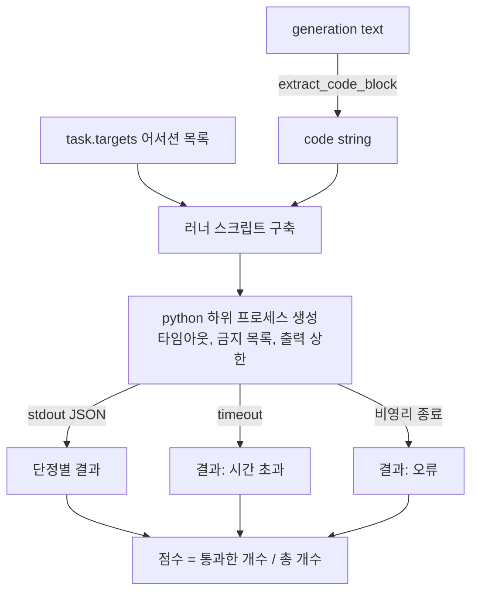
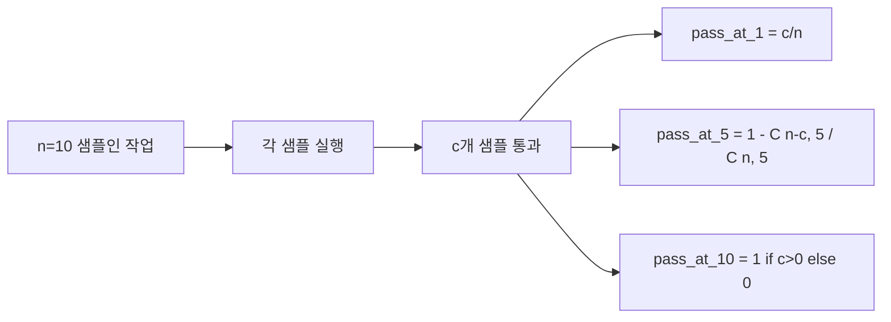

# 코드 실행 지표

> 생성된 코드는 테스트를 통과할 때 옳습니다. 평가 하네스는 코드를 추출하고, 호스트를 크래시시키지 않고 실행하며, 통과율을 정직하게 집계해야 합니다. 이 강의는 그 표면(surface)을 구축합니다.

**유형:** Build
**언어:** Python
**선수 요건:** 19단계 트랙 B 기초, 70강 및 71강
**시간:** 약 90분

## 학습 목표

- 70강의 후처리 규칙과 일치하는 방식으로 자유 형식 생성에서 코드 블록을 추출합니다.
- 월클록(wall-clock) 타임아웃, 출력 상한 및 import 금지 목록(denylist)을 사용하여 격리된 하위 프로세스에서 후보 코드를 실행합니다.
- 공급된 어서션(assertion) 문자열 중 후보에 대해 통과한 비율로 작업을 점수화합니다.
- 하나의 모델에서 여러 생성을 샘플링하는 작업에 대해 pass-at-k를 계산합니다.
- 샌드박스 크래시, 구문 오류 및 타임아웃을 러너가 기록할 수 있는 고유한 종료 코드를 가진 일급(first-class) 실패 모드로 취급합니다.

```figure
sandbox-runner
```

## 격리된 하위 프로세스를 사용하는 이유

인라인 `exec`은 보안 및 안정성 위험입니다. 생성된 `while True: pass`은 평가를 영원히 차단합니다. 생성된 `import shutil; shutil.rmtree('/')`는 말 그대로 재앙입니다. 해결책은 후보마다 새로운 Python 인터프리터를 생성하고, 코드를 stdin으로 전달하며, 어서션 결과를 stdout에 기록하고, 프로세스가 초과되면 종료하는 것입니다. 호스트 평가 프로세스는 계속 실행됩니다.

HumanEval, MBPP, BigCodeBench, LiveCodeBench와 같은 실제 평가는 모두 하위 프로세스 샌드박스를 사용합니다. 일부는 그 위에 Docker를 계층화합니다. 우리는 하위 프로세스에서 멈추는 이유가 있습니다: 이식성이 있고, 표준 라이브러리이며, 교육용 평가에 중요한 실패 모드를 포착하기 때문입니다. 프로덕션 배포는 seccomp, 네트워크 격리 및 읽기 전용 파일 시스템을 추가합니다. 하드닝(hardening)에 대한 다음 강의는 이 트랙 외부에 있습니다.

## 코드 실행 작업의 형태

`code_exec` 작업은 `targets`에 어서션 문자열을 담고 있습니다. 러너는 생성된 결과에서 fenced code block을 추출하고, 그 주위에 테스트 하네스를 구축하며, 결과를 실행합니다.



점수는 `[0, 1]` 범위의 분수입니다. 세 개의 단정 중 두 개가 통과한 작업의 점수는 0.667입니다. 러너는 무엇이 실패하든 동일한 형태를 반환합니다: 하위 프로세스 충돌은 하네스로 전파되는 Python 트레이스백이 아니라 정규화된 오류 코드로 매핑됩니다.

## 거부 목록

거부 목록은 import 기반입니다. 후보 코드를 실행하기 전에, 러너 스크립트는 위험한 모듈의 import를 `ImportError("denied")`을 발생시키는 스텁으로 재작성합니다. 이 목록은 의도적으로 보수적입니다: `os.system`, `subprocess`, `socket`, `requests`, `urllib`, `urllib.request`, `urllib.error`, `urllib.parse`, `ctypes`, `shutil`, `http.client`, `asyncio.subprocess`.

이것이 완전한 방어책이라고 주장하지는 않습니다. 결정적인 적대적 코드는 Python의 모든 프로세스 내 샌드박스를 탈출할 수 있습니다. 거부 목록은 백스톱입니다. 월클록 시간 제한과 출력 상한이 핵심적인 제어 수단입니다.

```python
DENIED = {
    "os.system": True,
    "subprocess": True,
    "socket": True,
    "shutil": True,
    "requests": True,
    "urllib": True,
    "ctypes": True,
}
```

우리는 `import sys`을 앞에 붙이고 `os.system`을 발생시키도록 몽키 패치하는 가드를 추가하여 후보 코드를 감쌉니다. 전체 템플릿은 `main.py`에 있습니다.

## 월클록 시간 제한

모든 하위 프로세스는 기본 월클록 예산이 3초입니다. 러너는 `subprocess.run(..., timeout=t)`을 사용합니다. 시간 제한이 발동하면, 러너는 `TimeoutExpired`을 포착하여 프로세스를 종료하고, 해당 작업에 대해 `timeout` 종료 이유를 기록합니다. 해당 작업의 점수는 0입니다. 러너는 다음으로 진행합니다.

시간 제한은 `task.metadata.timeout_s`을 통해 작업별로 설정할 수 있습니다. 오래 실행되는 단위 테스트는 더 긴 시간을 요청할 수 있습니다. 70강의 검증기는 값이 30초를 넘지 않도록 상한을 설정하여 테스트 스위트의 범위를 제한합니다.

## 출력 상한

하위 프로세스는 stdout을 넘쳐 호스트 메모리를 고갈시킬 수 있습니다. 러너는 stdout을 버퍼로 스트리밍하며, 누적 합계가 256 KB를 넘으면 즉시 자식 프로세스를 종료합니다. 결과는 `exit_code = error`으로 기록되며 상세 문자열은 `"output overflow"`입니다. 이는 생성물이 실수로 무한 루프를 출력하는 경우 실제로 발생합니다.

## Pass-at-k

Pass-at-k는 HumanEval 및 유사 벤치마크에서 사용하는 편향 없는 추정치입니다. 각 작업에 대해 `n`개의 독립적인 샘플을 생성하고 그 중 `c`개가 통과했을 때, `n`개에서 `k`개를 샘플링하여 적어도 하나의 통과하는 솔루션이 포함될 확률은 다음과 같습니다:

```
pass_at_k(n, c, k) = 1 - C(n - c, k) / C(n, k)
```

`n - c < k`일 때 분모가 정의되지 않으며 값은 `1`입니다. 구현에서는 이 엣지 케이스를 직접 처리합니다. `pass_at_k(n, c, k)`는 74강의 리더보드 레이어에서 사용하도록 노출합니다.



## 종료 코드

러너는 각 작업에 대해 다섯 가지 결과 중 하나를 반환합니다:

- 모든 어서션이 통과했을 때 `pass`.
- 코드가 실행되었지만 적어도 하나의 어서션이 실패했을 때 `assertion_fail`.
- 코드가 import되지 않았거나 SyntaxError가 발생했을 때 `syntax_error`.
- 월 클록(wall clock)이 만료되었을 때 `timeout`.
- denylist 적중 및 출력 오버플로(오버플로는 `"output overflow"` 상세 정보와 함께 표면화됨)를 포함한 기타 모든 크래시에 대해 `error`.

점수는 여전히 분수입니다. 종료 코드는 메타데이터입니다. 후속 강의에서는 타임아웃을 0으로 계산할지 누락된 데이터로 계산할지 결정할 수 있습니다.

## 이 강의가 하지 않는 것

이 강의는 실제 샌드박스를 제공하지 않습니다. 오픈 웹의 신뢰할 수 없는 코드를 실행하지 않습니다. 파일 I/O나 네트워크 호출과 같은 상태 유지(stateful) 작업을 처리하지 않습니다. 이러한 작업에는 컨테이너나 마이크로 VM이 필요합니다. 이 강의의 요점은 계약(contract)입니다: 격리된 하위 프로세스, denylist, 타임아웃, 출력 상한, 깔끔한 종료 코드 어휘, 그리고 pass-at-k 수학.

## 코드를 읽는 방법

`main.py`는 `extract_code`, `run_candidate`, `score_code_exec`, `pass_at_k`를 정의합니다. 하위 프로세스 러너 스크립트는 문자열로 빌드되어 `-c`로 새로운 Python 인터프리터에 전달됩니다. `code/tests/test_exec.py`의 테스트는 HumanEval 스타일의 예제에 대해 네 가지 종료 코드와 pass-at-k를 검증합니다.

`main.py`를 위에서 아래로 읽어 보세요. 러너 템플릿은 핵심적인 부분입니다. 부모 프로세스로 되돌려 쓰는 JSON 엔벨로프를 예측할 수 있을 때까지 어서션 루프를 주의 깊게 살펴보세요.

## 더 깊이 들어가기

서브프로세스 형태가 작동하면, 다음 관심사는 이식성입니다. Windows에서는 Python 버전마다 SIGKILL을 처리하는 방식이 다릅니다. 가장 깔끔한 해결책은 러너를 Docker 이미지로 만드는 것입니다. 그 다음 단계는 어서션 문자열을 실제 단위 테스트 파일로 교체하여 평가가 프로덕션 CI가 하는 것과 일치하도록 하는 것입니다. 이때 어서션 문자열을 테스트라고 부르는 것을 멈추세요.它们是 장난감 테스트이며, 장난감 실패 모드를 가지고 있습니다.
