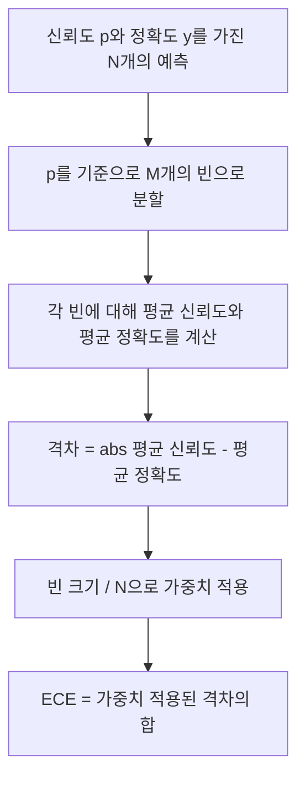
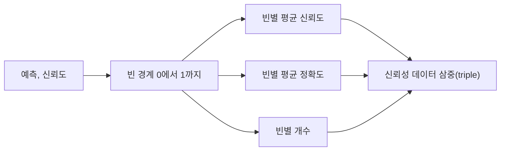

# 퍼플렉시티와 보정

> 모델이 천 개의 답변에 대해 90%의 확신을 표명했는데 정답이 600개라면, 잘 보정(calibration)된 모델이 아닙니다. 보정은 신뢰할 수 있는 평가의 절반을 차지합니다. 나머지 절반은 퍼플렉시티(perplexity)로, 모델이 홀드아웃 텍스트를 전체적으로 타당하다고 생각하는지 알려줍니다.

**유형:** Build
**언어:** Python
**선수 요건:** 19단계 Track B 기초, 70강 및 71강
**시간:** 약 90분

## 학습 목표

- 모델 어댑터가 제공하는 토큰 음의 로그 확률을 사용하여 홀드아웃 코퍼pus에서 토큰 단위 퍼플렉시티를 계산합니다.
- 분할된 예측 확률로부터 분류기나 객관식 평가의 기대 보정 오차(ECE)를 계산합니다.
- 브리어 점수(Brier score, 정확성의 지표에 대한 평균 제곱 오차)를 계산하고, ECE가 하지 못하는 것을 브리어 점수가 수행하는 시점을 설명합니다.
- 신뢰도 대 정확도 곡선을 그리기 위해 필요한 신뢰도 다이어그램 데이터를 구축합니다.
- 세 가지 지표 모두를 평가 하네스에 연결하여, 러너가 모델 보고서에 `perplexity`, `ece`, `brier` 값을 첨부할 수 있도록 합니다.

```figure
cd-reliability-diagram
```

## 퍼플렉시티가 알려주는 것

퍼플렉시티는 토큰당 음의 로그 우도의 평균을 지수화한 값입니다. 낮을수록 좋습니다. 퍼플렉시티가 1이라는 것은 모델이 모든 실제 토큰에 확률 1을 할당한다는 의미입니다. 퍼플렉시티가 어휘 크기라는 것은 모델이 균일 분포를 따르며 아무것도 학습하지 못했다는 의미입니다. 실제 값은 그 사이에 위치합니다: WikiText-103에서의 강력한 2026년 기본 모델은 대략 8에서 12 사이입니다. 같은 텍스트에서의 나쁜 모델은 50 이상입니다.

하네스는 로그 확률을 자체적으로 계산하지 않습니다. 이는 모델 어댑터에서 제공됩니다. 하네스는 집계만 수행합니다: 토큰별 로그 확률 목록, 시퀀스별 토큰 수 목록을 받아 코퍼pus 퍼플렉시티를 반환합니다.

```python
def perplexity(neg_log_probs, token_counts):
    total_nll = sum(neg_log_probs)
    total_tokens = sum(token_counts)
    return math.exp(total_nll / total_tokens)
```

구현은 토큰 수가 0인 엣지 케이스를 처리하며, 음의 로그 확률이 음수가 아님을 단언합니다. 흔한 실수는 부호를 잊는 것입니다: `log p` 대신 `-log p`을 반환하는 어댑터는 퍼플렉시티가 1 미만인 값을 생성하는데, 이는 불가능합니다. 함수는 이를 계약 위반으로 포착합니다.

## ECE가 측정하는 것

기대 캘리브레이션 오차(Expected Calibration Error)는 예측을 신뢰도에 따라 고정된 수의 빈(bin)으로 그룹화한 후, 빈 크기로 가중치를 적용하여 빈 전체의 신뢰도와 정확도 간 평균 격차를 측정합니다.



표준 공식은 `[0, 1]`에서 10개의 등폭 빈을 사용합니다. 구현은 양의 정수 개수를 지원합니다. `bins` 매개변수를 노출하여 런너가 출판 관례(10)와 비교 관례(15) 중 하나를 선택할 수 있도록 합니다.

ECE는 빈 개수와 표본 크기에 의해 편향됩니다. 10개의 빈과 100개의 예측을 사용하면 0.02 ECE를 무작위 잡음과 구별할 수 없습니다. 구현은 ECE와 함께 채워진 빈의 개수를 반환하므로, 런너는 표본이 너무 적을 때 단일 숫자를 보고하지 않을 수 있습니다.

## Brier 점수가 ECE가 하지 못하는 것

ECE는 평균 격차에만 신경 씁니다. 빈의 절반에서 과신뢰하고 나머지 절반에서 과소신뢰하는 모델은 지역적으로 캘리브레이션이 잘 안 되어도 낮은 ECE를 가질 수 있습니다. Brier 점수는 예측별 실제 결과에 대한 제곱 오차를 측정하므로, 산포를 직접적으로 페널티합니다.

이진 결과의 경우 Brier는 `mean((p_i - y_i)^2)`입니다. 이는 신뢰성(reliability), 해상도(resolution), 불확실성(uncertainty)으로 분해됩니다. 점수와 분해를 계산합니다. 런너는 스칼라 값을 보고하지만 대시보드용 분해는 로깅합니다.

```python
def brier(p, y):
    return float(np.mean((p - y) ** 2))
```

## 신뢰성 다이어그램 데이터

신뢰성 다이어그램은 각 빈에서 예측된 신뢰도를 경험적 정확도에 대해 플롯합니다. 대각선은 완벽한 캘리브레이션입니다. 함수는 세 개의 배열을 반환합니다: 빈별 평균 신뢰도, 빈별 평균 정확도, 빈별 개수. 플롯 코드는 하류에 위치하며, 이 강의는 데이터 형태에서 멈춥니다.



반환된 튜플은 호출 계층이 플롯을 그리거나 커스텀 ECE 변형(adaptive ECE, sweep ECE 등)을 계산하는 데 필요한 값입니다. downstream 코드가 변환할 필요가 없도록 numpy 배열을 반환합니다.

## 신뢰도 소스

하네스는 신뢰도가 softmax에서 나온다고 가정하지 않습니다. 각 예측에 대해 `[0, 1]` 내의 임의의 숫자를 허용합니다. 객관식 작업의 경우 자연스러운 신뢰도는 `softmax over option log-likelihoods`입니다. 자유 텍스트의 경우 자연스러운 신뢰도는 모델이 자체 보고한 확률이나 평균 로그 우도의 지수값입니다. 평가는 단순히 이 숫자를 소비합니다. 그 출처는 어댑터의 몫입니다.

## 엣지 케이스

- 모든 예측이 틀린 경우: ECE는 평균 신뢰도이며, Brier는 높고, 퍼플렉시티는 모델이 텍스트에 대해 생각하는 값입니다.
- 모든 예측이 높은 신뢰도로 맞은 경우: ECE는 0에 가깝고, Brier는 0에 가깝습니다.
- p=0.5에서 완벽하게 불확실한 예측자: ECE는 0.5에서 정확도를 뺀 값이며, Brier는 0.25에서 보정 항을 뺀 값입니다.
- 빈 입력: ECE, Brier 및 신뢰도는 `0.0` (또는 0으로 채워진 배열)을 반환합니다. 퍼플렉시티는 0 토큰인 경우 `NaN`을 반환합니다. 이러한 경로 중 어느 것도 경고를 발생시키지 않습니다. 러너는 값을 검사하여 보고할지 건너뛸지 결정합니다.

이러한 케이스는 테스트에 포함되어 있습니다. 실제 벤치마크의 실제 모델은 이러한 케이스에 도달하지 않지만, 버그가 있는 어댑터나 매우 작은 샘플은 도달할 수 있으며, 러너는 크래시되어서는 안 됩니다.

## 디스패치

보정(Calibration)은 F01강 같은 작업별 지표가 아닙니다. 모델별 보고서입니다. 러너는 전체 평가 동안 `(confidence, correct)` 쌍을 누적하고 ECE, Brier 및 신뢰도 데이터를 한 번에 계산합니다. 퍼플렉시티는 작업별 점수링과 분리된 홀드아웃 텍스트 코퍼스에 대해 계산됩니다.

인터페이스는 다음과 같습니다:

```python
report = CalibrationReport.from_predictions(confidences, correct)
report.ece          # float
report.brier        # float
report.reliability  # numpy 배열 3개 튜플
report.populated_bins  # int
```

`PerplexityResult.from_token_nll(neg_log_probs, token_counts)`는 퍼플렉시티와 토큰당 평균 음수 로그 우도를 반환합니다.

## 이 강에서 하지 않는 것

이 코드는 모델을 호출하지 않습니다. 소프트맥스(softmax)를 구현하지도 않습니다. 출력 토큰에서 신뢰도를 추정하지도 않습니다. 그 일은 어댑터의 몫입니다. 온도 스케일링이나 플랫 스케일링도 하지 않습니다. 그것들은 다른 강의에서 다루는 사후 보정입니다. 이 강의의 목적은 세 가지 수치(퍼플렉시티, ECE, Brier)를 신뢰할 수 있고 재현 가능하게 만드는 것입니다.

## 코드 읽는 방법

`main.py`는 `perplexity`, `expected_calibration_error`, `brier_score`, `reliability_diagram` 및 `CalibrationReport` / `PerplexityResult` 데이터 클래스를 정의합니다. 데모는 정답이 알려진 합성 예측값에서 실행됩니다. 잘 보정된 모델, 과신뢰 모델, 과소신뢰 모델을 사용합니다. `code/tests/test_calibration.py`의 테스트는 모든 엣지 케이스와 합성 예측기의 참조 값을 고정합니다.

`main.py`을 위에서 아래로 읽어 보세요. 함수 순서는 스칼라에서 벡터, 그리고 리포트로 이어집니다. 각 함수는 수식과 계약이 포함된 짧은 도크스트링을 가지고 있습니다.

## 더 깊이 들어가기

보정(calibration)은 공개된 평가에서 가장 간과되는 축입니다. 대부분의 리더보드는 단일 정확도 수치만 보고하고 끝냅니다. 정확도에서는 이기지만 Brier 점수에서는 지는 모델은, 정확도가 몇 점 낮더라도 불확실성을 신뢰할 수 있게 보고하는 모델보다 생산 환경에서 더 나쁜 배포입니다. 보정 인프라가 갖춰지면, 홀드아웃 검증 슬라이스에 온도 스케일링을 추가하고, ECE를 재계산하여 격차가 줄어드는 것을 지켜보세요. 이것은 별도의 강의 주제이지만, 그 기반은 여기 있습니다.
