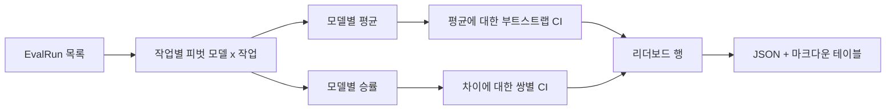
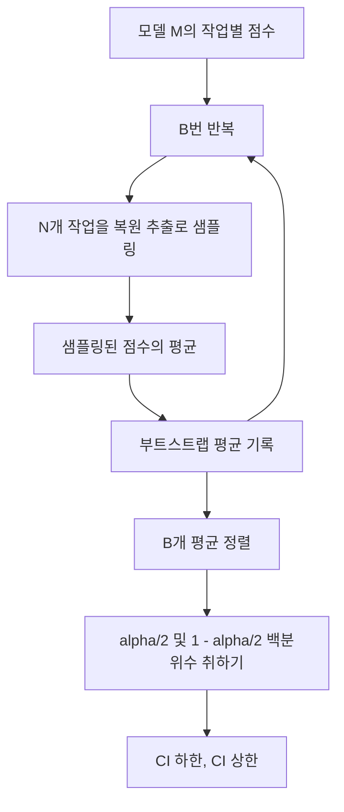

# 리더보드 집계

> 작업별 점수는 쉽습니다. 이질적인 작업에 걸친 모델별 순위는 더 어렵습니다. 천 개의 예측이 있는 리더보드에서의 통계적 유의성은 모두가 건너뛰는 부분입니다. 이 강의는 이를 건너뛰지 않습니다.

**유형:** Build
**언어:** Python
**선수 요건:** 19단계 트랙 B 기초, 70강, 71강, 73강
**시간:** 약 90분

## 학습 목표

- 다수의 모델과 다수의 작업에 걸친 작업별 점수를 깔끔한 모델별 행으로 집계해 보세요.
- 이질적인 점수를 정규화하여 통과율과 BLEU 값이 집계 결과에 과도한 영향을 미치지 않도록 해 보세요.
- 평균과 승률로 모델을 순위 매기고, 각각이 적절한 요약인 경우를 설명해 보세요.
- 모델별 평균 점수와 쌍별 차이에 대해 부트스트랩 신뢰 구간을 계산해 보세요.
- 리더보드를 JSON 보고서와 75강의 러너가 CI 주석에 붙여넣을 수 있는 마크다운 테이블로 출력해 보세요.

```figure
ci-leaderboard-ci
```

## 입력의 형태

집계기는 `EvalRun` 레코드 목록을 소비합니다:

```python
@dataclass
class EvalRun:
    model_id: str
    task_id: str
    metric_name: str
    score: float          # [0, 1] 범위 내
    category: str
```

75강의 러너는 `(model, task)` 쌍당 하나의 레코드를 방출합니다. 집계기는 점수가 어떻게 생성되었는지关心하지 않습니다. 정규화가 이미 완료된 상태로 기대합니다: 모든 점수는 `[0, 1]`에 있습니다.

## 출력

세 개의 테이블이 나옵니다:



리더보드 행에는 `model_id`, `mean_score`, `mean_ci_lo`, `mean_ci_hi`, `win_rate`, `tasks_completed`, 그리고 카테고리별 평균을 위한 선택적 `categories` 맵이 포함됩니다.

## 정규화

한 작업은 `[0, 1]`로 점수화되고 다른 작업은 `[0, 100]`로 점수화된다면, 후자가 평균을 조용히 지배합니다. 집계기는 모든 입력 점수가 `[0, 1]`에 위치하는지 검증하고, 그렇지 않으면 실행을 거부합니다. 수정은 상류에 있습니다: 지표는 이미 분수를 반환해야 합니다. 71강부터 73강까지가 그 계약을 강제합니다.

## 평균 및 승률

두 가지 순위 체계는 서로 다른 목적을 위해 사용됩니다.

평균 점수는 한 모델의 작업별 점수 평균입니다. 리더보드가 보고하는 헤드라인 수치입니다. 이상치와 작업 불균형에 민감합니다.

승률은 모델이 같은 작업에서 다른 모든 모델을 얼마나 자주 이기는지 계산합니다. 각 작업에서 가장 높은 점수를 받은 모델이 승리합니다(무승부는 분할). 승률은 모델이 점수를 가진 작업 수로 나눈 승리 횟수입니다. 이상치와 스케일 차이에 덜 민감하지만 정보를 잃습니다.

```python
def win_rate(model_id, runs_by_task, all_models):
    wins, total = 0, 0
    for task_id, runs in runs_by_task.items():
        scores = {r.model_id: r.score for r in runs if r.model_id in all_models}
        if model_id not in scores:
            continue
        total += 1
        best = max(scores.values())
        if scores[model_id] >= best:
            wins += 1
    return wins / total if total else 0.0
```

하네스는 두 가지를 모두 보고합니다. 75강의 러너는 기본적으로 평균으로 순위를 매깁니다. 사용자가 선호할 경우를 대비해 승률용 마크다운 열이 바로 거기에 있습니다.

## 부트스트랩 신뢰 구간

모델별 평균은 작업에 대한 부트스트랩 재샘플링으로 추정된 신뢰 구간과 함께 제공됩니다. 작업 ID를 복원 추출하여 재샘플링하고, 재샘플링된 집합의 평균을 계산하며, `B`번 반복하고, `alpha`수준의 백분위 구간을 취합니다.



짝을 이루는 비교에서는 작업별 차이 `score_A - score_B`를 부트스트랩하고, 백분위 구간을 취하며, 이를 보고합니다. 사용자는 구간이 0을 포함하는지 여부를 읽습니다. 포함하지 않으면, 차이는 alpha 수준에서 유의미합니다. 포함하면, 리더보드는 모델들을 무승부로 취급합니다.

저수준 헬퍼(`bootstrap_mean_ci`, `bootstrap_pairwise_diff`)는 `B=1000`를 기본값으로 사용하며, 공개 집계기(`aggregate`, `pairwise_diffs`)는 `b=500`를 기본값으로 사용하므로 데모와 테스트가 빠르게 유지됩니다. 기본 alpha는 0.05입니다. 이 강의는 부트스트랩을 순수 numpy로 유지하며, scipy는 사용하지 않습니다.

## 카테고리

`EvalRun.category`가 설정되면, 집계기는 카테고리별 평균도 보고합니다. 이는 모든 리더보드에서 `math`, `reasoning`, `code`, `safety`라고 표시되는 열입니다. 이를 통해 러너는 모델이 전반적으로 뛰어나지만 코드에서는 약한지 파악할 수 있으며, 이는 헤드라인 평균이 숨기는 정보입니다.

## 마크다운 렌더링

리더보드는 마크다운 표로 렌더링됩니다:

```text
| Rank | Model | Mean | 95% CI | Win rate | Tasks |
|------|-------|------|--------|----------|-------|
| 1    | gpt   | 0.78 | 0.74-0.82 | 0.62 | 50 |
| 2    | claude| 0.75 | 0.71-0.79 | 0.34 | 50 |
| 3    | random| 0.10 | 0.07-0.13 | 0.04 | 50 |
```

표는 평균 점수 순으로 정렬됩니다. CI는 소수점 둘째 자리까지 렌더링됩니다. 긴 모델 ID는 20자로 잘립니다.

## 이 강의가 하지 않는 것

모델을 실행하지 않습니다. 메트릭 계층을 호출하지 않습니다. 적응형 ECE나 다른 캘리브레이션 변형을 구현하지 않습니다; 이는 73강의 내용입니다. 작업 가중치를 구현하지 않습니다. 여기서는 모든 작업이 동일하게 계산됩니다. 프로덕션 리더보드는 작업에 가중치를 부여합니다; `weight` 필드를 통해 그 훅을 열어두지만, 집계기에서는 이를 무시합니다. 필요하면 후속 강의에서 가중치를 추가하세요.

## 코드 읽는 방법

`main.py`는 `EvalRun`, `LeaderboardRow`, `aggregate`, `bootstrap_mean_ci`, `bootstrap_pairwise_diff`, `render_markdown`를 정의합니다. 데모는 세 개의 모델과 열두 개의 작업으로 구성된 합성 스위트, 집계, 리더보드 및 쌍별 차이 표를 출력합니다. `code/tests/test_leaderboard.py`의 테스트는 부트스트랩, 마크다운 렌더링, 승률 엣지 케이스, 빈 입력 동작을 고정합니다.

`main.py`를 위에서 아래로 읽어 보세요. 데이터 형태(EvalRun, LeaderboardRow)가 먼저 오고, 그 다음에 집계기, 세 번째로 부트스트랩, 마지막으로 렌더링이 옵니다. 각 함수는 집중된 계약을 가집니다.

## 더 나아가기

자연스러운 다음 단계는 비쌍 부트스트랩 대신 쌍별 작업 유의성입니다. 모델 A와 B가 동일한 백 개의 작업을 실행했다면, 적절한 테스트는 작업별 차이에 대한 쌍별 부트스트랩이며, 이를 구현합니다. 그 beyond에는 작업 계열을 존중하는 계층적 부트스트랩이 필요합니다(수학 문제는 서로 독립적이지 않습니다; 산술 오류 패턴은 그중 열 개에 영향을 미칩니다). 이는 후속 작업입니다. 이 강의의 요지는 바닥을 정확히 다져 평가가 방어 가능한 숫자를 보고하도록 하는 것입니다.
