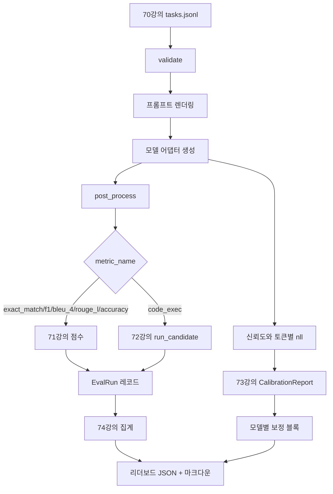

# 엔드투엔드 평가 실행기

> 파이프라인 구축을 위한 다섯 강과 이를 연결하는 한 강. 실행기는 70강의 작업 사양을 읽고, 어댑터를 통해 모델을 호출하며, 71강과 72강으로 점수를 매기고, 73강의 보정 보고서를 첨부하며, 74강의 리더보드를 생성합니다. 데모는 스스로 종료됩니다.

**유형:** Build
**언어:** Python
**선수 요건:** 19단계 트랙 B 기초, 70강부터 74강까지
**시간:** 약 90분

## 학습 목표

- 모든 모델(모의, 로컬, API)이 작은 메서드 표면으로 충족할 수 있는 `ModelAdapter` 인터페이스를 정의합니다.
- 워커 풀을 통해 병렬 작업 실행으로 픽스처 JSONL 파일에 대한 평가를 실행합니다.
- 메트릭 레이어(exact_match, F1, BLEU-4, ROUGE-L, code_exec)와 보정 레이어를 한 번의 패스로 구성합니다.
- 모델별 `EvalRun` 레코드를 생성하고 리더보드 집계기에 직접 전달합니다.
- JSON 보고서와 마크다운 테이블을 모두 출력합니다. 정상 실행 시 exit zero로, 검증 또는 런타임 실패 시 non-zero로 스스로 종료합니다.

```figure
eval-grid
```

## 파이프라인



실행기는 통합 지점입니다. 70강부터 74강까지 각 강은 실행기가 구성하는 하나의 모듈을 소유합니다. 실행기는 해당 모듈의 로직을 중복하지 않습니다. 모듈을 임포트합니다.

## 어댑터 인터페이스

어댑터는 실행기와 모델 사이의 접점입니다. 인터페이스는 의도적으로 작습니다.

```python
class ModelAdapter:
    model_id: str

    def generate(self, prompt: str, task: TaskSpec) -> Generation: ...
```

`Generation`는 다음을 포함하는 dataclass입니다:

- `text`: 모델의 자유 형식 출력
- `confidence`: `[0, 1]` 범위의 float로, 모델이 자체 보고한 답변 확률을 나타냅니다
- `token_nll`: 생성된 토큰에 대한 음의 로그 우도 합계 (선택 사항)
- `token_count`: 생성된 토큰 수 (선택 사항)

러너의 목(mock) 어댑터는 세 가지 유형을 제공합니다: `RuleBasedAdapter` (결정적, 거의 완벽), `NoisyAdapter` (과신, 자주 오류), `BiasedAdapter` (한 범주에서는 잘하지만 다른 범주에서는 매우 나쁨). 데모는 70강의 픽스처에 대해 세 가지를 모두 실행합니다.

## 병렬 실행

러너는 `concurrent.futures.ThreadPoolExecutor`를 사용하여 모델별로 작업을 병렬로 실행합니다. 워커 수는 08강 작업 수 중 작은 값으로 기본 설정됩니다. 실제 모델 호출의 병목은 네트워크 I/O이므로 스레드가 충분합니다. 코드 실행 경로는 작업 내에서 자체 하위 프로세스를 생성하며, 실행기는 대기만 스케줄링합니다.

결정적 테스트를 위해 러너는 `run_eval(adapters, tasks, parallel=False)`를 노출하여 테스트가 실행 순서를 고정할 수 있도록 합니다.

## 단일 패스 스코어링 루프

각 작업에 대해:

1. 프롬프트를 렌더링합니다 (소수 예시(few-shot) 접두어 및 프롬프트 본문).
2. 어댑터를 호출하고 호출 시간을 측정합니다.
3. 작업의 규칙에 따라 생성된 결과를 후처리합니다.
4. 메트릭 계층으로 디스패치합니다.
5. 점수와 메트릭 메타데이터를 포함하는 `EvalRun` 레코드를 생성합니다.
6. `(confidence, correct)` 쌍을 보정 버퍼에 추가합니다.

`correct` 신호는 exact_match 스타일 메트릭 (`exact_match`, `accuracy`, `code_exec`)에 대해 `score >= 1.0`이며, 등급화된 메트릭에 대해 `score >= 0.5`입니다. 임계값은 `_correct_from_score`에 있으며, 러너는 공개 오버라이드를 노출하지 않습니다.

## 집계

모든 작업에 결과가 있으면 러너는 74강의 `aggregate` 및 `pairwise_diffs`와 73강의 `CalibrationReport.from_predictions`를 호출합니다. 출력은 단일 JSON 엔벨로프입니다:

```json
{
  "leaderboard": [...],
  "pairwise": [...],
  "calibration": {
    "model_id_a": {"ece": 0.04, "brier": 0.10, "populated_bins": 8, ...},
    ...
  },
  "summary": {
    "tasks": 10,
    "models": 3,
    "wall_seconds": 1.2
  }
}
```

러너는 또한 stdout에 마크다운 표를 기록하여 사용자가 결과를 PR 리뷰에 붙여넣을 수 있도록 합니다.

## 자기 종료 데모

데모는 70강의 10개 픽스처 작업에 대해 세 개의 목(mock) 어댑터를 실행합니다. 벽 시간(wall time)은 10초 미만이어야 합니다. 깨끗한 실행(clean run)의 경우 종료 코드는 0입니다.

깨끗한 실행(clean run) 기준은 다음과 같습니다:

- 모든 작업이 70강에서 검증되었습니다.
- 모든 작업이 71강 및 72강에서 점수화되었습니다.
- 73강에서 오류 없이 보정 보고서가 집계되었습니다.
- 리더보드는 규칙 기반 어댑터를 랜덤 어댑터보다 엄격하게 높은 순위에 배치했습니다.

이 중 하나라도 깨지면 러너는 JSON 엔벨로프에 구조화된 오류와 함께 비영(non-zero) 코드로 종료합니다.

## 이 강의가 하지 않는 것

실제 모델을 호출하지 않습니다. API 키 흐름이나 속도 제한 처리를 구현하지 않습니다. 스트리밍이나 부분 생성을 구현하지 않으며, 어댑터는 호출당 하나의 생성만 반환합니다. 재시도나 캐싱을 수행하지 않습니다. 이러한 관심사는 어댑터 계층에 있으며, 러너는 메트릭에 무관하고 제공업체에 무관합니다.

## 코드를 읽는 방법

`main.py`는 통합 모듈입니다. 상대 경로로 다른 다섯 강의 모듈을 해석하는 작은 `_load_sibling` 헬퍼를 통해 이를 가져옵니다. 데이터 클래스 `Generation`, `EvalReport`, `ModelAdapter`는 로컬에 정의되어 있습니다. 목(mock) 어댑터는 파일 하단에 있습니다.

`main.py`를 위에서 아래로 읽어 보세요. 임포트 부분을 훑어본 후 `run_eval`, `_score_one`, 그리고 어댑터를 살펴보세요. 마지막 데모가 진입점입니다.

`code/tests/test_runner.py`의 테스트는 어댑터 인터페이스, 단일 패스 루프, 병렬 대 순차 등가성, 보정 버퍼, JSON 엔벨로프 형태를 고정합니다.

## 더 나아가기

이 러너는 기본입니다. 프로덕션 평가 시스템은 `(task_id, model_id, model_version)`를 키로 하는 결과 캐시, 실행당 비용과 토큰을 추적하는 비용 원장, 속도 제한 시 백오프하는 재시도 계층, pass-at-k 작업을 위한 샘플링 정책, 긴 스위트용 스트리밍 출력 형식을 추가합니다. 각각은 메트릭이나 집계 계층을 변경하지 않고 러너를 감싸는 단일 관심사입니다. 이 분리가 계약의 요점입니다.

목(mock)이 작동한 후 실제 제공업체용 어댑터를 추가해 보세요. 무료 티어가 있는 것을 선택해 30줄의 글루 코드를 작성하고 리더보드가 점등되는 것을 지켜보세요. 그 후 두 번째 제공업체를 추가하고 하네스가 작업을 수행하도록 하세요.
