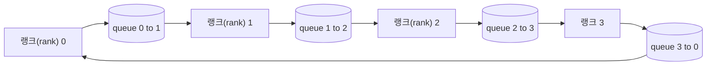

# 처음부터 collective 연산 구현하기

> 분산 훈련을 하나로 묶어 주는 네 가지 collective 연산은 allreduce, broadcast, allgather, reduce_scatter입니다. 훈련 프레임워크가 제공하는 다른 모든 프리미티브는 이 네 가지의 래퍼입니다. `multiprocessing.Queue` 메시(mesh) 위에서 한 번 구현하고, 참고 구현(reference implementation)과 검증해 보세요. 그러면 트랙의 나머지 부분은 단순한 배선(plumbing) 작업이 됩니다.

**유형:** Build
**언어:** Python
**선수 요건:** 19단계 C트랙 42-49강
**시간:** 약 90분

## 학습 목표

- 링(ring) allreduce를 두 단계(reduce-scatter, 그 다음 allgather)로 구현하고, 랭크(rank)당 통신량이 요소(element)당 2(N-1)/N 바이트임을 증명해 보세요.
- `multiprocessing.Queue` 위의 point-to-point 전송을 기반으로 broadcast, allgather, reduce_scatter를 구축해 보세요.
- 동일한 입력에 대해 `torch.distributed` gloo 참고 구현(reference)과 모든 프리미티브를 검증해 보세요.
- 클러스터 형태, 지연(latency) 하한, 대역폭 상한을 고려해 링(ring)과 트리(tree) 중 선택 이유를 방어해 보세요.

## 문제점

N개 랭크(rank)에 대한 단순한(naive) allreduce는 N번 텐서를 루트(root)로 보내고 N번 브로드캐스트로 되돌려 보냅니다. 랭크당 대역폭은 O(N)로 확장되고, 루트는 병목(bottleneck)이 되며, 벽시계(wall-clock) 하한은 가장 느린 링크에 N을 곱한 값이 됩니다. 링(ring) allreduce는 이를 크기가 T/N인 2(N-1)개의 청크(chunk)로 평탄화(flatten)하므로, 랭크당 바이트는 클러스터 크기와 무관하게 2T(N-1)/N으로 떨어집니다. 트리(tree) allreduce는 깊이가 2(N-1) 대신 log2(N) 홉(hop)이므로 작은 N과 높은 지연(latency) 링크에서 유리합니다. 클러스터 형태에 맞는 토폴로지(topology)를 선택하지 않으면 가장 느린 GPU가 스텝(step) 시간을 결정합니다.

이 트랙에서 읽게 될 모든 분산 훈련 프레임워크는 이 네 가지 프리미티브에 의존합니다. PyTorch DDP는 파라미터 버킷(bucket)당 하나의 allreduce로 기울기(gradient)를 동기화합니다. ZeRO는 reduce_scatter로 옵티마이저(optimizer) 상태를 샤드(shard)하고, allgather로 업데이트된 파라미터를 브로드캐스트합니다. FSDP는 전체 forward를 allgather와 reduce_scatter로 변환합니다. 파이프라인 병렬화(Pipeline parallelism)는 스테이지(stage) 그룹 간 활성값(activation)에 broadcast가 필요합니다. 네 가지 collective를 구현할 수 없다면, 훈련이 왜 멈추는지, 왜 랭크(rank) 3에서 기울기 불일치(gradient mismatch)가 나타나는지, 토폴로지(topology)를 바꾸면 왜 파이프라인 버블(bubble)이 두 배가 되는지 추론할 수 없습니다.

## 개념



### 두 단계로 수행하는 링 allreduce

텐서를 N개의 동일한 청크로 분할하고 0..N-1로 인덱싱합니다. 각 랭크는 자신의 랭크 번호와 동일한 인덱스를 가진 청크를 소유합니다. 1단계인 reduce-scatter는 N-1단계로 실행됩니다. 단계 s에서 랭크 r은 청크 (r - s) mod N을 랭크 (r + 1) mod N으로 전송하고, 랭크 (r - 1) mod N으로부터 청크 (r - s - 1) mod N을 수신하여 수신한 청크를 로컬 사본에 누적합니다. N-1단계 후, 랭크 r은 청크 r의 전체 합을 소유합니다. 2단계인 allgather는 추가 N-1단계로 실행되며, 완료된 청크를 링 주위로 회전시켜 모든 랭크가 모든 청크의 전체 합을 보유하게 됩니다.

| 원시 연산 | 랭크당 바이트 | 단계 | 사용 시점 |
|-----------|---------------|-------|-------------|
| Ring allreduce | 2T(N-1)/N | 2(N-1) | 큰 T, 넓은 파이프의 동질 클러스터 |
| Tree allreduce | T log2(N) | 2 log2(N) | 작은 T 또는 고지연 링크 |
| Broadcast | T | log2(N) 트리 | 파라미터 초기화, 스칼라 설정 |
| Allgather | T(N-1)/N | N-1 | 분할된 순전파, ZeRO 언샤드 |
| Reduce_scatter | T(N-1)/N | N-1 | ZeRO 기울기 샤딩 |

### NCCL의 대체 수단으로서 큐 메쉬

NCCL은 PCIe와 NVLink를 통해 하드웨어 오프로드된 reductions를 수행합니다. CPU에서는 이를 사용할 수 없습니다. 각 링 간에 `multiprocessing.Queue`를 사용하면 단일 생산자와 단일 소비자로 순서 있는 점대점 전달이 가능합니다. reduction은 사용자 공간에서 수행되므로 Python 오버헤드가 발생하지만, 통신 패턴은 NCCL ring allreduce와 동일합니다. 큐 버전으로 정확성을 검증하면 클러스터 동작도 따라오게 됩니다.

### gloo로 검증하기

각 원시 연산은 동일한 텐서와 동일한 world size로 gloo 백엔드를 초기화한 `torch.distributed`의 출력과 비교하는 단위 테스트를 포함합니다. ring allreduce가 gloo와 float32 epsilon 이상으로 편차하면 테스트가 실패합니다. 참고 구현에 대한 검증은 필수입니다. 이것이 없으면 실제 학습 실행의 10000단계까지 원시 연산이 정상으로 보일 수 있습니다.

```figure
ci-ring-allreduce
```

## 구현하기

`code/main.py`는 다음을 구현합니다:

- N개의 `multiprocessing.Queue` 인스턴스를 링으로 연결하고 각 랭크에 `send(dst, tensor)`와 `recv(src)`를 노출하는 `Mesh` 클래스.
- 두 단계 알고리즘을 실행하는 `ring_allreduce(mesh, rank, world_size, tensor)`.
- 로그arithmic 트리에서의 `broadcast(mesh, rank, world_size, tensor, src)`.
- `allgather(mesh, rank, world_size, tensor)`을 N-1번 회전으로 사용
- `reduce_scatter(mesh, rank, world_size, tensor)`을 allreduce의 첫 번째 부분으로 사용
- `_gloo_reference(op, world_size, tensor)`이 gloo를 사용하여 `torch.distributed`에 동일한 입력을 실행하고 바이트 단위 비교를 수행

실행해 보세요:

```bash
python3 code/main.py
```

출력: queue-mesh와 gloo의 출력을 비교하는 원시 연산별 검증 표, 그리고 2T(N-1)/N 스케일링을 증명하는 랭크별 바이트 카운터가 출력됩니다.

## 실전에서의 프로덕션 패턴

세 가지 패턴이 원시 연산의 안정성을 충분히 강화하여 출시할 수 있게 합니다.

**allreduce 전에 그래디언트를 버킷화하세요.** 10억 파라미터 모델은 수만 개의 그래디언트 텐서를 가집니다. 텐서마다 하나의 allreduce를 수행하면 지연 시간 하한을 N번 지불해야 합니다. DDP는 그래디언트를 약 25 MB 청크로 버킷화하고 버킷마다 하나의 allreduce를 발행합니다. 작은 텐서는 큰 텐서의 뒤를 따라갑니다. 버킷화 없이는 지연 시간 오버헤드가 스텝을 지배합니다.

**통신과 연산을 겹치세요.** 백워드 연산은 역순으로 레이어별 그래디언트를 계산합니다. 마지막 레이어의 그래디언트가 준비되는 즉시, 다음 레이어가 계속 계산하는 동안 해당 allreduce를 시작하세요. PyTorch DDP는 버킷 준비 훅으로 이를 연결합니다. 네트워크에 여유가 있을 때 겹치기(overlap)는 가시적인 통신 시간을 절반으로 줄입니다.

**메시지 크기에 따라 링 또는 트리를 선택하세요.** NCCL은 약 1 MB 이상의 메시지에 대해 링을, 그 이하에 대해 트리를 선택하는 토폴로지 감지기를 제공합니다. 교차점은 대역폭 대 지연 시간입니다: 1 MB 이상에서는 대역폭 항 2T(N-1)/N이 지배하므로 링이 승리하고, 1 MB 미만에서는 log2(N) 홉 카운트가 승리합니다. 하나의 토폴로지를 하드코딩하면 잘못된 메시지 크기에서 처리량이 손실됩니다.

## 사용하기

프로덕션 패턴:

- **PyTorch DDP.** 백워드 후 버킷화된 그래디언트에 `dist.all_reduce`을 호출합니다. 버킷 크기는 조정 가능하며, 기본값 25 MB는 100Gbit Ethernet에 적당합니다.
- **DeepSpeed ZeRO.** 그래디언트를 샤딩하기 위해 reduce_scatter를 발행하고, 포워드 전에 전체 파라미터를 재구성하기 위해 allgather를 발행합니다. 이 강의의 원시 연산은 ZeRO가 호출하는 것과 정확히 동일합니다.
- **FSDP.** 포워드는 allgather로 레이어를 언샤딩하여 시작하고, 연산한 후 reduce_scatter로 축소하고 언샤딩을 폐기합니다. 동일한 원시 연산, 다른 스케줄입니다.

## 출시하기

77-81강의 queue-mesh 프리미티브를 사용해 보세요. 77강은 allreduce를 DDP에 연결합니다. 78강은 reduce_scatter를 ZeRO에 연결합니다. 79강은 broadcast를 파이프라인 활성화에 연결합니다. 81강은 네 가지를 모두 조합하여 엔드투엔드 데모를 구성합니다.

## 연습 문제

1. 트리 allreduce 변형을 추가하고 메시지 크기에 따라 링과 트리를 전환하세요. 교차점을 측정해 보세요.
2. `recv_timeout_ms`을 추가하여 멈춘 랭크가 영원히 대기하는 대신 마감 시간 오류를 표시하도록 하세요.
3. 네 가지 프리미티브에 대해 `multiprocessing.Queue`을 TCP 소켓으로 교체하세요. 동일한 테스트를 실제 네트워크에서 수행합니다.
4. 대역폭 계측 훅을 추가하여 랭크별 바이트 카운터가 JSONL에 기록되도록 하세요.
5. 4개 랭크에서 1KB, 1MB, 16MB 크기의 텐서에 대해 링과 트리의 벽시계 시간을 비교하세요. 교차점을 경험적으로 입증하세요.

## 핵심 용어

| 용어 | 사람들이 말하는 것 | 실제 의미 |
|------|----------------|------------------------|
| Allreduce | "랭크 간 합산" | 호출 후 모든 랭크가 동일한 축소된 텐서를 보유합니다 |
| Ring | "빠른 토폴로지" | 크기 T/N의 N-1개 청크가 사이클을 두 번 순환합니다 |
| Tree | "로그 토폴로지" | 축소는 이진 트리를 따르며, 깊이는 log2(N) 홉입니다 |
| Allgather | "청크 연결" | 모든 랭크가 다른 모든 랭크의 청크를 최종적으로 보유합니다 |
| Reduce_scatter | "합산 분할" | 각 랭크는 하나의 청크에 대한 합산만 최종적으로 보유합니다 |
| Bucket | "작은 텐서 융합" | N개의 작은 allreduce를 하나의 큰 allreduce로 병합합니다 |

## 추가 읽기

- [PyTorch Distributed: NCCL collectives](https://pytorch.org/docs/stable/distributed.html#collective-functions)
- [Horovod ring allreduce paper](https://arxiv.org/abs/1802.05799)
- [NCCL topology and algorithm selection](https://docs.nvidia.com/deeplearning/nccl/user-guide/docs/index.html)
- [Patarasuk and Yuan, Bandwidth optimal allreduce algorithms](https://www.cs.fsu.edu/~xyuan/paper/09jpdc.pdf)
- 10단계 05강 - 분산 학습 개요
- 19단계 77강 - 이 프리미티브 위에 연결된 DDP
