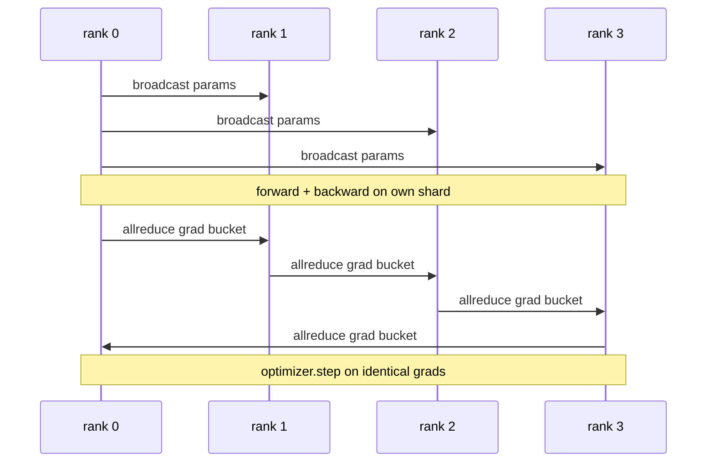

# Data Parallel DDP From Scratch

> DistributedDataParallel은 allreduce 위에 얹은 훅입니다. 모델을 감싸고, rank 0의 초기 매개변수를 브로드캐스트하여 모든 rank가 동일한 상태로 시작하게 하고, 모든 매개변수에 후방 전파 시 기울기의 allreduce를 수행하는 후방 훅을 설치하면, 나머지는 경사 하강법입니다. 전체 패턴은 200줄입니다.

**유형:** Build
**언어:** Python
**선수 요건:** 19단계 C트랙 42-49강
**시간:** 약 90분

## 학습 목표

- 초기 매개변수를 브로드캐스트하고 후방 전파 후 기울기를 allreduce하는 `DistributedDataParallel` 형태의 래퍼를 구성해 보세요.
- gloo 백엔드와 파일 기반 렌데부스를 사용하여 `torch.multiprocessing.spawn`로 N개의 CPU rank를 생성해 보세요.
- 동일한 모델과 데이터를 순차적으로 학습하고 단계별 매개변수 동등성을 보여줌으로써 기울기 동기화 정확성을 입증해 보세요.
- 작동하는 DDP를 프로덕션 DDP로 전환하는 두 가지 변경 사항인 버킷(기울기 융합)과 오버랩(후방 전파 중 통신)의 사용을 옹호해 보세요.

## 문제점

10억 매개변수 모델과 12 GB의 활성화는 단일 소비자 GPU에 맞지 않습니다. 맞더라도 학습에는 몇 주가 걸립니다. 데이터 병렬은 배치를 N개의 rank로 분할하며, 각 rank는 자신의 샤드에 대해 순방향 및 후방 전파를 계산하고, 매 단계마다 모든 rank의 기울기를 합산하여 N개의 사본이 모두 동일하게 유지됩니다. 합산된 기울기가 옵티마이저가 스텝하는 값입니다.

기울기 동기화가 없으면 N개의 복제본은 2단계에서 발산합니다. 모델은 더 많은 데이터로 학습된 "하나의 모델"이 아니라, 초기 가중치를 공유하는 N개의 독립적인 모델이 됩니다. 기울기 동기화가 잘못되면(매개변수마다 allreduce 한 번, 오버랩 없음, 버킷팅 없음) 네트워크가 병목이 되어 GPU는 네트워크를 기다리며 유휴 상태가 됩니다. DDP의 기술은 계산에 비해 기울기 동기화를 거의 무료에 가깝게 만드는 것입니다. 표준 PyTorch DDP는 기울기를 버킷팅하고, allreduce를 다음 레이어의 후방 전파와 오버랩하며, NVLink에서 NCCL을 사용하여 이를 달성합니다. 우리는 CPU에서 gloo를 사용하여 세 가지를 모두 수행하고 동일한 교훈을 배울 수 있습니다.

## 개념



### DDP가 필요로 하는 세 가지 연산

| 단계 | 집합 연산 | 이유 |
|-------|-----------|-----|
| 초기화 | rank 0에서 broadcast | 모든 rank가 동일한 매개변수로 시작 |
| backward 후 | 각 기울기의 allreduce | 평균 기울기가 옵티마이저가 스텝하는 값 |
| 때에 따라 | 버퍼의 broadcast | Batchnorm의 running stats가 동기화 유지 |

### 왜 합(sum)이 아닌 평균(mean)인가

Allreduce-SUM을 world_size로 나누면 평균 기울기가 됩니다. 평균은 world_size에 대해 불변입니다: 한 rank에서 튜닝한 학습률은 네 rank에서도 작동합니다. 스텝당 기울기 크기가 변하지 않기 때문입니다. 나누지 않는 Allreduce-SUM은 클러스터 크기를 변경할 때마다 학습률을 다시 튜닝해야 합니다. DDP는 SUM을 래핑하고 나누므로, 강의에서도 동일하게 구현하세요.

### 왜 기울기를 버킷으로 묶는가

트랜스포머는 수천 개의 매개변수 텐서를 가집니다. 텐서마다 하나의 allreduce를 수행하면 gloo 지연 하한을 수천 번 지불하게 됩니다. DDP는 기울기를 약 25 MB 버킷으로 그룹화하고 버킷당 하나의 allreduce를 발행합니다. 총 전송 바이트는 동일하지만 지연이 버킷에 걸쳐 상각(amortised)됩니다. 강의의 작은 모델에서는 모든 것을 하나의 버킷으로 그룹화합니다. 구조가 핵심입니다.

### 왜 시드(seed)를 고정하는가

모든 rank는 셔플링(shuffling)을 위해 `torch.manual_seed(seed + rank)`를 호출해야 하지만, 매개변수 초기화를 위해 `torch.manual_seed(seed)`를 호출해야 합니다. 단일 공유 시드를 사용하면 모든 rank가 동일한 배치 순서를 보게 되어 데이터 병렬화가 무의미해집니다. 매개변수에 대해 rank별 시드를 사용하면 초기 매개변수가 float epsilon 차이로 불일치하고, 기울기 동기화 후에도 복제본이 동일해지지 않습니다. 시드 패턴을 정확히 설정하지 않으면 매개변수 동등성 테스트가 1단계에서 실패합니다.

```figure
ci-ddp-grad-sync
```

## 구현하기

`code/main.py`는 다음을 구현합니다:

- `MiniMLP`: 몇 초 안에 수렴할 만큼 작으면서, 배선을 드러낼 만큼 큰 3층 MLP입니다.
- `DistributedDataParallel(model, world_size)`: 생성 시 매개변수를 broadcast하며, 누적된 allreduce-summed 기울기를 world_size로 나누는 래퍼(wrapper)를 반환합니다. `sync_grads`
- `worker(rank, world_size, ...)`: gloo를 사용하여 `torch.distributed` 초기화, forward, backward, sync, step을 포함하는 전체 학습 루프입니다.
- `_reference_single_process_loop(...)`: 동일한 데이터를 하나의 rank에서 순차적으로 학습하며, 각 스텝 후 바이트 단위 매개변수 동등성 테스트에 사용됩니다.

실행하세요:

```bash
python3 code/main.py
```

출력: 단일 프로세스 손실 및 매개변수 체크섬을 4개 랭크의 DDP 실행과 비교하는 단계별 학습 표입니다. 두 경로가 부동 소수점 오차 범위 내에서 동일한 손실 곡산을 생성하므로, 기울기 동기화가 정확함을 증명합니다.

## 실전에서의 프로덕션 패턴

세 가지 패턴이 DDP를 충분히 강화하여 출시할 수 있게 합니다.

**사용되지 않는 매개변수 찾기.** 일부 순방향 경로가 조건부로 매개변수를 건너뛰는 경우가 있습니다 (조기 종료, 혼합 전문가 라우터). 건너뛴 매개변수에는 기울기가 없지만, DDP의 버킷 준비 훅은 여전히 이를 기다리므로 allreduce가 데드락에 빠집니다. `find_unused_parameters=True`는 DDP가 기울기를 받은 매개변수를 먼저 확인한 후 감소하도록 지시합니다. 비용은 단계별 그래프 순회이므로, 순방향에 분기가 없는 한 이 기능을 끄는 것이 좋습니다.

**정적 그래프 최적화.** 순방향이 단계 간에 안정적일 때, `static_graph=True`는 DDP가 버킷 스케줄을 사전 계산하도록 허용합니다. 이 최적화는 대규모 환경에서 중요합니다. 사전 계산은 단계당 몇 ms를 절약하며, 이는 10000 단계에 걸쳐 누적됩니다.

**기울기 누적 주의.** K개의 마이크로배치에 걸쳐 각 마이크로배치를 동기화하지 않고 기울기를 누적하는 것은 처리량을 10배 높이는 방법입니다. DDP는 post-backward allreduce를 일시 중지하는 컨텍스트 매니저로 `no_sync()`를 노출합니다. 매니저를 잊으면 K번의 allreduce를 헛되이 수행하게 되며, 처리량은 바닥으로 떨어집니다.

## 사용하기

프로덕션 패턴:

- **PyTorch DDP.** 표준 구현입니다. `torch.nn.parallel.DistributedDataParallel(model)`는 버킷화, 오버랩 및 no_sync 컨텍스트를 연결합니다.
- **HuggingFace Accelerate.** `torchrun` 환경 변수와 모델 래핑을 처리하는 런처를 추가합니다. 내부적으로는 동일한 DDP를 사용합니다.
- **Megatron-LM 데이터 병렬.** 대규모 모델에 DDP와 텐서 병렬화를 결합합니다. 데이터 병렬 부분은 동일한 backward 후 allreduce 패턴입니다.

## 출시하기

78강 (ZeRO 샤딩)은 매개변수별 allreduce를 reduce_scatter로 대체하여 각 랭크가 옵티마이저 상태의 샤드만 저장하도록 합니다. 81강은 DDP와 ZeRO를 결합하여 엔드투엔드 데모를 구성합니다.

## 연습 문제

1. 설정 가능한 크기의 기울기 버킷을 추가하고, 더 깊은 모델에서 매개변수별 allreduce 대비 속도 향상을 측정해 보세요.
2. `no_sync()`를 컨텍스트 매니저로 구현하고, K개의 마이크로배치에 걸쳐 기울기 누적이 단일 프로세스 기준선과 일치하는지 검증해 보세요.
3. MLP 레이어 중 하나를 포워드 패스가 때때로 건너뛰는 `find_unused_parameters` 모드를 추가해 보세요. 플래그가 없으면 실행이 데드락에 빠져야 합니다.
4. gloo를 `torch.distributed.barrier()` 전용 동기화로 교체하여 allreduce 기반 동기화와 barrier 기반 동기화의 차이를 느껴 보세요.
5. 배치 크기 1, 16, 256에서 기울기 동기화 오버헤드가 스텝 시간의 몇 비율을 차지하는지 측정하고, 스케일링을 설명해 보세요.

## 핵심 용어

| 용어 | 사람들이 말하는 것 | 실제 의미 |
|------|----------------|------------------------|
| DDP | "데이터 병렬" | 매 스텝마다 매개변수를 브로드캐스트하고 기울기를 allreduce하는 래퍼 |
| 버킷 | "기울기 융합" | 작은 allreduce N개를 하나의 큰 allreduce로 그룹화 |
| 겹침 | "통신 숨기기" | 이후 레이어가 역전파를 계산하는 동안 allreduce를 실행 |
| no_sync | "누적" | 기울기 누적을 위해 역전파 후 allreduce를 건너뛰기 |
| find_unused | "분기 있는 포워드" | 감소하기 전에 기울기가 없는 매개변수를 감지 |

## 추가 읽기

- [PyTorch DistributedDataParallel docs](https://pytorch.org/docs/stable/generated/torch.nn.parallel.DistributedDataParallel.html)
- [PyTorch DDP internals tutorial](https://pytorch.org/tutorials/intermediate/ddp_tutorial.html)
- [Li et al, PyTorch Distributed: Experiences on Accelerating Data Parallel Training](https://arxiv.org/abs/2006.15704)
- 19단계 76강 - DDP가 구축된 기반의 콜렉티브
- 19단계 78강 - ZeRO 샤딩은 매개변수별 allreduce를 reduce_scatter로 대체합니다
