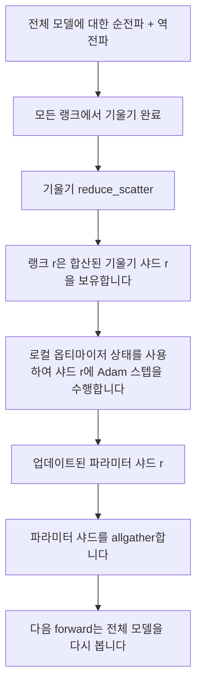

# ZeRO 옵티마이저 상태 샤딩

> Adam은 각 매개변수에 대해 두 개의 모멘트 추정치를 저장하며, 둘 다 float32입니다. 70억 매개변수 모델은 56 GB의 옵티마이저 상태를 포함합니다. ZeRO 단계 1은 이를 N개의 랭크에 샤딩하며, 각 랭크는 옵티마이저의 1/N을 소유합니다. 로컬 스텝이 완료된 후 업데이트된 매개변수 샤드가 브로드캐스트되어 모든 랭크가 전체 모델을 재구성하고, 다음 스텝이 시작됩니다. 이 방식의 이점은 학습 스택에서 가장 큰 단일 할당의 메모리가 선형적으로 감소한다는 것입니다.

**유형:** Build
**언어:** Python
**선수 요건:** 19단계 C트랙 42-49강
**시간:** 약 90분

## 학습 목표

- 옵티마이저 상태(1차 모멘트, 2차 모멘트, fp32 마스터 복사본)를 N개의 랭크에 샤딩하여 각 랭크가 1/N을 소유하도록 합니다.
- reduce_scatter를 사용하여 각 랭크에 해당 샤드의 기울기 합만 전달한 후, allgather를 통해 업데이트된 매개변수 샤드를 브로드캐스트합니다.
- 순수 DDP 대비 단계 1, 단계 2, 단계 3의 메모리 절감 표를 계산합니다.
- 모델 크기와 대역폭 예산을 고려하여 단계 1, 단계 2, 단계 3 중 선택의 근거를 설명합니다.

## 문제점

순수 DDP는 모든 것을 복제합니다: 매개변수, 기울기, 옵티마이저 상태가 모든 랭크에 완전히 존재합니다. fp16의 70억 매개변수 모델의 경우 랭크당 14 GB의 매개변수, 14 GB의 기울기, 28 GB의 옵티마이저 상태가 필요합니다. 옵티마이저 상태는 가장 큰 항목이며, 스텝 중에만 사용되고 순전파나 역전파 중에는 사용되지 않으므로 샤딩하기 가장 쉽습니다.

ZeRO 단계 1은 옵티마이저 상태를 샤딩합니다. 각 랭크는 Adam 모멘트의 1/N을 보유합니다. 역전파 후, 전체 기울기를 allreduce하고 로컬에서 스텝하는 대신 ZeRO는 reduce_scatter를 수행하여 각 랭크가 해당 샤드의 합산된 기울기만 받습니다. 랭크는 마스터 매개변수의 샤드에 옵티마이저 스텝을 적용합니다. 업데이트된 매개변수 샤드는 allgather를 통해 브로드캐스트되어 모든 랭크가 다음 순전파를 위해 전체 모델을 갖게 됩니다. 옵티마이저 메모리는 N만큼 감소합니다. 스텝당 통신량은 DDP와 동일합니다: reduce_scatter 하나와 allgather 하나는 대역폭 측면에서 allreduce 하나와 같습니다. 메모리는 절감되고 처리량은 유지됩니다.

## 개념



### ZeRO의 단계

| 단계 | 샤드 대상 | 랭크당 메모리 | 스텝당 통신 |
|-------|----------------|------------------|---------------|
| DDP | 없음 | 파라미터 + 기울기 + 옵티마이저 | 1x allreduce |
| ZeRO-1 | 옵티마이저 상태 | 파라미터 + 기울기 + 옵티마이저/N | 1x reduce_scatter + 1x allgather |
| ZeRO-2 | 옵티마이저 + 기울기 | 파라미터 + 기울기/N + 옵티마이저/N | 1x reduce_scatter + 1x allgather |
| ZeRO-3 | 옵티마이저 + 기울기 + 파라미터 | 파라미터/N + 기울기/N + 옵티마이저/N | 레이어당 1x allgather + 레이어당 1x reduce_scatter |

Stage 1은 옵티마이저 상태가 메모리 예산의 대부분을 차지하므로 가장 저렴한 개선입니다. Stage 2는 기울기 샤드 누적 로직이 필요하지만 대역폭은 동일합니다. Stage 3 (FSDP)는 모든 forward와 backward에서 레이어별 통신 비용을 지불하며, 파라미터 샤드 메모리 절감을 얻습니다. 이 강의는 Stage 1을 완전히 구현합니다.

### 메모리 계산, 실제 수치

Adam을 사용하여 혼합 정밀도(Mixed Precision)로 학습되는 P 파라미터를 가진 모델의 경우:

| 항목 | Vanilla | ZeRO-1 | 이유 |
|------|---------|--------|-----|
| fp16 파라미터 | 2P 바이트 | 2P 바이트 | forward에 필요 |
| fp16 기울기 | 2P 바이트 | 2P 바이트 | backward에 필요 |
| fp32 마스터 복사본 | 4P 바이트 | 4P/N 바이트 | 옵티마이저만 사용 |
| fp32 1차 모멘트 | 4P 바이트 | 4P/N 바이트 | 옵티마이저만 사용 |
| fp32 2차 모멘트 | 4P 바이트 | 4P/N 바이트 | 옵티마이저만 사용 |
| 합계 | 16P 바이트 | 4P + 12P/N 바이트 |   |

N=8일 때: Vanilla 16P, ZeRO-1 5.5P로 65% 감소합니다. N=64일 때: Vanilla 16P, ZeRO-1 4.19P로 74% 감소합니다.

### allreduce 후 샤드화보다 reduce_scatter가 더 나은 이유

Allreduce는 모든 랭크에 합산된 전체 기울기를 제공합니다. 랭크 r이 샤드 r만 필요로 한다면, 리듀스된 기울기의 (N-1)/N은 랭크 r에서 낭비됩니다. Reduce_scatter는 각 랭크가 소유한 샤드를 정확히 전달합니다. 랭크당 바이트 수는 allreduce와 동일합니다(allreduce는 reduce_scatter + allgather이므로)하지만, 후반부는 이후의 파라미터 샤드 allgather로 대체됩니다. 전체 통신량은 DDP와 동일하며, 메모리는 분할됩니다.

```figure
cd-zero-shard
```

## 구현하기

`code/main.py`는 다음을 구현합니다:

- `flatten_params(module)` 및 `unflatten_into(module, flat)`는 모델의 파라미터를 하나의 연속 텐서로 팩킹하고 언팩킹합니다. 평면(flat) 레이아웃은 랭크별 샤딩을 단순한 슬라이스로 만듭니다.
- `ZeroOptimizer(model, world_size, rank, lr)`는 마스터 사본의 랭크 샤드와 Adam 모멘트를 소유합니다.
- `step()`는 평면 기울기에 reduce_scatter를 실행하고, 랭크 샤드에 Adam을 적용하며, 업데이트된 파라미터를 allgather로 복원합니다.
- 3층 MLP를 20단계 동안 학습하고, 바닐라 DDP 기준선과 함께 단계별 메모리 예산을 출력하는 데모입니다.

실행해 보세요:

```bash
python3 code/main.py
```

출력: 단계별 손실과 ZeRO-1이 각 랭크에서 옵티마이저 상태의 1/N을 유지하는 반면 DDP는 전체 사본을 유지함을 보여주는 메모리 테이블입니다.

## 실전에서의 프로덕션 패턴

ZeRO를 출시할 수 있을 정도로 강화하는 세 가지 패턴이 있습니다.

**샤드 체크포인팅이 중요합니다.** ZeRO-1의 옵티마이저 상태는 랭크 간에 분할되어 있으며, 체크포인트는 어떤 랭크가 무엇을 소유하는지 기록해야 합니다. 80강은 동일한 월드 사이즈에서 ZeRO 실행을 재개하는 샤드 체크포인팅 매니페스트를 구축합니다. 이것이 없으면 저장된 상태는 재시작 시 읽을 수 없습니다.

**혼합 정밀도가 핵심입니다.** ZeRO는 혼합 정밀도(Mixed Precision) 기술이며, 샤딩되는 것은 fp32 마스터 사본입니다. 혼합 정밀도 없이 ZeRO를 실행하면 fp16 순전파의 이점 없이 fp32 마스터에 대한 메모리 비용을 지불하게 됩니다. 프로덕션 실행은 항상 ZeRO를 autocast 또는 bf16 가중치와 함께 사용합니다.

**Stage 1은 거의 무료인 승리입니다.** 통신량은 대역폭 측면에서 DDP와 동일합니다. 메모리 절감은 N에 대해 선형입니다. 유일한 비용은 옵티마이저 샤드에 대한 관리(bookkeeping)입니다. 프로덕션 스택은 파라미터 샤드 메모리도 문제가 되지 않는 한 기본적으로 stage 1을 사용하며, 문제가 되면 stage 2 또는 3이 통신을 메모리와 교환합니다.

## 사용하기

프로덕션 패턴:

- **DeepSpeed ZeRO.** 참고 구현입니다. `deepspeed_config.json`에서 stage 1/2/03강 분할 크기를 선택합니다.
- **PyTorch FSDP.** PyTorch 네이티브에 해당하는 구현입니다. `ShardingStrategy.SHARD_GRAD_OP`는 ZeRO-2이고, `FULL_SHARD`는 ZeRO-3입니다.
- **HuggingFace Accelerate.** DeepSpeed와 FSDP를 모두 단일 설정으로 감싸줍니다.

## 출시하기

79강(파이프라인 병렬화)은 직교하는 분할 축입니다. 같은 모델에 대해 옵티마이저 상태를 분할하는 대신, 파이프라인은 레이어를 랭크 간에 분할합니다. 81강은 엔드투엔드 데모에서 DDP + ZeRO를 조합합니다.

## 연습 문제

1. 기울기를 분할하여 ZeRO-2로 확장해 보세요. 각 랭크는 자신의 샤드에 대한 기울기만 저장하며, 이는 역전파 후 비샤드 부분을 0으로 만들어 달성합니다.
2. 랭크 0의 실제 fp32 바이트 사용량과 공식 예측값을 출력하는 메모리 프로파일러를 추가해 보세요.
3. 바닐라 DDP와 ZeRO-1의 단계별 벽시계 시간을 측정하고, 이를 순방향, 역방향, 통신으로 분해해 보세요.
4. ZeRO-1에서 기울기 클리핑을 구현해 보세요. L2 노름은 모든 샤드에 걸쳐 계산되어야 하며, 이는 지역 노름의 제곱을 allreduce하여 달성합니다.
5. reduce_scatter 대신 allreduce를 사용하는 "순진한 ZeRO"를 구현하고, 전송 시간 차이를 측정해 보세요. reduce_scatter 선택의 근거를 수치로 방어해 보세요.

## 핵심 용어

| 용어 | 사람들이 말하는 것 | 실제 의미 |
|------|----------------|------------------------|
| ZeRO-1 | "옵티마이저를 분할하세요" | 각 랭크는 fp32 마스터 + Adam 모멘트의 1/N을 보유합니다 |
| ZeRO-2 | "기울기도 분할하세요" | 각 랭크는 reduce_scatter 후 비샤드 기울기도 버립니다 |
| ZeRO-3 | "매개변수를 분할하세요" | 각 랭크는 fp16 매개변수의 1/N을 보유하며, 순방향에서 레이어별로 allgather합니다 |
| 마스터 사본 | "fp32 가중치" | 옵티마이저가 업데이트하는 고정밀 매개변수 사본입니다 |
| Reduce_scatter | "합을 분할하세요" | 각 랭크에 샤드의 합산된 기울기만 전달합니다 |

## 추가 읽기

- [Rajbhandari et al, ZeRO: Memory Optimizations Toward Training Trillion Parameter Models](https://arxiv.org/abs/1910.02054)
- [DeepSpeed ZeRO documentation](https://www.deepspeed.ai/tutorials/zero/)
- [PyTorch FSDP documentation](https://pytorch.org/docs/stable/fsdp.html)
- 19단계 76강 - 이 강의가 기반하는 reduce_scatter와 allgather
- 19단계 80강 - ZeRO 상태가 사용해야 하는 분할 체크포인팅
