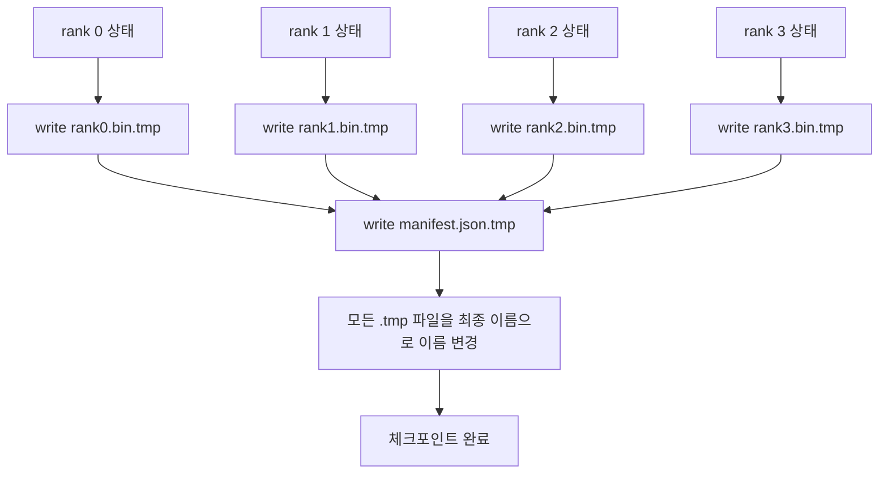

# 분할 체크포인트와 원자적 재개

> 700억 매개변수 학습 작업이 몇 시간마다 노드 장애로 인해 일시 중지됩니다. 체크포인트 형식은 30분 손실과 30시간 손실 중 어느 쪽을 선택할지 결정합니다. 분할 체크포인트는 모든 랭크의 청크를 병렬로 기록하고 소유권을 매니페스트에 기록합니다. 재개 시 각 랭크는 자체 파일에서 청크를 로드하고 동일한 월드 크기로 상태를 복원하며, 옵티마이저는 아무 일도 일어나지 않은 것처럼 스텝을 진행합니다. 원자적 쓰기는 반쯤 완료된 체크포인트가 다음 재개를 오염시키는 것을 방지합니다.

**유형:** Build
**언어:** Python
**선수 요건:** 19단계 C트랙 42-49강
**시간:** 약 90분

## 학습 목표

- 다중 랭크 체크포인트를 랭크별 청크 파일과 매니페스트로 저장하며, 매니페스트는 어떤 랭크가 무엇을 소유하는지 기록합니다.
- 원자적 쓰기 패턴(임시 경로에 쓴 후 이름 변경)을 사용하여 쓰기 중 충돌이 발생해도 반쯤 완료된 체크포인트가 생성되지 않도록 합니다.
- 매니페스트에서 재개하며, 모든 랭크에서 fp16 매개변수와 ZeRO 옵티마이저 상태가 바이트 단위로 동일한지 검증합니다.
- 세 가지 장애 모드(월드 크기 변경, 청크 수 불일치, 부분 쓰기)에 대해 매니페스트 스키마를 방어합니다.

## 문제점

기본 체크포인트는 모든 매개변수와 옵티마이저 상태를 랭크 0으로 읽어 모으고 단일 파일에 씁니다. 700억 모델의 경우 한 랭크의 네트워크 포트를 통해 1.1 TB의 상태를 전송해야 합니다. 쓰기는 모으기(gather)를 기다리는 동안 다른 모든 랭크가 유휴 상태가 되므로 모든 랭크를 차단합니다. IO 대역폭은 가장 느린 단일 GPU의 네트워크 링크이며, 집계 대역폭이 아닙니다. 실제 클러스터에서는 모으기 후 쓰기 단계가 이전 학습 시간보다 오래 걸릴 수 있으며, 이는 하루 학습당 체크포인트가 한 개 미만으로 생성됨을 의미합니다.

분할 체크포인트는 패턴을 뒤집습니다. 모든 랭크가 자체 청크를 자체 파일에 병렬로 씁니다. 매니페스트는 어떤 랭크가 어떤 청크를 소유했는지 기록하므로, 재개 시 각 청크를 원래 위치로 되돌릴 수 있습니다. 집계 쓰기 대역폭은 클러스터 규모에 따라 확장됩니다. 한 랭크를 통해 4시간이 걸렸던 1 TB 체크포인트는 64개 랭크를 통해 4분이 걸립니다. 또한 매니페스트는 호환되지 않는 재개에 대한 계약을 제공합니다. 월드 크기 변경은 감지 가능하고, 부분 쓰기는 감지 가능하며, 로드 경로는 오래된 데이터를 조용히 사용하는 대신 명확하게 실패할 수 있습니다.

## 개념



### Manifest 스키마

```json
{
  "world_size": 4,
  "step": 1234,
  "wall_clock_seconds": 4521,
  "shards": [
    {"rank": 0, "path": "rank0.bin", "sha256": "...", "param_shard_offset": 0, "param_shard_numel": 65536},
    {"rank": 1, "path": "rank1.bin", "sha256": "...", "param_shard_offset": 65536, "param_shard_numel": 65536}
  ],
  "schema_version": 1
}
```

세 가지 필드가 핵심입니다. `world_size`는 다른 크기로 재개할 때 조용히 손상되는 것이 아니라 명확하게 실패하도록 합니다. `sha256`는 샤드별로 부분적이거나 손상된 쓰기를 감지합니다. `param_shard_offset`와 `param_shard_numel`는 샤드별로 로더가 평평한 매개변수 텐서를 올바른 위치에서 재구성할 수 있도록 합니다.

### 원자적 쓰기

표준 패턴: 모든 샤드를 `<name>.tmp`에 쓰고, manifest를 `manifest.json.tmp`에 쓰며, 각각 fsync한 후 이름 변경합니다. 같은 파일 시스템 내의 POSIX rename은 원자적입니다. 새 파일이 완전히 존재하거나, 기존 파일이 존재합니다. 최종 rename 전에 크래시가 발생하면 이전 체크포인트가 라이브 체크포인트로 남습니다. 원자적 쓰기가 없으면 크래시로 부분적인 샤드가 남을 수 있으며, manifest가 이를 가리키게 되어 재개 시 옵티마이저 상태가 손상됩니다.

### 스키마가 방어해야 하는 세 가지 실패 모드

| 실패 | 증상 | 방어 |
|---------|---------|---------|
| World-size 변경 | N=4의 manifest로 N=8에서 재개 | manifest의 world_size 불일치, 명확하게 실패 |
| 샤드 수 불일치 | 재개 시 manifest의 샤드 수보다 rank*.bin 파일이 적음 | 샤드를 열거하고 각각이 존재하는지 검증 |
| 부분 쓰기 | 플러시 중 샤드 파일이 잘림 | 로드 시 sha256 검증 |

각 방어는 잘못된 로드를 조기에 거부합니다. 대안은 손실이 NaN이 되는 100 스텝 후에 드러나는 조용한 손상입니다.

### 왜 하나의 큰 파일이 아니라 rank별 파일인가

`O_APPEND`를 통해 하나의 파일에 동시 쓰기는 바이트 정렬된 쓰기에서는 POSIX에서 작동하지만, 실제로는 하나의 샤드 내 오프셋이 MB 크기의 영역에 걸쳐 있으며 잠금이 지배적입니다. rank별 파일은 경쟁이 없으며, 기본 파일 시스템이 병렬(Lustre, GPFS)일 때 스트라이핑의 이점을 얻습니다. 프로덕션 스택(DeepSpeed, FSDP, NeMo)은 모두 이 이유로 rank별 파일을 사용합니다.

```figure
ci-sharded-checkpoint
```

## 구현하기

`code/main.py`는 다음을 구현합니다:

- 위 스키마에 `to_json`/`from_json`를 추가한 `ShardManifest` dataclass입니다.
- 각 랭크의 바이너리 상태를 자체 파일에 원자적(temp-then-rename) 패턴으로 기록한 후 매니페스트를 기록하는 `save_sharded(state_dict_per_rank, dir, step)`입니다.
- 매니페스트를 읽고 각 샤드의 sha256을 검증한 후 랭크별 상태 딕셔너리를 반환하는 `load_sharded(dir, expected_world_size)`입니다.
- 왕복 테스트: 랭크별 상태를 생성하고, 저장하고, 로드하고, 바이트 단위로 동일함을 검증합니다.

실행해 보세요:

```bash
python3 code/main.py
```

출력: 4개의 샤드 파일과 매니페스트가 기록된 후, 바이트 단위 동일성 검증을 통해 다시 로드됩니다.

## 실전에서의 프로덕션 패턴

세 가지 패턴이 체크포인트를 출시할 수 있을 정도로 강화합니다.

**비동기 쓰기.** 프로덕션 스택은 체크포인트 쓰기를 별도 스레드나 프로세스에서 수행하여 훈련이 계속되도록 합니다. 배리어는 다음 체크포인트에 있습니다: 이전 저장이 완료될 때까지 다음 저장을 시작하지 마세요. DeepSpeed의 `async_io` 플래그가 정확히 이 역할을 합니다. 이 레슨에서는 단계를 명확히 볼 수 있도록 쓰기를 동기식으로 유지합니다.

**먼저 로컬 고속 디스크에, 그 다음 비동기 업로드.** 로컬 NVMe(고속)에 기록한 후 S3나 GCS로 비동기 업로드하세요. 2단계 패턴은 클러스터 내 체크포인트를 빠르게 유지하여 재개(resume)를 지원하면서, 아카이브를 위해 클러스터 외부에 내구성 있는 복사본을 전송합니다. 매니페스트는 로컬 경로를 담고, 업로드 매니페스트는 원격 경로를 담습니다.

**회전(Rotation)이 중요합니다.** 프로덕션 실행은 마지막 K개 체크포인트(통상 3-5개)를 유지하고 가장 오래된 것을 회전합니다. 회전 없이는 실행 중 디스크가 가득 차 다음 체크포인트가 실패합니다. 회전하면 다음 저장이 가장 오래된 것을 먼저 삭제하여 예산을 확보합니다.

## 사용하기

프로덕션 패턴:

- **DeepSpeed 체크포인팅.** `deepspeed.save_checkpoint(tag=step)`는 랭크별 파일과 활성 태그를 가리키는 `latest` 파일을 기록합니다.
- **PyTorch FSDP 체크포인팅.** `torch.distributed.checkpoint`는 랭크별 레이아웃을 결정하는 `Planner`와 함께 샤드된 상태를 저장합니다.
- **NeMo.** DeepSpeed와 FSDP를 메타데이터를 추가하는 균일한 `save_to_checkpoint` API로 래핑합니다.

## 출시하기

81강은 엔드투엔드 DDP+ZeRO 실행의 샤드된 체크포인트를 저장하고, 동일한 월드 사이즈에서 이를 다시 로드하여 재개 계약이 유지됨을 증명합니다.

## 연습 문제

1. 비동기 쓰기를 추가하세요: 스레드에서 저장을 시작하고 학습이 계속되도록 하세요. 이전 저장이 완료될 때까지 다음 저장을 차단합니다.
2. `last_5_steps` 로테이션을 추가하세요: 가장 최근 체크포인트 5개를 유지하고, 새 체크포인트를 저장하기 전에 가장 오래된 것을 삭제합니다.
3. 내부 루프 재로딩을 위한 CRC 전용 빠른 검증 경로를 추가하세요 (로테이션은 전체 sha256 검증 없이 체크포인트를 새 활성 체크포인트로 전환합니다).
4. 교차 세계 크기 로딩을 추가하세요: 매니페스트를 읽고, 연결하고, 재분할하여 N=4에서 N=8로 샤드 재균형을 수행합니다.
5. 가짜 S3 (두 번째 디렉토리)에 업로드하고 업로드 매니페스트를 작성하세요. 2단계 저장 정책을 방어합니다.

## 핵심 용어

| 용어 | 사람들이 말하는 표현 | 실제 의미 |
|------|----------------|------------------------|
| 샤드 체크포인트 | "랭크별 저장" | 각 랭크가 병렬로 자체 샤드 파일을 씁니다 |
| 매니페스트 | "인덱스" | 샤드 경로, 오프셋 및 sha256를 기록하는 JSON 파일 |
| 원자적 쓰기 | "임시 파일 후 이름 변경" | .tmp에 쓴 후 POSIX rename을 수행하여 크래시가 발생해도 이전 파일이 살아남도록 합니다 |
| 부분 쓰기 | "잘린 샤드" | 쓰기 중 크래시가 발생하면 손상된 샤드가 생성되며, sha256이 이를 감지합니다 |
| 로테이션 | "마지막 K개 유지" | 디스크 사용량을 제한하기 위해 새 체크포인트를 쓰기 전에 가장 오래된 체크포인트를 삭제합니다 |

## 추가 읽기

- [DeepSpeed checkpointing](https://deepspeed.readthedocs.io/en/latest/model-checkpointing.html)
- [PyTorch torch.distributed.checkpoint](https://pytorch.org/docs/stable/distributed.checkpoint.html)
- [POSIX rename atomicity](https://pubs.opengroup.org/onlinepubs/9699919799/functions/rename.html)
- 19단계 78강 - 이 체크포인트가 저장하도록 설계된 ZeRO 상태
- 19단계 81강 - 엔드투엔드 데모가 저장된 상태를 왕복합니다
