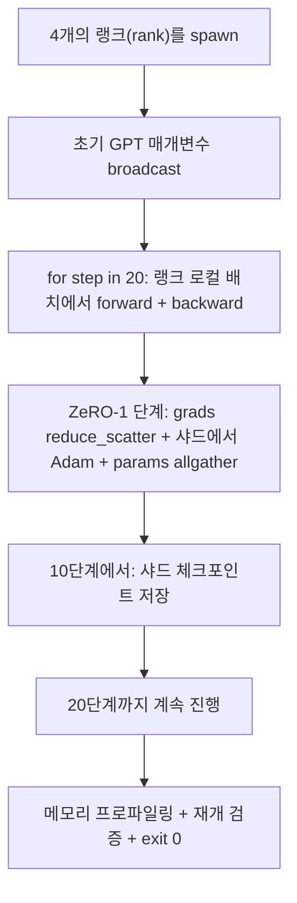

# 엔드투엔드 분산 학습

> 76강부터 80강까지 각각 하나의 구성 요소를 만들었습니다. 이 강은 그 조립 과정입니다: 4개의 시뮬레이션된 랭크(rank)에서 DDP로 기울기 동기화, ZeRO-1로 옵티마이저 상태 샤딩(sharding), 중간 지점에서의 샤드된 체크포인트를 사용하여 작은 GPT를 학습합니다. 데모는 20단계가 실행되며, 스스로 종료하고, 손실 곡선과 메모리 프로파일을 출력하며, 재개 가능한 체크포인트를 기록합니다.

**유형:** Build
**언어:** Python
**선수 요건:** 19단계 C트랙 42-49강
**시간:** 약 90분

## 학습 목표

- DDP(77강)와 ZeRO-1(78강)과 샤드된 체크포인트(80강)를 하나의 학습 루프로 구성합니다.
- 4개의 시뮬레이션된 랭크(rank)에서 작은 합성 코퍼스를 사용하여 2층 트랜스포머 언어 모델을 20단계 동안 학습합니다.
- 단계별 손실 표, 랭크별 메모리 프로파일, 그리고 동일한 월드(world) 크기에서 바이트 단위로 동일하게 재개되는 체크포인트 매니페스트를 출력합니다.
- 구성 요소를 방어합니다: 각 구성 요소는 이전 강에서 독립적으로 테스트 가능하며, 이 강은 그것들이 잘 조립됨을 증명합니다.

## 문제점

캡스톤은 구성 요소들이 서로 잘 맞물린다는 증거입니다. 76강은 콜렉티브(collectives)를 구현했습니다. 77강은 이를 DDP로 감쌌습니다. 78강은 reduce_scatter를 사용하여 옵티마이저 상태를 샤딩했습니다. 79강은 파이프라인을 분석했습니다. 80강은 샤드된 체크포인트를 저장했습니다. 각 강은 자체 테스트를 통해 독립적으로 서 있었습니다. 실제 학습 실행은 모든 원시(primitive)를 동시에 사용하며, 구성이 잘못되면 손실이 발산하고, 체크포인트가 재개되지 않거나, 랭크별 메모리가 줄어야 할 때 증가합니다.

이 강은 엔드투엔드 데모를 실행하고 네 가지 불변 조건을 검증합니다: (a) 20단계 동안 손실이 부동 소수점 노이즈 범위 내에서 단조롭게 감소합니다, (b) 모든 랭크가 모든 단계에서 동일한 매개변수 노름(norm)을 유지합니다, (c) 랭크별 옵티마이저 메모리가 ZeRO-1 공식인 12P/N 바이트와 일치합니다, 그리고 (d) 10단계의 체크포인트가 재시작 시 바이트 단위로 동일하게 다시 로드됩니다. 데모는 스스로 종료합니다: 20단계, 단일 명령어, exit 0.

## 개념



### 미니 GPT

모델은 의도적으로 작습니다: 트랜스포머 블록 2개, 임베딩 차원 32, 어텐션 헤드 4개, 어휘 64, 시퀀스 길이 16, 배치 크기 4. 파라미터는 몇 천 개입니다. 모든 연결 결정(멀티 헤드 어텐션은 표준 마스킹 경로를 실행; LayerNorm은 동기화할 가중치가 있음; LM 헤드는 어휘로 돌아가는 별도의 선형 투영)을 연습하기에 충분히 크지만, 4개의 CPU 랭크에서 20단계가 몇 초 안에 끝나기에 충분히 작습니다.

### 구성 규칙

| 강의 구성 요소 | 담당하는 부분 | 루프에 남기는 부분 |
|--------------|--------------|----------------------------|
| DDP 브로드캐스트 | 초기 파라미터 동기화 | 생성 시 한 번 호출 |
| ZeRO-1 단계 | 기울기 동기화, 마스터 사본 업데이트, 파라미터 브로드캐스트 | optimiser.step을 대체하는 한 번의 호출 |
| 샤드 체크포인트 | 랭크별 상태 저장, sha256이 포함된 매니페스트 | allgather로 수집된 상태로 랭크 0에서 호출 |
| 학습 루프 | 순전파, 역전파, 손실 로깅 | 위 세 가지를 순서대로 호출 |

루프는 reduce_scatter나 렌데부스 파일에 대해 알지 못합니다. ZeRO 및 체크포인트 모듈은 루프가 조합하는 좁은 인터페이스를 노출합니다.

### 왜 작은 GPT를 사용하며 MLP만 사용하지 않는가

77강의 MLP는 기울기 동기화를 검증하기에 충분했습니다. 작은 GPT는 세 가지를 추가합니다: 어휘에 대한 별도의 LM 헤드(이 강의에서는 명확성을 위해 분리되어 있으며, 전체 GPT는 일반적으로 헤드를 토큰 임베딩과 연결(tie)합니다), 손실로서의 softmax+교차 엔트로피(MSE보다 더 많은 수치적 엣지 케이스가 있음), 그리고 비대칭 순전파(레이어마다 임베딩, 어텐션, MLP 순서). 캡스톤에서 MLP만 고집하면 구성이 LayerNorm이나 임베딩 레이어의 기울기 형태를 올바르게 처리하는지 숨겨질 수 있습니다.

### 자기 종료는 exit 0를 의미합니다

루프는 고정된 20단계를 실행하고 종료합니다. `while True` 없음, 인간 개입 없음, 외부 상태에서의 재개 없음. 방치해 두고 실행할 수 있으며 완료되면 완전한 로그를 찾을 수 있는 캡스톤은 시스템이 올바르게 연결되었음을 증명하는 캡스톤입니다. 어떤 부분이 데드락에 빠지면 데모가 반환되지 않으며 테스트 리그가 이를 잡아냅니다.

```figure
ci-distributed-assembly
```

## 구현하기

`code/main.py`는 다음을 구현합니다:

- `MiniGPT`: 마스킹된 셀프 어텐션과 분리된 LM 헤드를 가진 2층 트랜스포머입니다.
- `make_corpus(seed, total_tokens)`: 결정적인 다음 토큰 예측 데이터입니다.
- `_train_worker`: 랭크별로 생성되며, 초기화 매개변수를 브로드캐스트하고, 루프를 실행하며, ZeRO 스텝을 호출하고, 10번째 스텝에서 샤드된 체크포인트를 기록합니다.
- `verify_resume`: 메인 실행 후, 10번째 스텝의 체크포인트를 프로세스 내에서 다시 로드하고, 저장된 마스터 샤드가 메모리 스냅샷과 바이트 단위로 일치함을 검증합니다.
- `main`: 전체 데모를 오케스트레이션하며, 손실 테이블, 메모리 프로파일, 검증 결과를 출력합니다.

실행해 보세요:

```bash
python3 code/main.py
```

출력: 성공 시 20행 손실 테이블, 4행 랭크별 메모리 프로파일, 체크포인트 매니페스트, "RESUME VERIFIED" 라인입니다.

## 실전에서의 프로덕션 패턴

세 가지 패턴이 실제 실행을 위한 구성을 완성합니다.

**K 스텝마다가 아니라 K 분마다 체크포인트를 저장하세요.** 스텝 시간은 시퀀스 길이와 마이크로배치 수에 따라 달라집니다. 10분 간격의 체크포인트 주기는 모델 크기와 무관하게 동일한 연산량을 포착합니다. 이 강의는 단순함을 위해 스텝 기반을 사용하지만, 프로덕션에서는 벽시계(wall-clock) 기반을 사용합니다.

**발산을 조기에 감지하세요.** 프로덕션 실행에서는 역전파 후 NaN 가드와 손실 급증 감지기를 추가합니다. 손실이 한 스텝에서 2배 이상 급증하면, 옵티마이저가 퇴화된 상태로 진행하도록 방치하지 말고 이전 체크포인트로 롤백하세요. 이 강의의 손실 곡선은 매끄럽기 때문에 가드가 사용되지 않지만, 훅은 유지됩니다.

**랭크 간 메모리 프로파일을 집계하세요.** 실제 실행에서는 랭크별 메모리가 랭크에 따라 다릅니다(가장 큰 파이프라인 스테이지를 가진 랭크가 더 많은 활성화를 보유합니다). 프로덕션에서는 랭크 간 최대값과 평균을 기록하며, 이 강의는 공식이 일치함을 보여주기 위해 랭크별 값을 출력합니다.

## 사용하기

프로덕션 패턴:

- **DeepSpeed.** 하나의 설정으로 DDP + ZeRO + 파이프라인 + 활성화 체크포인팅을 결합합니다. 이 강의의 구성은 DeepSpeed 형태의 축소판입니다.
- **PyTorch FSDP.** 네이티브 동등물입니다. `FullyShardedDataParallel`와 `ShardingStrategy.SHARD_GRAD_OP`는 ZeRO-2입니다.
- **NeMo 및 Megatron-LM.** 가장 큰 모델에 텐서 병렬화를 추가합니다. 그 외에는 구성이 동일한 형태입니다.

## 출시하기

전체 트랙이 여기서 끝납니다. 6개 강의는 실제 팀이 DeepSpeed를 도입하기 전에 구축하는 분산 학습 서브시스템을 구성합니다. 추상화는 gloo에 대해 검증되었으며, 실패 모드도 테스트되었습니다. 17단계 (인프라 및 프로덕션)은 이를 실제 클러스터로 가져가는 단계입니다.

## 연습 문제

1. 어텐션 헤드의 텐서 병렬화(Tensor Parallelism) 분할을 추가하고 손실이 단일 랭크 기준선과 일치하는지 검증해 보세요. 두 랭크를 사용하며, 각 랭크는 헤드의 절반을 담당하고 어텐션 출력에 대해 allreduce를 수행합니다.
2. 4개의 마이크로배치에 걸쳐 기울기 누적(Gradient Accumulation)을 추가하고, 기울기가 단일 큰 배치의 기울기와 동일함을 증명해 보세요.
3. 10단계에서 복원하여 20단계까지 실제로 학습을 계속하고, 원본 실행과 동일한 최종 손실을 생성하는 경로를 추가해 보세요.
4. 손실, 기울기 노름, 단계 시간을 JSONL로 내보내는 지표 내보내기(metrics export)를 추가하여 실행 후 시각화할 수 있도록 해 보세요.
5. 손실 급증(loss spike) 시 이전 체크포인트로 롤백하는 NaN 가드(guard)를 추가하고, 1단계 학습률(LR) 배수를 사용하여 급증을 강제하여 롤백을 테스트해 보세요.

## 핵심 용어

| 용어 | 사람들이 말하는 표현 | 실제 의미 |
|------|----------------|------------------------|
| End-to-end | "전체 연결" | 모든 구성 요소를 하나의 실행으로 조합하며, 각 구성 요소에 대한 단위 테스트가 아님 |
| Memory profile | "랭크당 GB" | 매개변수, 기울기, 옵티마이저 상태가 각 랭크에 차지하는 바이트 수 |
| Resume contract | "저장 및 로드" | 체크포인트 왕복(round-trip) 후 랭크별 상태가 바이트 단위로 동일해야 함 |
| Self-terminating | "유한 실행" | 고정된 단계 수, 완료 시 exit 0, 인간 개입 루프(HITL) 없음 |

## 추가 읽기

- [DeepSpeed end-to-end training tutorial](https://www.deepspeed.ai/getting-started/)
- [PyTorch FSDP advanced tutorial](https://pytorch.org/tutorials/intermediate/FSDP_advanced_tutorial.html)
- [Megatron-LM training script reference](https://github.com/NVIDIA/Megatron-LM)
- 19단계 76-80강 - 이 강의가 조합하는 각 구성 요소
- 17단계 - 조합을 실제 클러스터로 이동
