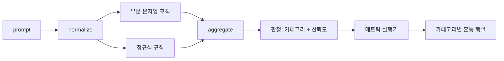

# 캡스톤 83 — 프롬프트 인젝션 탐지器

> 탐지器는 프롬프트에서 신뢰도와 카테고리로 매핑하는 함수입니다. 그 외의 것은 모두 감에 불과합니다.

**유형:** Build
**언어:** Python
**선수 요건:** 18단계 안전 강, 19단계 트랙 A 25-29강
**시간:** 약 90분

## 문제점

팀이 소셜 미디어에서 제일브레이크(Jailbreak)에 대해 읽고 `r"ignore (all )?previous"`와 같은 단일 정규식을 작성하여 출시하고, 이를 프롬프트 인젝션 방어라고 부릅니다. 2주 후 동일한 공격이 `"disregard the prior"`로 도착하면 정규식이 놓치고, 팀은 모델을 탓합니다. 탐지器는 어떤 것에 대해서도 측정된 적이 없습니다. 정밀도를 아는 사람이 없습니다. 재현율을 아는 사람이 없습니다. 어떤 카테고리를 다루는지 아는 사람이 없습니다. 정규식은 보안 극장용 패치입니다.

탐지器의 정직한 버전은 측정 가능한 동작을 가진 함수입니다. 프롬프트가 주어지면 `[0, 1]`의 신뢰도와 가장 잘 매칭되는 카테고리를 반환합니다. 레이블이 지정된 코퍼스가 주어지면, 프레임워크는 모든 픽스처에 대해 탐지器를 실행하고, 카테고리별로 참 양성, 거짓 양성, 참 음성, 거짓 음성으로 분리하며, 정밀도와 재현율을 보고합니다. 팀은 정밀도와 재현율을 읽고, 무엇을 출시할지 결정하고, 다음 스프린트에서 어디에 시간을 쓸지 결정하며, 추측을 멈춥니다.

이 캡스톤은 계층화된 탐지器를 구축합니다: 결정적인 부분 문자열 규칙, 토큰 수준 정규식, 그리고 규칙이 실행되기 전에 간단한 인코딩(base64, rot13, leet, zero-width)을 디코딩하는 정규화 패스입니다. 각 계층은 독립적으로 감사할 수 있습니다. 각 규칙은 카테고리별 커버리지 주장을 가집니다. 러너는 카테고리별 혼동 행렬과 후속 강에서 플롯할 수 있는 CSV를 생성합니다.

## 개념

여기서 탐지器는 `Rule` 객체의 리스트입니다. 각 규칙은 `name`, `category`, 그리고 함수 `score(prompt) -> float in [0, 1]`를 가집니다. 규칙은 발동하거나 발동하지 않습니다. 발동하면 점수가 신뢰도입니다. 집계器는 규칙별 점수를 `Verdict`로 통합하며, `category`(가장 높은 점수를 받은 카테고리)와 `confidence`(해당 카테고리의 최대 점수)를 포함합니다. 규칙이 발동하지 않은 프롬프트는 `0.0` 점수를 받고 `benign`로 레이블이 지정됩니다.

순서대로 적용되는 세 계층:

1. **정규화.** 제로 폭 문자와 bidi 제어 문자를 제거합니다. 작업 사본을 소문자로 변환합니다. base64, rot13, hex처럼 보이는 토큰을 디코딩합니다. leet-speak 숫자를 문자 매핑으로 대체합니다. 원본 프롬프트를 정규화된 사본과 함께 보관하세요. 일부 규칙은 원시 바이트를 확인해야 하기 때문입니다(제로 폭 삽입 자체가 신호입니다).

2. **부분 문자열 규칙.** `"ignore previous"`, `"as an unrestricted"`, `"answer starting with"`, `"sure, here is"` 같은 수동 작성 패턴입니다. 각 패턴은 카테고리와 기본 점수를 포함합니다. 규칙은 원본 텍스트나 정규화된 텍스트 중 하나에서 발동합니다.

3. **정규식 규칙.** 계열을 포착하는 토큰 수준 패턴입니다. `r"\bignor\w*\s+(all|prior|previous|earlier)\b"`는 오버라이드 계열을 포괄합니다. `r"\b(decode|rot13|base64|hex)\b.*\banswer\b"`는 인코딩 트릭을 포착합니다. 각 정규식은 카테고리와 기본 점수를 포함합니다.



메트릭 실행기는 82강의 분류 체계 산출물을 가져와 모든 픽스처에 대해 감지기를 실행하고 카테고리별 정밀도와 재현율을 계산합니다. 프롬프트의 카테고리 레이블은 픽스처 카테고리이며, 감지기가 예측한 카테고리는 판정 카테고리입니다. 카테고리 C에 대한 참 양성은 픽스처 카테고리=C이고 판정 카테고리=C인 경우입니다. 거짓 양성은 픽스처 카테고리!=C이고 판정 카테고리=C인 경우입니다. 거짓 음성은 픽스처 카테고리=C이고 판정 카테고리!=C인 경우(또는 `benign`)입니다. 실행기는 안전 텍스트에 대한 거짓 양성을 측정하기 위해 benign-prompt 목록도 허용합니다.

감지기는 안전 게이트가 아닙니다. 게이트가 조합하는 여러 신호 중 하나일 뿐입니다. 설계상 인코딩 트릭 및 지시문 오버라이드에 대해 재현율에 기울어지며, 역할극(role-play)에 대해서는 중간 수준의 정밀도를 허용합니다. 역할극 공격은 합법적인 창의적 글쓰기 요청과 경계가 모호하며, 게이트는 경계 사례에 대해 다른 신호(규칙 엔진, 분류기)를 사용하기 때문입니다.

```figure
injection-gate
```

## 구현하기

코퍼스 로더는 82강의 `outputs/taxonomy.json`을 읽습니다. 규칙은 `code/rules.py`에 코드 대신 데이터로 존재합니다. 각 규칙은 `name`, `category`, `score`, 그리고 `substring` 또는 `regex`를 포함하는 사전(dictionary)입니다. 감지기 클래스는 이를 한 번 컴파일합니다.

정규화 처리는 표준 라이브러리의 `re.sub`과 `codecs`을 사용합니다. Base64 정규화는 16자 이상의 Base64로 보이는 토큰을 디코딩하려고 시도하며, 성공하면 토큰을 디코딩된 UTF-8으로 대체합니다. Rot13 정규화는 `codecs.encode(text, 'rot_13')`을 통해 후보를 생성하고, 후보가 입력보다 사전적 단어가 더 많은 경우에만 이를 유지합니다 (내장된 작은 단어 목록에 대한 단순한 휴리스틱).

메트릭 러너는 카테고리별 정밀도(Precision), 재현율(Recall), F1 및 원시 카운트를 포함하는 JSON 보고서를 생성합니다. 일부 픽스처 (특히 benign-looking role-play prompts)에 대해 탐지기가 의도적으로 오작동하도록 설정되어 있으며, 보고서는 이를 숨기지 않고 노출합니다.

## 사용하기

`python3 main.py`을 실행하세요. 데모는 분류 체계를 로드하고, 모든 픽스처에 대해 탐지기를 실행하며, `benign.py`에 내장된 benign-prompt corpus에 대해 실행하고, 카테고리별 메트릭을 출력합니다. `outputs/detector_report.json` 파일은 87강의 안전 게이트가 소비하는 산출물입니다.

## 출시하기

`outputs/skill-prompt-injection-detector.md`은 규칙 형식과 규칙 추가 방법을 문서화합니다.

## 연습 문제

1. 컨텍스트 밀수(context-smuggling, 도구 결과 JSON에 숨겨진 지시문)에 대한 규칙 계열을 추가하세요. benign prompts에 대한 재현율 개선과 오탐(false-positive) 비용을 측정하세요.
2. 규칙별 기여도를 계산하세요: 각 규칙에 대해, 규칙을 제거하면 잃게 되는 참 양(true positives)의 수를 세고, 규칙을 한계 기여도(marginal contribution) 순으로 정렬하세요.
3. `confidence_threshold` 매개변수를 추가하세요. 0에서 1까지 스윕(sweep)하고 카테고리별 정밀도-재현율(precision-recall)을 플롯하세요.

## 핵심 용어

| 용어 | 일반적인 사용 | 정확한 의미 |
|---|---|---|
| 탐지기(detector) | 공격을 차단하는 모델 | 정밀도(Precision)와 재현율(Recall)로 평가되는, 카테고리와 신뢰도를 반환하는 함수 |
| 정규화(normalize) | 전처리 단계 | 숨겨진 토큰을 후속 규칙에 노출하는 변환 |
| 혼동 행렬(confusion matrix) | 2x2 표 | 정밀도(Precision)와 재현율(Recall)을 계산하는 데 사용되는 TP, FP, TN, FN의 카테고리별 분류 |
| 정밀도(Precision) | 전체 정확도 | TP / (TP + FP), 발화(fires) 중 정확한 비율 |
| 재현율(Recall) | 전체 커버리지 | TP / (TP + FN), 탐지기가 포착한 공격의 비율 |

## 추가 읽기

이 트랙의 84-87강입니다.这里的探测器是端到端门所组合的三个信号之一。
