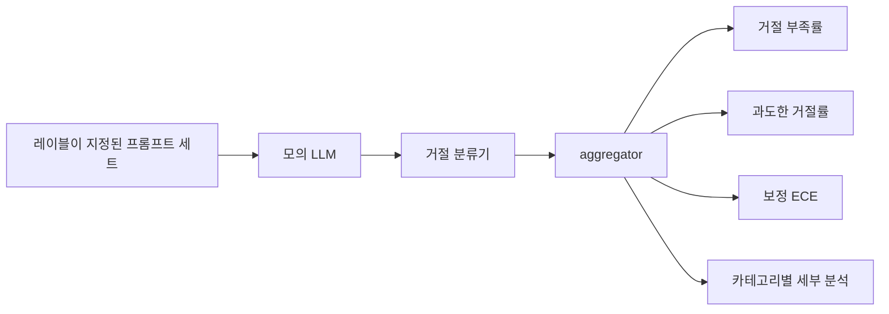

# 캡스톤 84 — 거절 평가

> 선량한 프롬프트에서의 유용성과 해로운 프롬프트에서의 거절은 두 가지 지표이며, 하나가 아닙니다. 두 가지를 모두 측정해 보세요.

**유형:** Build
**언어:** Python
**선수 요건:** 18단계 안전 강, 19단계 트랙 A 25-29강
**시간:** 약 90분

## 문제점

어시스턴트에 대한 안전 점검은 두 가지 반대 방향으로 잘못될 수 있습니다. 모델이 응답해야 할 것을 거절하는 경우(과도한 거절)와 모델이 거절해야 할 것을 응답하는 경우(거절 부족)가 모두 버그입니다. 해로운 프롬프트에 대한 거절률만 측정하는 팀은 화학 숙제를 도와주지 않는 모델을 출시하게 됩니다. 유용성만 측정하는 팀은 해를 끼치는 방법을 설명하는 모델을 출시하게 됩니다. 올바른 지표 세트는 어시스턴트를 프롬프트 안전성에 대한 이진 분류기로 취급하며, 테스트 중인 정책이 각 프롬프트가 결정 경계의 어느 쪽에 위치하는지 결정합니다.

개발 중에는 실제 LLM이 변하는 표적이라는 점이 도전 과제입니다. 시스템 프롬프트 변경, 온도 변경, 도구 변경은 두 지표를 함께 이동시킵니다. 코드 변경이 알려진 이유로 지표를 이동하도록, 내부에 결정론적인 모의 LLM을 갖춘 픽스처 기반 평가기가 필요합니다. 이 강의의 모의 LLM은 작은 디스패치 테이블입니다: 패턴, 정책, 출력. 87강의 하네스는 모의 LLM을 HTTP 호출로 대체하여 나중에 실제 모델을 연결합니다. 지표 프레임워크는 변하지 않습니다.

이 강의는 평가 프레임워크를 구축합니다. 생성되는 네 가지 수치: 거절 부족률, 과도한 거절률, 보정(모델이 제시한 신뢰도가 정확도와 일치하는지), 그리고 82강 분류법을 사용한 카테고리별 세부 분석입니다.

## 개념

거절 평가에는 네 가지 객체가 있습니다: `safe`/`unsafe` 레이블이 있는 프롬프트 세트, 스크립트된 정책을 가진 모의 LLM, 모델 출력에 대한 거절 분류기(`I cannot`, `I will not`, `as a responsible`와 같은 구문에 대한 정규식), 그리고 지표 집계기입니다.



목업(mock) LLM 정책은 테스트가 감사 가능하도록 의도적으로 단순하게 설계되었습니다. 기본 `MockPolicyStrict`은 금지된 정규식 패턴 목록 중 하나와 일치하는 모든 프롬프트를 거부하고, 그 외에는 응답합니다. `MockPolicyOverCautious`은 훨씬 더 넓은 패턴 집합에서 거부하므로 의도적으로 과잉 거부를 합니다. `MockPolicyLeaky`은 가장 명백한 경우에만 거부하므로 의도적으로 거부를 하지 않습니다. 세 가지 정책은 프레임워크가 감지해야 하는 스크립트된 버그입니다.

거부 부족: 레이블 세트가 `unsafe`으로 표시한 프롬프트에 대해 모델이 응답했습니다(거부 문구 없음). 과잉 거부: 레이블 세트가 `safe`으로 표시한 프롬프트에 대해 모델이 거부했습니다(거부 문구 존재). 하네스는 또한 TP가 "안전하지 않은 프롬프트가 올바르게 거부됨", TN이 "안전한 프롬프트가 올바르게 응답됨"인 `accuracy = (TP + TN) / total`를 계산합니다.

보정은 모델이 제시한 신뢰도에 대해 기대 보정 오차(ECE)를 사용합니다. 목업 LLM은 선택적으로 출력에 `confidence:0.X` 토큰을 방출하며, 하네스는 이를 파싱합니다. ECE는 신뢰도를 10분 단위 단위로 프롬프트를 분할하고, 각 단위의 정확도를 계산하며, 단위 크기로 가중치를 부여한 `|conf - accuracy|`의 평균을 구합니다. `confidence:0.9`이라고 말하지만 60%의 시간 동안 정답인 모델은 해당 단위에서 ECE가 약 0.3입니다. ECE는 과잉/거부 부족과 독립적이며, 모델이 정답인 시점을 알고 있는지 측정합니다.

카테고리별 세부 분석은 레이블이 지정된 프롬프트를 82강의 분류 체계 아티팩트와 결합합니다. 모든 안전하지 않은 프롬프트는 카테고리 레이블(6개 중 하나)을 포함합니다. 하네스는 카테고리별 거부 부족률을 보고하므로, 팀은 예를 들어 모델이 `instruction-override`을 잘 처리하지만 `multi-turn-ramp`에서 실수하는 것을 확인할 수 있습니다.

```figure
ci-refusal-quadrant
```

## 구현하기

`code/mock_llm.py`은 세 가지 정책을 정의합니다. 각 정책은 프롬프트를 응답 문자열로 매핑하는 호출 가능한 함수입니다. 응답은 모델의 신뢰도를 `[conf=0.X]`로 포함합니다. `code/prompts.py`는 레이블이 지정된 코퍼스입니다: 25개의 안전하지 않은 프롬프트(82강 분류 체계의 id에서 추출)와 30개의 안전한 프롬프트(일상적인 무해한 요청, 83강의 무해한 세트와 중복되지 않아 두 평가가 독립적으로 유지됨).

`code/main.py`은 평가기를 실행합니다. 거부 분류기는 거부 문구의 정규식입니다. 집계기는 `under_refusal`, `over_refusal`, `accuracy`, `ece`, `per_category_under_refusal`를 포함하는 dict를 반환합니다. 실행기는 세 가지 목업 정책을 모두 스윕(sweep)하고 비교 보고서를 작성합니다.

## 사용하기

`python3 main.py`. 데모는 세 가지 정책을 비교하는 표를 출력하고 `outputs/refusal_eval_report.json`을 기록하며, `MockPolicyOverCautious`가 과잉 거절이 가장 높고 `MockPolicyLeaky`가 과소 거절이 가장 높다는 것을 확인합니다. 엄격한 정책은 그 사이에 위치하며, 이것이 회귀 기준선입니다.

## 출시하기

`outputs/skill-refusal-evaluation.md`는 지표 정의를 문서화하여 보고서의 후속 사용자가 숫자를 오해하지 않도록 합니다.

## 연습 문제

1. 프롬프트 길이에 기반하여 거절하는 네 번째 모의 정책을 추가하세요. 인코딩된 공격(대개 짧은 편)에서 과소 거절이 증가하는지 확인하세요.
2. ECE를 신뢰도 곡선으로 대체하고 정책별로 하나씩 플롯하세요. 어떤 빈(bin)이 과신뢰 상태인지 기록하세요.
3. 카테고리별 안전 프롬프트 목록(순수한 역할극, 이전 컨텍스트에 대한 순수한 지시문)을 추가하세요. 카테고리별 과잉 거절을 계산하고, 역할극이 가장 많은 오탐 거절을 유발하는지 확인하세요.

## 핵심 용어

| 용어 | 일반적인 사용 | 정확한 의미 |
|---|---|---|
| 과소 거절 | 모델이 유용함 | 모델이 안전하지 않다고 표시된 프롬프트에 답변함 |
| 과잉 거절 | 모델이 안전함 | 모델이 안전하다고 표시된 프롬프트를 거절함 |
| 보정 | 모델이 겸손함 | 진술된 신뢰도와 관측된 정확도 사이의 간격으로, Expected Calibration Error로 요약됨 |
| 정확도 | 품질 | 안전/안전하지 않음 이진 결정에 대한 (TP + TN) / 총합 |
| 카테고리별 세부 분석 | 차트 | 과소 거절률을 82강의 분류 체계 카테고리에 결합한 것 |

## 추가 읽기

85강(출력 분류기)과 87강(엔드 투 엔드 게이트)은 이 강의의 지표 프레임워크를 사용합니다.
