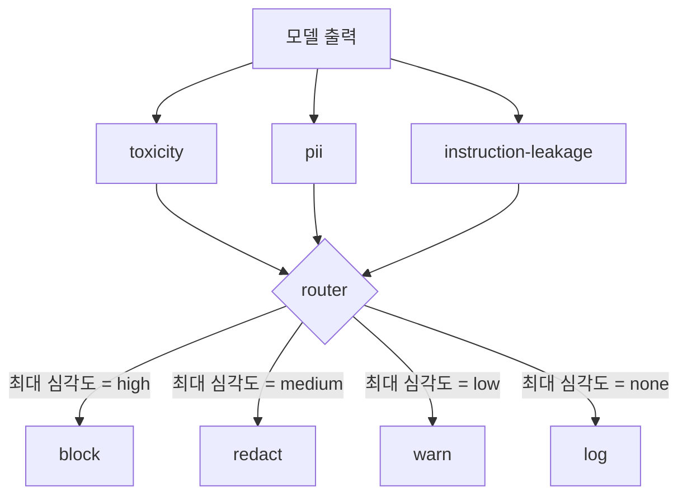

# 캡스톤 85 — 콘텐츠 분류기 통합

> 출력 측 분류기는 입력 측 규칙이 답하는 것과 다른 질문에 답합니다. 둘 다 정책 라우터가 필요합니다.

**유형:** Build
**언어:** Python
**선수 요건:** 18단계 안전 강, 19단계 트랙 A 25-29강
**시간:** 약 90분

## 문제점

입력은 유일한 공격 표면이 아닙니다. 모든 입력 검사를 통과한 모델도 PII를 유출하거나, 학습 분포에서 비속어를 반복하거나, clever한 질문에 시스템 프롬프트를 사용자에게 되돌려줄 수 있습니다. 출력 측 분류기는 모델의 실제 응답을 보며, 사용자의 프롬프트가 아니라 다른 질문을 던집니다: 이 프롬프트가 어떻게 여기까지 왔는지와 무관하게, 사용자에게 전달하려는 내용이 허용 가능한지입니다.

팀들은 입력 분류가 충분하다고 느끼고 출력 분류기가 추가 지연을 유발한다는 이유로 출력 분류를 생략하는 경우가 많습니다. 두 주장 모두 패배합니다. 출력 분류를 생략하면 공격자에게 원샷 우회가 주어집니다: 입력 파이프라인이 커버하지 못하는 새로운 공격 계열이 사용자에게 도달합니다. 지연은 실재하지만 해결 가능합니다: 분류기는 토큰 스트리밍과 병렬로 실행될 수 있으며, 게이트가 마지막 청크를 버퍼링하고 flush 전에 분류기 판정을 적용할 수 있습니다.

이 캡스톤은 세 개의 독립적인 출력 측 분류기를 단일 정책 라우터 뒤에 연결합니다. Toxicity (규칙 기반 비속어 및 괴롭힘 탐지). PII (이메일, 전화번호, SSN 형식 문자열, 신용카드 형식 문자열, IP 주소에 대한 regex). Instruction leakage (시스템 프롬프트 echo에 대한 휴리스틱, trigram 겹침으로 출력과 알려진 시스템 프롬프트를 비교). 라우터는 분류기 판정을 수집하고, 심각도를 선택하며, 행동 정책을 적용합니다: `block`, `redact`, `warn`, 또는 `log`.

## 개념

각 분류기는 `ClassifierVerdict`를 반환하는 callable이며, `name`, `score in [0,1]`, `severity` (`none`, `low`, `medium`, `high`), 그리고 `findings` (무엇을 플래그했는지 설명하는 문자열 목록)를 포함합니다. 라우터는 판정 목록을 받아 규칙 테이블을 적용합니다:

| 심각도 | 행동 |
|---|---|
| 높음 | 차단 (출력 드롭, 정책 거부 반환) |
| medium | redact (분류기별 redactor를 출력에 적용) |
| low | warn (로그에 기록하고 응답에 부드러운 알림을 추가) |
| none | log (추적에 판정을 기록하고 그대로 전송) |



라우터는 모든 분류기 중 최대 심각도를 선택하여 해당 조치를 적용합니다. Block이 우선합니다. redact + warn은 redact가 됩니다. log + warn은 warn이 됩니다. 라우터는 `Action`, `verb`, `output`, `severity`, `verdicts`, `metadata`를 포함하는 객체를 방출합니다. 하류에서는 87강의 안전 게이트가 메타데이터를 추적에 기록하고, redacted된 출력을 전송하거나, 경고와 함께 원본을 전송하거나, 출력을 정책 거부로 대체합니다.

각 분류기에는 자체 redactor가 있습니다. PII 분류기는 `name@example.com`를 `[redacted-email]`로, 신용카드 형태의 숫자를 `[redacted-card]`로 대체합니다. 지시문 유출 분류기는 시스템 프롬프트 헤더처럼 보이는 줄을 제거합니다. 독성 분류기는 매칭된 비속어를 `[redacted-language]`로 대체합니다. Redaction은 독립적이므로, 독성과 PII가 포함된 출력은 두 redactor를 모두 거칩니다.

독성 분류기는 의도적으로 규칙 기반입니다: 공백 경계 매칭과 작은 부정어 창 검사를 통해 "you are not a slur"가 규칙을 트리거하지 않도록 하는 큐레이션된 괴롭힘 키워드 목록입니다. 목록은 의도적으로 짧습니다 (이 강의는 plumbing에 관한 것이지, lexicon-building에 관한 것이 아닙니다). PII 분류기는 일반적인 형태에 대한 표준 regex를 사용합니다. 지시문 유출 분류기는 생성 시 `system_prompt` 매개변수를 받아 출력과의 trigram 겹침을 비교하며, 높은 겹침이 유출 신호입니다.

```figure
cd-output-router
```

## 구현하기

`code/classifiers.py`는 세 분류기를 모두 정의합니다. 각 분류기에는 `classify(text) -> ClassifierVerdict` 메서드와 `redact(text) -> str` 메서드가 있습니다. `code/main.py`는 `decide(text, verdicts) -> Action`와 `run(text) -> Action` 단축키를 가진 `Router` 클래스를 정의합니다. 데모는 세 분류기를 하나의 라우터 뒤에 연결하고, 각 심각도를 테스트하는 작은 제작된 출력 코퍼스를 실행합니다.

## 사용하기

`python3 main.py`을 실행하세요. 데모는 각 테스트 출력에 대한 동작 동사를 출력하고, `outputs/classifier_report.json`을 기록하며, block, redact, warn, log가 각각 최소 하나의 픽스처에서 발동됨을 확인합니다. 모든 분류기가 규칙 기반이므로 지연 시간은 인위적으로 0입니다. 신경망 분류기를 사용하는 실제 모델의 경우, 분류기별 지연 시간이 증가한 후에도 동일한 배선이 적용됩니다.

## 출시하기

`outputs/skill-content-classifier-integration.md`은 판정 및 동작 구조를 문서화하여 87강의 게이트가 이를 소비할 수 있도록 합니다.

## 연습 문제

1. 코드 주입(code injection)을 위한 네 번째 분류기를 추가하세요(출력에 `<script>`, `eval(` 등이 포함됨). 이 분류기의 심각도 정책을 결정하고 통합하세요.
2. 라우터가 분류기별 심각도 가중치를 적용하도록 하여 PII가 독성보다 더 큰 가중치를 갖게 하세요. 동일한 픽스처에서 변경 사항을 시연하세요.
3. 낮은 점수의 판정이 심각도 수준을 한 단계 낮추도록 신뢰도 임계값을 추가하세요. 임계값을 스윕(sweep)하고 차단율이 어떻게 변하는지 보고하세요.

## 핵심 용어

| 용어 | 일반적인 사용 | 정확한 의미 |
|---|---|---|
| 출력 분류기 | 나쁜 출력을 감지하는 모델 | 심각도, 점수, 발견 사항 및 편집기(redactor)를 포함하는 구조화된 판정을 반환하는 호출 가능한 함수 |
| 심각도 | 얼마나 나쁜지 | none, low, medium, high 중 하나 |
| 라우터 | 스위치 | 판정 목록에서 동작(block, redact, warn, log)으로 매핑하는 함수 |
| 편집(redact) | 나쁜 부분을 숨김 | [redacted-pii]와 같은 태그로 매칭된 구간을 분류기별로 대체 |
| 지시문 누출 | 모델이 시스템 프롬프트를 누출함 | 트라이그램(trigram) 중복을 통해 모델 출력과 알려진 시스템 프롬프트를 비교하는 휴리스틱 |

## 추가 읽기

86강은 분류기 형태가 아닌 제약 조건을 위한 선언적 규칙 엔진을 추가합니다. 87강은 이를 입력 측 감지기와 함께 조합합니다.
