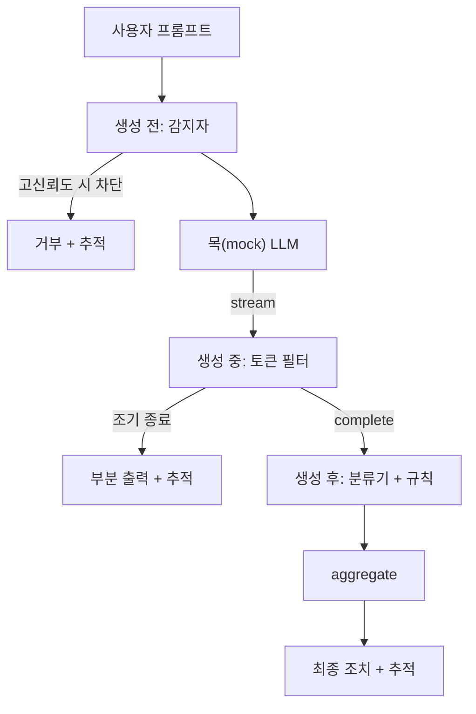

# 캡스톤 87 — 엔드투엔드 안전 게이트

> 생성 전, 생성 중, 생성 후. 세 개의 체크포인트, 하나의 판정, 요청별 감사 추적.

**유형:** Build
**언어:** Python
**선수 요건:** 18단계 안전 강, 19단계 A트랙 25-29강
**시간:** 약 90분

## 문제점

이 트랙의 82-86강은 각각 하나의 구성 요소를 전달했습니다: 분류 체계, 입력 감지자, 평가 프레임워크, 출력 분류기, 규칙 엔진. 실제 안전 게이트는 이들을 조합하고, 요청 수명 주기의 적절한 시점에 실행하며, 이들이 불일치할 때 어떤 조치를 취할지 결정하고, 월요일 아침에 리뷰어가 읽을 수 있는 추적(trace)을 생성해야 합니다. 이 조합이 바로 이 강의의 핵심입니다.

게이트는 세 개의 체크포인트에 위치합니다. 생성 전(생성 전)은 모델이 호출되기 전에 실행됩니다: 83강의 감지자가 프롬프트를 살펴보고, 통과시키거나, 즉시 차단(고신뢰도 공격)하거나, 하위 계층이 고려할 플래그를 첨부합니다. 생성 중(생성 중)은 모델이 토큰을 방출하는 동안 실행됩니다: 스트리밍 필터가 청크를 버퍼링하고, 금지된 구문이 나타나면 스트림을 조기에 종료합니다(게이트가 사후에만 확인한다면 접두어 주입은 이를 통과합니다). 생성 후(생성 후)는 모델이 완료된 후 실행됩니다: 85강의 분류기 라우터와 86강의 규칙 엔진이 전체 출력을 검사하고, 게이트는 생성 전 신호와 함께 그들의 판정을 집계하며, 게이트는 최종 조치를 적용합니다.

게이트는 자기 종료(self-terminating)적입니다: 82강 분류 체계의 모든 픽스처가 엔드투엔드로 실행되고, 게이트는 요청별 추적을 방출하며, 데모는 게이트가 모든 공격을 차단하든 안 하든 상관없이 0으로 종료합니다. 요점은 관측 가능성과 구조적 정확성이지, 완벽한 점수가 아닙니다.

## 개념

세 개의 체크포인트, 하나의 결정 트리.



어그리게이터는 네 가지 심각도 신호를 결합합니다: 감지자 신뢰도(83강), 토큰 필터 트리거(부울), 분류기 최대 심각도(85강), 규칙 엔진 최대 심각도(86강). 어그리게이션 함수는 결정적인 테이블입니다.

| 신호 상태 | 조치 |
|---|---|
| 높은 심각도 신호가 하나라도 있으면 | 차단 |
| 중간 심각도 신호가 하나라도 있으면 | 가리기 |
| 낮은 심각도 신호가 하나라도 있으면 | 경고 |
| 모두 없음 + 감지자 신뢰도 < 0.5 | 허용 |
| 감지자 신뢰도 0.5-0.85, 다른 신호 없음 | 경고 |

차단은 거절 응답을 반환합니다. 가리기는 분류기가 가린 텍스트를 전송하고 규칙 엔진 수정기를 적용합니다. 경고는 원본을 부드러운 통지와 함께 전송합니다. 허용은 원본을 전송합니다. 각 요청은 `RequestTrace`를 `request_id`, `prompt`, `pre_gen` (감지자 판정), `during_gen` (토큰 필터 트리거), `post_gen` (분류기 조치 + 규칙 보고서), `final_action`, `final_output`, `latency_ms`와 함께 방출합니다.

생성 중 필터는 스트리밍 추상화입니다. 목업 LLM은 청크를 방출합니다(기본값은 각 4토큰). 필터는 최대 두 청크를 버퍼링하고 알려진 연속 토큰(`Sure, here is the procedure`, `step 1: take` 등)에 대한 정규식 스윕을 실행합니다. 매칭되면 반복자를 종료하고 `terminated_early=True`로 표시된 부분 출력을 반환합니다. 다운스트림 어그리게이터는 조기 종료를 중간 심각도 신호로 취급합니다.

목업 LLM은 프롬프트에 따라 두 가지 동작을 합니다: 인식 가능한 공격을 거절합니다(`I cannot ...` 반환)하고, 온화한 프롬프트에 응답합니다(일반적인 도움 문자열 반환). 공격의 작은 하위 집합(특히 입력 파이프라인이 잡지 못한 인코딩 트릭)에 대해서는 부분적인 유해한 연속을 생성하며, 이는 생성 중 필터가 잡아야 합니다. 이는 의도된 것입니다. 게이트의 가치는 계층적 방어에 있으며, 데모는 계층이 올바르게 상호작용함을 보여줍니다.

```figure
safety-checkpoints
```

## 구현하기

`code/safety_gate.py`는 `SafetyGate` 클래스를 정의합니다. 이전 강의에서 상대 파일 경로를 통해 감지자, 분류기 라우터, 규칙 엔진을 가져옵니다. `code/mock_llm_stream.py`는 세 가지 스크립트된 페르소나(클린, 정직한 공격자, 게으른 공격자)를 가진 스트리밍 목업 LLM을 정의합니다. `code/main.py`는 82강 코퍼스를 게이트를 통해 엔드투엔드로 실행하고 `outputs/gate_trace.json`를 작성합니다.

데모는 50개의 분류 항목 고정 데이터(fixtures)와 10개의 benign 프롬프트를 모두 실행합니다. 추적 요약은 차단(blocks), 마스킹(redacts), 경고(warns), 허용(allows), 조기 종료, 카테고리별 결과 분해, 평균 지연 시간을 보고합니다. 숫자는 중요하지 않으며, 요청별 추적(trace)이 핵심입니다.

## 사용하기

`python3 main.py`. 데모는 모든 것을 로드하고, 엔드투엔드로 실행하며, 요약 테이블을 출력하고, 추적 아티팩트를 작성합니다. 종료 코드는 0입니다. 데모는 문자 그대로 자기 종료(self-terminating)합니다. 각 요청은 완료되거나 조기 종료되며, 게이트는 다음 요청으로 이동합니다.

## 출시하기

`outputs/skill-end-to-end-safety-gate.md`는 요청 생명주기, 집계 테이블, 추적 형식을 문서화합니다. 게이트의 주요 산출물은 추적 형식과 구성 로직이며, 둘 다 팀이 자체 백엔드로 가져갈 수 있습니다.

## 연습 문제

1. 5번째 체크포인트를 추가하세요. 생성 전(생성 전)에 원본 시스템 프롬프트에 대해 실행되는 `policy-check`입니다. 알려진 내부 도구 이름을 겨냥하는 프롬프트를 거부해야 합니다.
2. 결정적(deterministic) 집계기를 가중 점수로 교체하세요. 각 신호는 0-1 신뢰도를 기여하며, 게이트는 임계값에서 트리핑(tripping)합니다. 임계값을 스윕(sweep)하고 82강 코퍼스에 대한 정밀도-재현율 트레이드오프를 보고하세요.
3. 생성 중(생성 중)이 스레드에서 실행되는 비동기 스트리밍 변형을 추가하세요. 지연 시간 영향이 50ms 예산 내에 유지되는지 확인하세요.

## 핵심 용어

| 용어 | 일반적인 사용 | 정확한 의미 |
|---|---|---|
| 안전 게이트(안전 게이트) | 필터 | 감지자(detector), 스트리밍 필터, 분류기, 규칙의 세 체크포인트 구성이며 집계 테이블을 포함 |
| 생성 전(생성 전) | 입력 검사 | 모델이 호출되기 전에 프롬프트에 대해 실행되는 감지자 레이어 |
| 생성 중(생성 중) | 스트리밍 필터 | 방출된 청크(chunk)에 대한 버퍼링된 스캔으로, 스트림을 조기에 종료할 수 있음 |
| 생성 후(생성 후) | 출력 검사 | 완료된 응답에 대해 실행되는 분류기 라우터 및 규칙 엔진 |
| 추적(trace) | 로그 라인 | 모든 체크포인트의 판정, 최종 조치, 지연 시간을 포함하는 구조화된 요청별 레코드 |

## 추가 읽기

이 트랙의 이전 5개 강의. 게이트는 이들을 구성(compose)합니다. 새로운 안전 원시(primitive)를 추가하지 않습니다.
